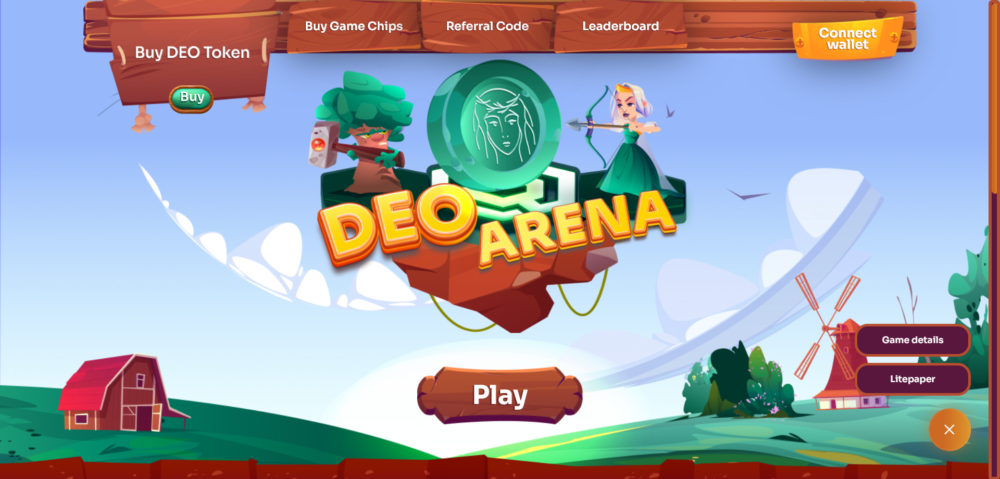

# DEO Arena

Demeter (DEO) is the native token of the Demeter farming platform and DEO Arena Web3 game. In the Ceres ecosystem, Demeter is the first self-purpose airdrop.

## Play-to-Earn game

[DEO Arena](https://deoarena.io/) is the first Play-To-Earn game on the SORA network and a pioneer in the DotSama ecosystem.
The in-game currency is the XOR-native token Demeter (DEO).
Players spawn in the arena and the goal is to eliminate opponents using different weapons.
Each player enters the match with a certain amount of DEO tokens, which are taken by the winner at the end.

