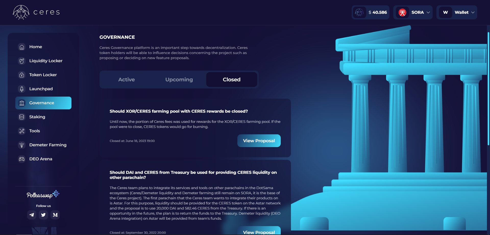

# Ceres Governance platform

The [Ceres Governance platform](https://dapps.cerestoken.io/governance) is an essential step towards decentralization.
Ceres token holders can influence decisions concerning the project, such as proposing or implementing new features.

