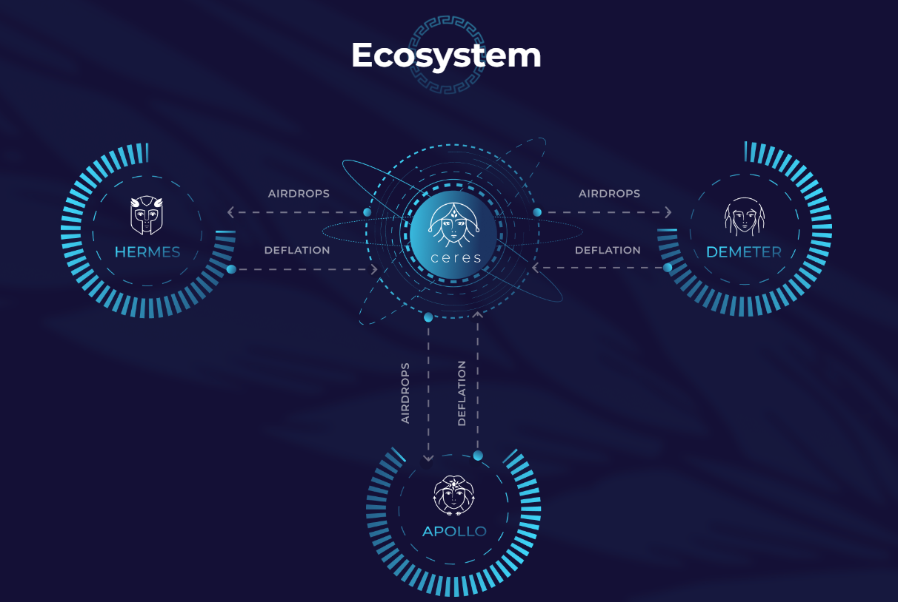

## Ceres Ecosystem

Ceres is one of the first DeFi service providers in the DotSama ecosystem and the first on the SORA network.
Ceres provides DeFi services and utilities for new projects and tokens in the DotSama ecosystem. 
CERES is the native token of the Ceres ecosystem, where the concepts of burning, airdrops, treasury, and community governance are all in one place.

## CERES token utility

- [Governance](governance.md) - CERES token holders can influence decisions concerning the project, either by making proposals or deciding on other’s proposals for new features.
- Airdrops - The goddess would always generously reward her admirers. Every CERES holder can get each of three Ceres Airdrop tokens ([Demeter](demeter-farming.md), [Hermes](hermes-dao.md), and Apollo). Each airdrop will have its purpose and will be provided with initial liquidity.
- Treasury - Part of the fees from all platforms in the Ceres ecosystem will be transferred to a public treasury wallet managed by CERES holders using the governance platform.
- Deflationary - For the goddess to grant all the wishes of her followers, it is necessary to offer an adequate sacrifice. CERES tokens will be burned over time and the supply will be constantly reducing.

 

**CERES tokenomics**

Team - 3,750  
Marketing - 1,250  
Initial liquidity offering - 12,000  
Listing - 8,000  
 
Max supply - 25,000

## Learn More

- [Official website](https://cerestoken.io/)
- [Ceres Telegram](https://t.me/cerestoken)
- [Twitter](https://twitter.com/tokenceres)
- [Medium](https://tokenceres.medium.com/)
- [LinkedIn](https://www.linkedin.com/company/ceres-blockchain-solutions-llc)
- [DEO Arena Telegram](https://t.me/DEOArena)

- [Ceres dApps](https://dapps.cerestoken.io/)
- [Demeter Farming platform](https://farming.deotoken.io/)
- [DEO Arena](https://deoarena.io/)
- [Ceres Tools](https://tools.cerestoken.io/)
