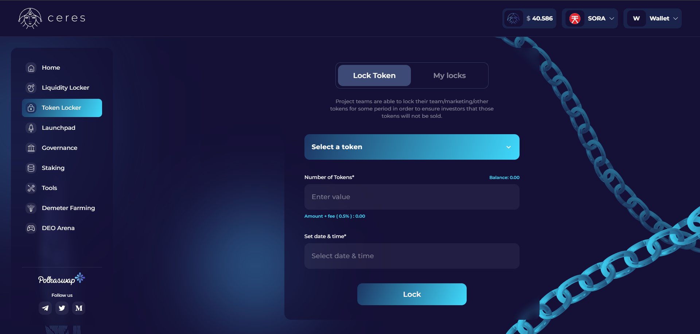

# Ceres Token Locker

The [Ceres Token Locker](https://dapps.cerestoken.io/token_locker) is a decentralized application that gives project teams the ability
to lock their team/marketing/other tokens for pre-determined periods to ensure investors that those tokens will not be sold.

