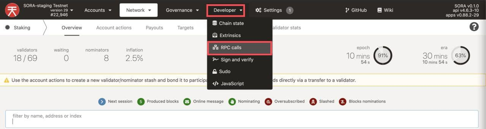
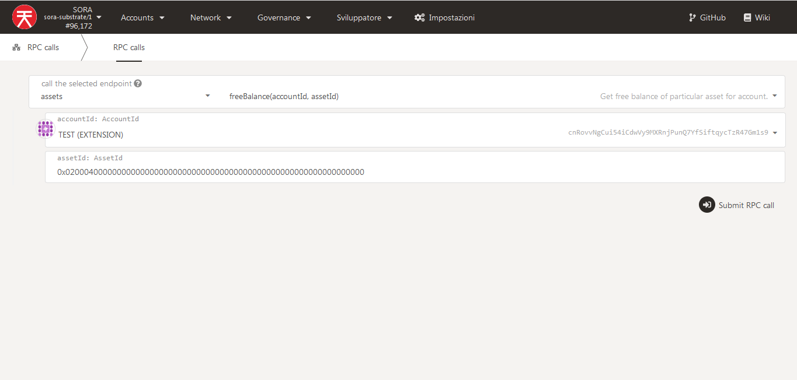
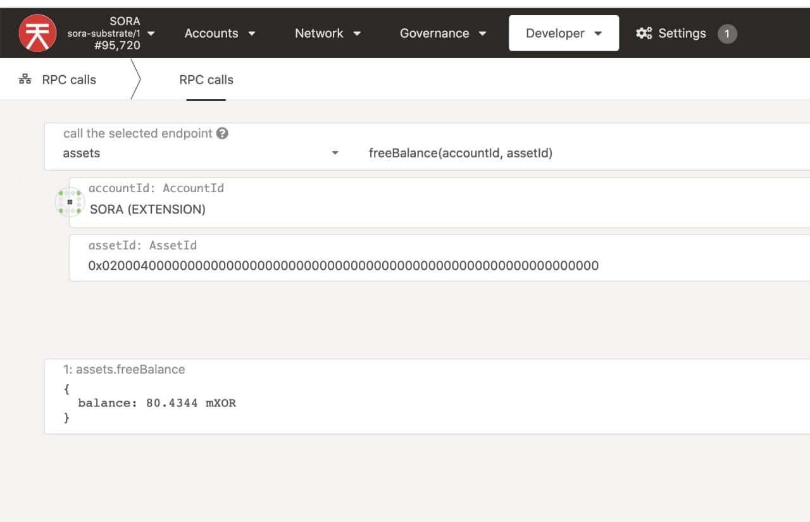

# Check User Balances

## Via Polkadot.js UI

1. Go to [SORA polkadot.js](https://polkadot.js.org/apps/?rpc=wss%3A%2F%2Fws.sora2.soramitsu.co.jp#/rpc).

2. Click on **Developer** and then **RPC calls**

   

3. Select \__assets_ → _freeBalance(accountid,assetid)_.

   

4. Fill in _AssetID_ and press _"Submit RPC call"_.

   ::: info

   For more Asset IDs check out the [Tokens subsection of the Polkaswap.io Explore](https://polkaswap.io/#/explore/tokens) page. You can find the core token Asset IDs in the [Check supply](check-supply.md) page.
   :::

   

This is the expected output. In this case, the VAL amount has been checked (look at AssetID)

Unfortunately, Polkadot.js supports only one asset for the network, that's why it shows XOR. However, it is actually the asset that you asked for: PSWAP, VAL, ETH, DAI, and so on.

The letter before XOR means that the number is multiplied by the following amount:

| Letter | Multiplier |
| ------ | ---------- |
| k      | 1000       |
| m      | 1000000    |
| B      | 1000000000 |
| m      | 0.001      |

So, in the example above the shown amount is 80.434 mXOR = 0.080434 VAL

For more details on how to read this output, [take a look at this](check-supply.md#how-to-read-the-results).
