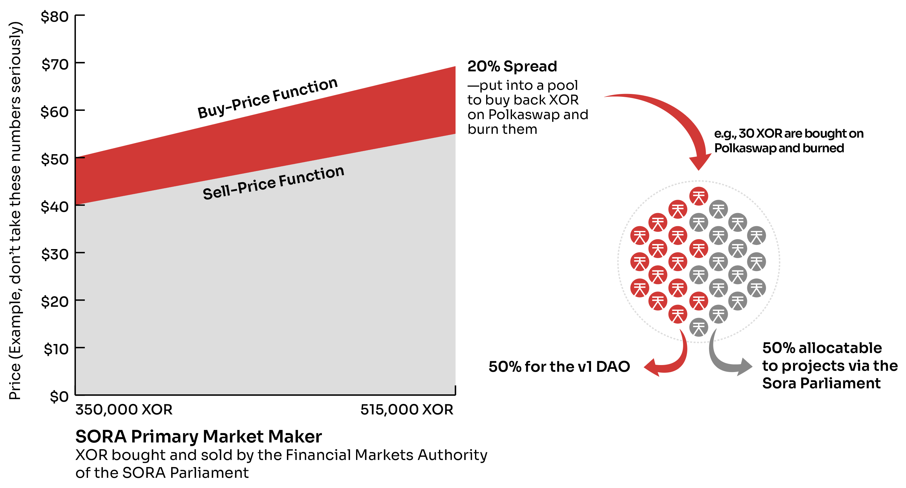
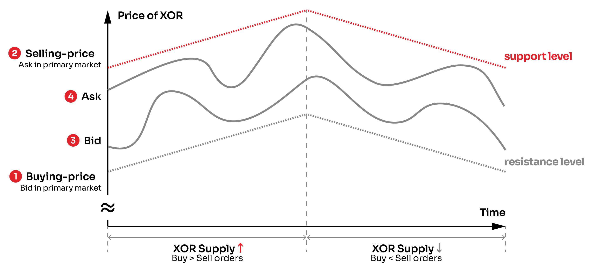
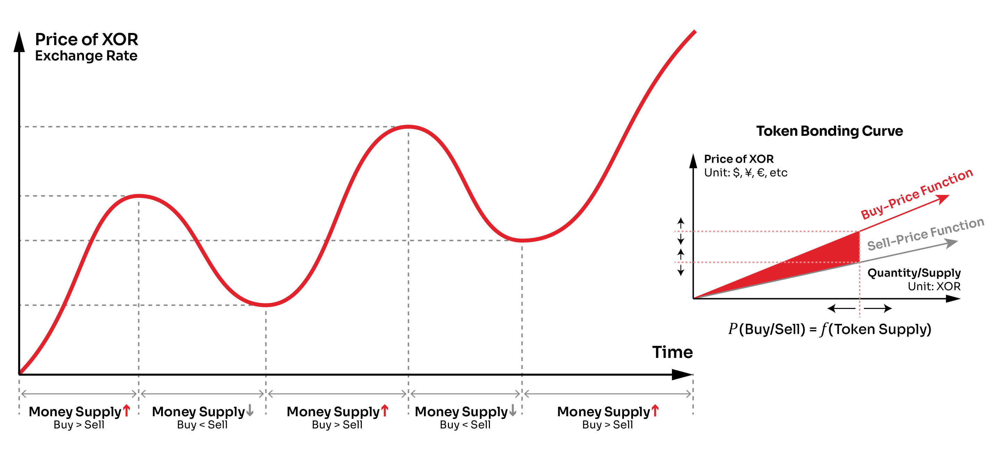

## SORA经济

2019年10月17日，SORA v1网络启动，发行了约16,180,339,88个XOR。2020年3月，约35万个XOR从SORA v1网络转移到以太坊网络，并在Uniswap上开始交易。在Uniswap的初次推出中，我们的目标是进行初步的价格发现，并通过吸引以太坊网络的用户来建立SORA社区。然而，我们的技术已经改进，使我们有可能塑造一种新的、更有雄心的加密生态系统。虽然我们的中期目标仍然是为我们的社区创造价值，但我们对SORA经济的分析使我们接受了实现一个超国家世界经济体系的长期目标。

为了实现这个系统，我们提出了SORA：新经济秩序。这是对SORA网络和SORA经济模型的深远而重要的升级。这个升级经过了SORA社区的投票和批准。我们认为这是一个能够为人类增加价值的系统，我们强烈支持它的采用。

## SORA经济学

SORA经济系统的关键论点是，为了能够与当代的中心化经济系统竞争，需要有一个合理的经济模型。为了创建一个合理的经济模型，我们在2017年开始了对各种经济理论的调研。在此期间，我们还在2018年聘请了一位经济学家（山口洋平）与我们合作，并在模型的几个关键部分上给予了帮助。

结论是有大量经验证据表明，经济中资金配置的变化是增长的必要和充分决定因素。这一点由理查德·沃纳在他的细分货币数量理论中得到证明，他将费雪的交换方程（MV = PY；一个好的思考方式是，MV等于从买方角度看到的名义GDP，而PY等于从生产者/卖方角度看到的名义GDP）细分为实际（R）和金融（F）交易。

V := velocity of money
V := 货币流通速度

M := quantity of money
M := 货币数量

P := price index P := 价格指数

Y := output of goods/services
Y := 产品/服务的产出

Q := quantity demanded Q := 需求量

将上述方程视为一个动力系统是有帮助的，这样，如果货币数量M在方程的左侧发生变化，右侧必须有一些变化来平衡这种变化（这是因为在大型经济体中，V通常相对稳定）。对于实体经济中的交易，这意味着新投入流通的货币会被新的商品和服务消耗掉，以平衡这种新的购买力。然而，对于金融交易来说，新投入流通的货币并没有创造出新的商品或服务，因此会导致资产价格上涨以进行补偿（这并不是经济体系中所希望的）。此外，扩大货币数量对于生产新商品和服务的重要性也需要理解。正如下村广文广泛讨论并由栗原昭简化为一个简单的线性规划模型，扩大货币数量用于新商品和服务的生产会扩大经济产出，因为潜在资源（尤其是人力资源）被动员起来，并通过新的资本投入为生产升级现有资源。

这一切的意思是，为了使SORA成为一个成功的去中心化经济体，我们必须明确地创建新的代币来创造新的商品（比如葡萄酒）或服务（比如一个非常棒的去中心化交易所）。虽然这一直是我们的目标，但在SORA经济体的v1版本中存在流动性问题，因此启动经济系统变得缓慢，需要一个新的模型来保证XOR的流动性和价格，以便项目能够成功使用该代币。

这就是我们的经济学家山口的研究再次取得成功的地方。早在2018年，他建议我们使用代币绑定曲线来自主管理经济中XOR的发行和撤销。换句话说，我们找到了一种在没有人类参与的情况下以合理方式管理代币供应的方法，从而创建了一个避免传统经济的繁荣-衰退问题和许多加密货币的通缩经济的系统。

## 代币绑定曲线

代币绑定曲线是一个智能合约，它以某种代币作为输入，并输出一个新的代币。有许多可能的变体，这是一个令人兴奋的研究领域，但在SORA中，我们使用一个简单的模型，其中包含两个线性函数：购买价格函数和销售价格函数。

SORA主网中的XOR供应由可接受的流动加密货币支持，每个XOR网络交易都需要支付一小笔费用，其费率由社区决定（例如，0.01-0.10美元等值）。要在代币绑定曲线上购买XOR，必须使用其中一种可接受的货币。您可以用来购买代币绑定曲线上的XOR的代币有：

- DOT（一旦我们获得Polkadot的平行链和与之连接的Substrate桥）
- KSM（一旦我们将Substrate桥连接到我们的Kusama平行链）
- BTC (in the future) 比特币（未来）
- ETH
- DAI
- VAL
- PSWAP
- XST
- TBCD

代币绑定曲线直接集成在Polkaswap.io中，如果上述交易对中的XOR的二级市场价格超过，将自动执行代币绑定曲线，以便将新的XOR投入流通，将购买货币的20%放入池中回购和销毁XOR，将购买货币的80%放入储备中，由代币绑定曲线持有。由于储备是以多种货币形式存在的，系统的未来版本应提供平衡货币储备以提供多种代币的流动性的方法。SORA经济模型与Polkaswap的紧密集成将允许在未来某个时候自动化这个过程。

购买价格函数从折扣价开始（考虑到VAL在主网上线时的初始价格），以Uniswap XOR上线时的价格为基准。购买价格函数使用预言机来确定XOR相对于法定货币的当前价格。相应地，卖出价格函数比购买价格函数低20%。购买和卖出函数之间的20%差价有不同的用途，在SORA 验证人奖励文章中有详细解释。

一个新的SORA议会（多体随机分配治理系统）将提供一种方法来合理分配这些XOR，以便根据SORA经济模型在SORA生态系统中创造新的商品和服务。所有创建的XOR都免费提供给SORA议会，然后使用代币绑定曲线来管理代币供应；具体来说，SORA议会的一个常设机构——金融市场管理局将成为通过一级市场做市商购买和出售XOR的实体。

由于代币绑定曲线本质上是一个无限流动的、去中心化的中央银行，价格无法超过或低于买入和卖出函数。这一点尤其适用于SORA的一级市场做市商，它已内置于Polkaswap并在范围内自动执行。此外，由于代币绑定曲线的定价功能呈上升趋势，价格随着代币供应的增加而上涨。这带来了以下特性：

- 自主管理代币供应以满足需求（弹性供应）- 代币绑定曲线从流通中引入和移除XOR以满足市场需求。这确保了代币经济的可持续增长和价格稳定，因为系统可以适应不断变化的需求。
- 确定性价格计算 - 一级市场中代币的买入和卖出价格会随着代币供应的变化而上下波动。因此，这不是一个固定汇率系统。买入价格函数的起始价格将在接近v2发布之前确定，并且每销售5000个XOR，价格将增加0.01美元，尽管这并非最终确定，在发布之前可能会有所变动。
- 连续价格动态 - 鉴于代币N的价格低于代币N+1且高于代币N-1，计算在给定买入或卖出订单量下铸造的代币数量需要积分学。
- 深度和即时流动性 - 绑定曲线合约是交易的对手方，始终持有足够的回购储备（如果投资者希望以当前卖出价格回售代币）。

SORA代币的经济设计特点：

- 一级市场与二级市场的分离：一级市场 - 发行/撤销，二级市场 - 汇率，套利交易。
- 在代币处于初期阶段且其经济规模仅占全球名义GDP（2019年为88万亿美元）的一小部分时，减轻拉高甩货/市场操纵攻击的影响。
- 代币绑定曲线自然地奖励早期购买 XOR 的买家，鼓励口碑营销。
- XOR的去中心化货币政策为用户提供了保护，使其免受当局滥用，并且具备完全透明度。
- 一级市场回购储备限制了政府或空头卖方操纵市场的能力。
- 整体激励机制的作用是协调所有利益相关者的利益，并帮助SORA生态系统作为一个全球去中心化自治经济组织的持续发展。
- SORA v2货币系统既不以债务为基础，也不以债务驱动，新代币总是在民主监督下分配，这有助于消除当代经济系统中不可持续的繁荣-衰退周期。

二级市场的买入/卖出价格受代币绑定曲线所限制，形成一个动态价格范围。因此，代币绑定曲线提供的当前买入/卖出价格为市场中XOR的支撑和阻力水平，或者说是市场中XOR的信心范围，并提供前瞻性指导。

价格不确定性一直是导致加密货币支付低普及率的主要原因。然而，通过公共区块链上提供的实时代币供应数据和全球知晓的代币绑定曲线，所有用户都可以观察到与代币价格相关的当前趋势，并对未来水平做出明智的预期。如下所示，代币绑定曲线提供的买入/卖出价格以及二级市场的买入/卖出价格都在不断变化，因为买入/卖出订单也在不断变化。因此XOR供应的可观察性以及代币绑定曲线的特性充当了XOR汇率的内置前瞻指引，在代币处于初期阶段时，减少了不确定性，增强了其价值储存属性。一旦基于XOR的自循环经济成熟，代币绑定曲线机制可以逐渐减弱或解除，但这可能要在几十年后才会发生。

尽管SORA经济处于初级阶段，但代币绑定曲线在维持XOR的价值储存属性方面起着至关重要的作用。能够设定代币价格波动的置信区间，降低了以XOR进行支付的心理障碍。由于其价格不断变化，代币绑定曲线并非固定的汇率机制，尽管其政策基础与中央银行在发展中国家尤其是外汇市场干预的理念相似。

## 迈向新的明天

去中心化的P2P经济系统之所以没有得到更广泛的采用并且缺乏成熟度，其中一个原因是没有通过中央银行或互助储蓄银行获得弹性资本供应。通过去中心化中央银行的概念，区块链网络最终可以创建和分配资本，用于资助有价值的生产者、必要的基础设施和公共物品。凭借其互操作技术，SORA可以成为区块链世界的去中心化中央银行，为新的令人兴奋的应用程序提供资金支持。