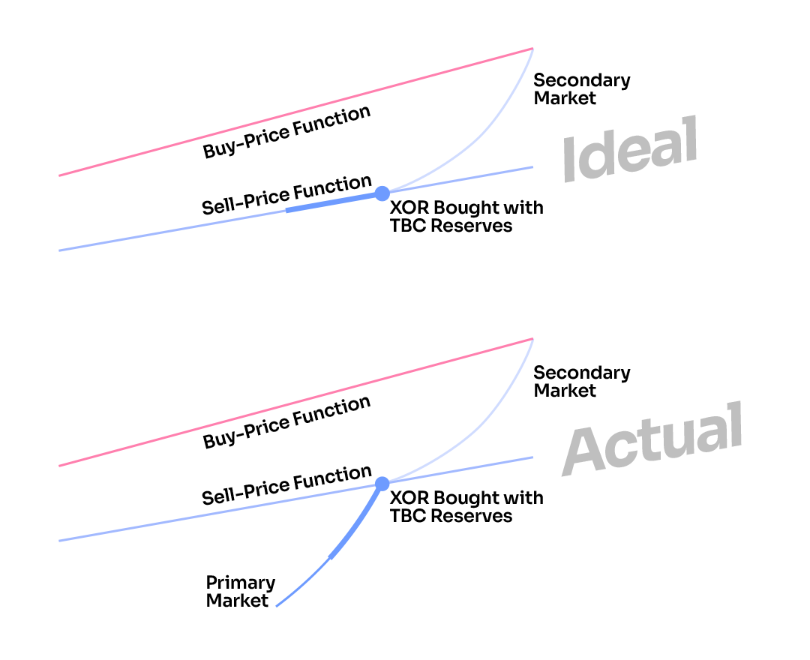

# 代币绑定曲线

代币绑定曲线（TBC）以合理的方式管理代币供应，无需人为干预，从而创建一个避免传统经济的繁荣-衰退问题和许多加密货币的通缩经济的系统。

TBC 是一个智能合约，它接受一个代币作为输入，并输出一个新的代币。这创造了大量可能的变化，推动了一个令人兴奋的研究领域，但在 SORA 中，我们使用了一个简单的模型，其中包含两个线性函数：购买价格函数和销售价格函数。

.png)

简单来说，代币绑定曲线本质上是一个无限流动的、去中心化的中央银行。您可以随时使用特定的储备资产从代币绑定曲线购买新铸造的 XOR 代币，或者将您的 XOR 代币（立即销毁）出售换取其中一种资产。

此外，由于代币绑定曲线的定价函数呈上升趋势，随着代币供应增加，价格也会上涨。请记住，使用代币绑定曲线时，XOR 的价格和供应是相关的，并且会相应地变动。

<figure><figcaption>
Price will increase when supply rises and vice versa
</figcaption></figure>

供应增加时价格会上涨，反之亦然

这个机制的另一个重要含义是，XOR 在二级市场（Polkaswap、Uniswap、CEXs 等）的价格往往受到一定价格范围的限制（在图表中以红色三角形表示）。事实上，如果用户在该范围之外交易 XOR，就会产生套利机会，可以以低于/高于代币绑定曲线价格购买/出售 XOR：从而降低了 XOR 的波动性。

## 为什么代币绑定曲线有用？

- 自主管理代币供应以满足需求（弹性供应）。代币绑定曲线从流通中引入和移除 XOR 以满足市场需求。这确保了代币经济的可持续增长和价格稳定，因为系统可以适应不断变化的需求。
- 深度和即时流动性。绑定曲线合约是交易的对手方，始终持有足够的回购储备（请在下面的“理想和实际情况”段落中阅读更多相关信息）。
- 它减轻了拉高甩货/市场操纵攻击的影响
- XOR 的去中心化货币政策为用户提供了免受当局滥用的保护，并且具备完全透明的特性。
- 一级市场回购储备限制了政府或空头卖方操纵市场的能力。
- SORA v2 货币系统既不以债务为基础，也不以债务驱动，新代币总是在民主监督下分配，这有助于消除当代经济系统中不可持续的繁荣-衰退周期。
- 当前的代币绑定曲线提供的买入/卖出价格为 XOR 在市场上的价格提供了支撑和阻力水平，或者说是价格的信心范围，并提供了前瞻性指导。
- 根据图表，购买函数中购买数量的 20%将为 SORA 网络中的不同玩家保留

.png)

尽管 SORA 经济处于初级阶段，但代币绑定曲线在维持 XOR 的价值储存属性方面起着至关重要的作用。能够设定代币价格波动的信心范围，降低了接受 XOR 作为支付手段的心理障碍。

需要注意的是，代币绑定曲线并不能保证 XOR 的价格稳定，而是提供了一种前瞻性的价格可预测性的衡量方式。

## 理想与现实情景

让我们现在专注于储备，它在 TBC 机制中扮演着至关重要的角色。

在 SORA v2 网络的启动时，将已经存在 350,000 个 XOR。这意味着 SORA 代币的绑定曲线将有一个未融资的负债，价值为 350,000 个 XOR 的 DAI，价值为 350,000 个 XOR 的 ETH，价值为 350,000 个 XOR 的 VAL，以及价值为 350,000 个 XOR 的 PSWAP。这是实际情况。

软启动时，购买价格函数已设定为 900 美元，其方程为 y = mx + b，其中 b:=634 美元，斜率 m:=1/1337。

这种情况的含义是，代币绑定曲线的卖价函数并不比买价函数低 20%（理想情况下应该如此），而是更低。事实上，储备中的流动性很少，你要卖出 XOR 代币的价格可能会比二级市场价格低。

.png)

实际销售价格函数随着储备增加而增加，逐渐接近理想销售价格函数，该函数比购买价格函数低 20%。

在实际和理想情况下，购买价格函数是相同的。

这就是为什么在推出后建立储备是至关重要的，并且在 PSWAP 中有一个特殊的激励计划（占总 PSWAP 供应的 25%），用于购买 TBC 上新铸造的 XOR 的用户。您可以在这里阅读详细信息。

## 实际情况下的销售

考虑到理想储备是一个长期目标，了解在未完全抵押的代币绑定曲线中进行销售的工作方式非常重要。

正如你所看到的，在实际情况下，价格的行为与理想情况下不同，用户会以比理想情况下更低的价格出售他们的代币。然而需要注意的是，当储备增加时，卖出价格函数将越来越接近理想的卖出价格函数，用户将已经具备足够的流动性，可以出售大量代币。你可以在这里看到一个详细的带有数字的卖出示例。

此外，低抵押率出售还会产生额外费用

- 低于 30%抵押：+1%费用
- 低于 20%抵押：+3%费用
- 不足 10%抵押：+6%费用
- 低于 5%的抵押率：+9%的费用

这些额外费用将被消除。

## 代币绑定曲线和平行链拍卖

未来，TBC 将在 Polkadot 和 Kusama 上为 SORA 网络争取一个平行链插槽起到关键作用。

首先，SORA 将通过众贷的方式加入 Kusama 作为一个平行链，正如在这里提到的那样。

这将使 KSM 进入 SORA 网络（以及 Polkaswap），因此用户将能够将 KSM 用作 TBC 中的储备资产，并且 KSM 可以用来确保下一年的插槽。

此外，Parity 还在开发 Polkadot <> Kusama 桥梁。通过这座桥梁，DOT 也将作为储备资产在 SORA 网络中可用。

DOT 和 KSM 代币将作为储备，通过代币绑定曲线用于竞拍 SORA 生态系统的后续平行链插槽。

使用 KSM 和 DOT 购买 XOR 的用户将获得双倍奖励，因为这两种代币对于 SORA 网络至关重要。
