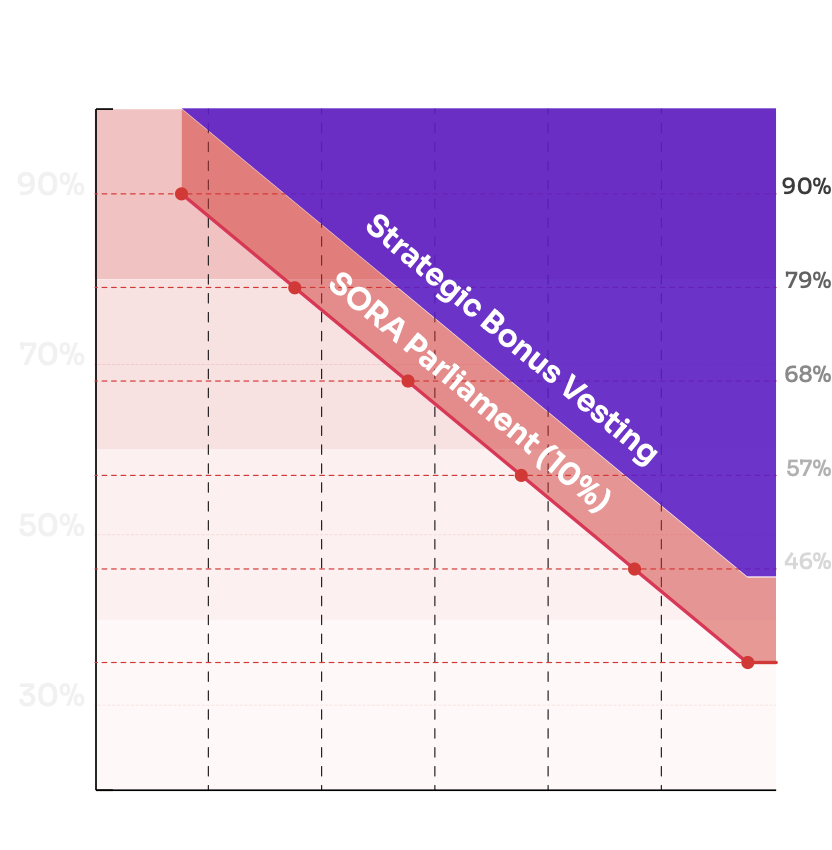

# Account creation

::: tip

We recommend using the SORA testnet for practice exercises. Here are the Testnet links:

1. [Polkaswap test application](https://test.polkaswap.io/)
2. [Polkadot js SORA testnet application](https://polkadot.js.org/apps/?rpc=wss%3A%2F%2Fws.stage.sora2.soramitsu.co.jp#/explorer)
3. [Android testnet application](https://play.google.com/store/apps/details?id=jp.co.soramitsu.sora.communitytesting&hl=en&gl=US)
4. [iOS testnet application](https://testflight.apple.com/join/670hF438)

:::

In the practice exercise, an account should be created in 3 different ways. Whichever way you choose, you'll have the same result after importing an account to other platforms. A beautiful video tutorial:

<iframe width="560" height="315" src="https://www.youtube.com/embed/RdJ6yFFl06k" title="SORA account creation" frameborder="0" allow="accelerometer; autoplay; clipboard-write; encrypted-media; gyroscope; picture-in-picture; web-share" allowfullscreen></iframe>

## Via polkadot.js browser plugin

Use a Chrome or Firefox browser.

Download [https://polkadot.js.org/extension/](https://polkadot.js.org/extension/) browser extension and install

.png>)

Open the extension and confirm that you understand the disclaimer.

.png>)

Create the account. You should click on the `+` button\
\
.png>)

You'll see the mnemonic. **Never share it with anyone** and don't use the same one as the screenshot (_this is just a demonstration, you will be assigned another_). **Keep this passphrase secure because it's the only way to restore your account.**

.png>)

Click the checkbox and move on to the next step.

Enter an account name and password then proceed\
\

.png>)

The new account is now created\
\
.png>)

Now you should change the address format so that it begins with `cn`. Open Settings and select Displayed Address format. It should be SORA Network\
\
.png>)

Great job! Now you have an address with the `cn` prefix\
\
.png>)

## Via polkadot.js apps UI

Open [https://polkadot.js.org/apps/](https://polkadot.js.org/apps/) and then select SORA network. Use this [link](https://polkadot.js.org/apps/?rpc=wss%3A%2F%2Fws.stage.sora2.soramitsu.co.jp#/explorer) for the testnet.

If you've already installed the Polkadot browser plugin, it will request authorization to sync data. You can do it, as it will make account management easier.\
\

.png>)

Open the [Accounts](https://polkadot.js.org/apps/?rpc=wss%3A%2F%2Fws.stage.sora2.soramitsu.co.jp#/accounts) page

If you allow the Polkadot browser plugin to sync, then your accounts will appear in the Polkadot.js app.

(1).png>)

You can create a new account.

Click Add account

(2).png>)

Save the mnemonic phrase, **make sure to keep it safe, and don't share it**. Confirm that you've saved the mnemonic and click Next.

(3).png>)

Enter a name and a password for the account, then click Next.

(1).png>)

After the confirmation click Save.

(4).png>)

Now you have 2 accounts. One was injected from the Polkadot browser plugin and the second one was created in the Polkadot js app.

(2).png>)

## Via SORA mobile application

The SORA mobile application allows users to interact with the SORA network using mobile devices. These are the links to the applications:

* [Android application](https://play.google.com/store/apps/details?id=jp.co.soramitsu.sora) for the **mainnet**
* [iOS application](https://apps.apple.com/us/app/sora-dae/id1457566711) for the **mainnet**

You can use these **testnet** applications to practice:

* [Android testnet application](https://play.google.com/store/apps/details?id=jp.co.soramitsu.sora.communitytesting\&hl=en\&gl=US)
* [iOS testnet application](https://testflight.apple.com/join/670hF438)

When you install the application you'll be able to create an account.

There are two options: **Create account** and **Import account.** For this exercise tap on **Create account.**\
\

.png>)\
\
.png>)

Then enter an account name. It may be any string. Then tap continue.\
\

.png>)

The screen with the passphrase will be shown.

_**Save the passphrase in a secret place or remember it. The passphrase is the only way to recover the account in case of changing the mobile phone, logging out of the application, or other emergency cases.**_

You can confirm the mnemonic or skip the process. Just tap the words at the top of the screen in the right order. The tapped word will be shown on the bottom of the screen.\
\

.png>)

After that, input and confirm a PIN code of your choice. \
\
.png>)

You can also allow the application to use biometry auth. And finally, you'll get access to the wallet.\
\
.png>)

#### Restoring account from mnemonic in different applications

The only way to restore the account in all applications is a mnemonic passphrase. The Polkadot.js browser plugin supports more options, however, the mobile application only supports a mnemonic passphrase. You can use a mnemonic passphrase from the mobile application in order to get access to [polkaswap.io](http://polkaswap.io) or [test.polkaswap.io](http://test.polkaswap.io) and vice-versa.

For example, my passphrase is

`chicken worth gaze device proof frost adjust toe elite obvious rapid club`

You can restore the account in the Polkadot browser plugin. Click on ➕ sign and click on **Import account from pre-existing seed.** Then enter the passphrase and click **Next.**\
\

.png>)\
\
.png>)

Then enter the account name and set up a password and proceed. Great, you've just restored your account!\
\
.png>)

(2).png>)

The process is the same for the mobile application. Open the mobile application and tap on **Import account.** Enter the account name and passphrase.\
\
.png>)\
\
.png>)

Then set up and confirm a PIN code. \
\

After that, you'll get access to the account.\
\
.png>)

#### Converting the address format

As mentioned before, Substrate networks use different address prefixes for generating addresses. However, the key pair is the same. If you create an account, but get the address without the `cn` prefix, then you can convert it using the [Subscan address converter](https://sora.subscan.io/tools/ss58\_transform).

.png>)

Just enter your address and click **Transfer**. You can specify the output type. By default, the Subscan tool will convert the address to all supported network formats.

(1).png>)

