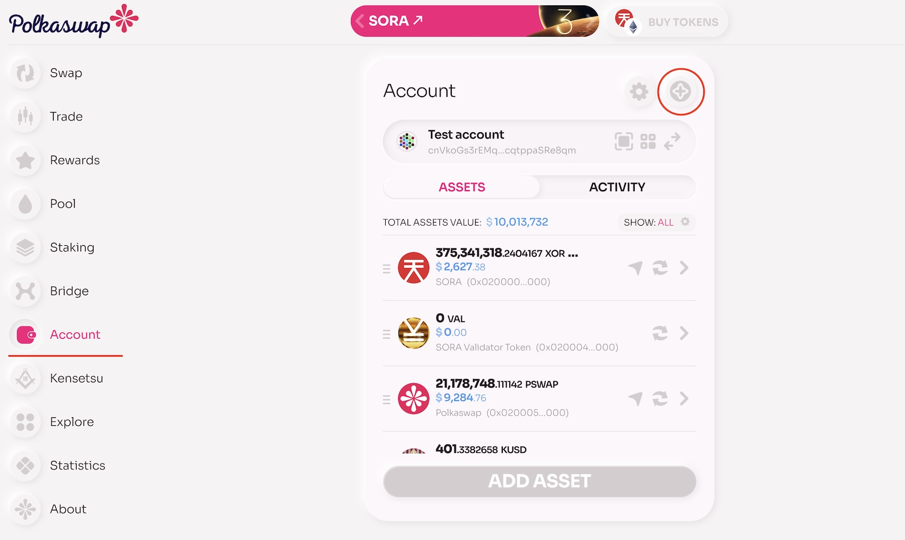
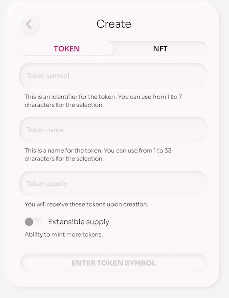
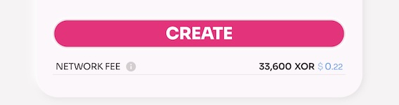
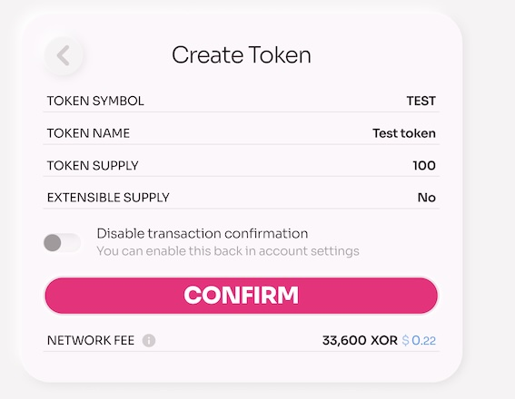
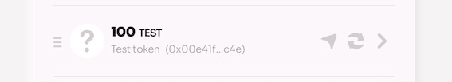
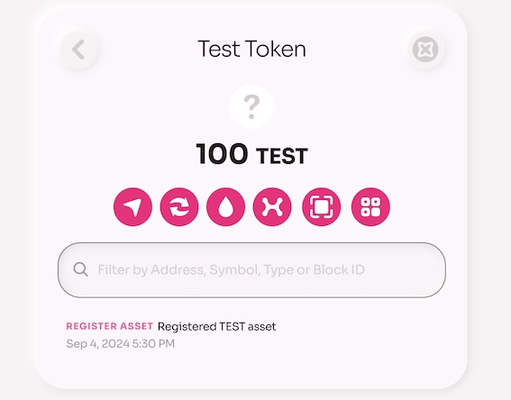

# How to Create a Token on the SORA Network

## TL;DR
- This guide provides a step-by-step process for creating tokens on the SORA network, ensuring a smooth and straightforward experience.
- As a decentralized network, SORA invites everyone to participate in the growth of the new economy, and creating a new token is one of the many ways to get involved.

## Connect Your Wallet

Before creating a new token, you need to connect your crypto wallet with Polkaswap. Please follow the instructions on this page: [Connect Your Wallet to Polkaswap](./polkaswap-connect-wallet.md)

Alternatively, you can create an account and wallet on the SORA network using your Google account. Instructions for this process are available here: [Connect With Google](./polkaswap-connect-with-google.md)

## Create a New Token

Open the Account page from the menu on the right. In the top-right corner of the central panel, find and click the "Create" button, which is represented by a star icon.

A new panel will appear where you can select your token and enter the required information. Fill in the following details:
- `Token Symbol`: A unique identifier for the token, which can be between 1 and 7 characters.
- `Token Name`: The name of the token, which can be between 1 and 33 characters.
- `Token Supply`: The total number of tokens you will receive upon creation.

::: info
 If you want the option to mint more tokens in the future, enable the **Extensible Supply** toggle. Otherwise, leave it turned off.
:::

Below the "Create" button, you will see the Network Fee displayed in XOR, calculated based on the current USD price.

After clicking the "Create" button, a central panel will display a confirmation of your action along with all the information you provided.

The process of creating and minting your new token will begin. Within a few seconds, your token will appear in your portfolio and will have an address on the SORA network.

Open your token to view its details, operation history, and available functions such as send, swap, add liquidity, bridge transfer, and QR code transactions.

Note: Initially, your token might display a question mark instead of an icon, and it may lack additional information. Follow the next steps to address this.

## Next Steps

After creating your new token on the SORA network, you need to add it to Polkaswap. For detailed instructions, please refer to this page: [Whitelist a Token on Polkaswap](./whitelist-token-to-polkaswap.md)

## Learn More

- [Whitelist a Token on Polkaswap](./whitelist-token-to-polkaswap.md)
- [SORA Builders Programme](/sora-builders)
