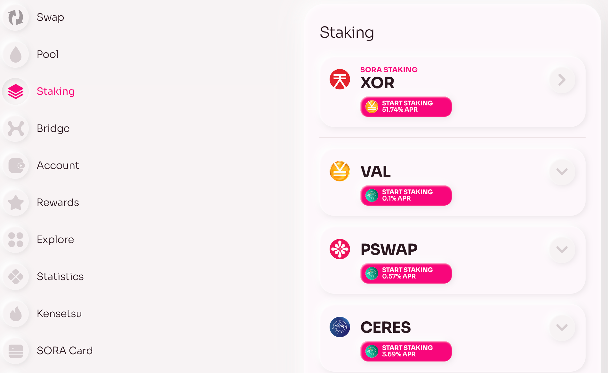

# Staking

## Via Polkaswap

1. Navigate to the ["Staking" page](https://polkaswap.io/#/staking/demeter/) on Polkaswap.

2. Click on the drop-down menu to select the preferred token you would like to stake.
3. Review all the staking details regarding this token, including the APR, total liquidity locked, reward token, and fee.

4. After reviewing the details, click on the "Start staking" button.

5. Enter the amount of tokens you would like to stake or click "MAX" to stake all the available balance of the token.

6. Review your stake amount, APR, and fee.

7. Click "Confirm" and sign the transaction in your wallet extension.

Congrats, you have successfully staked your tokens on Polkaswap!

You can now claim your staking rewards once they become available, remove your stake, or stake more tokens by repeating the above steps.
