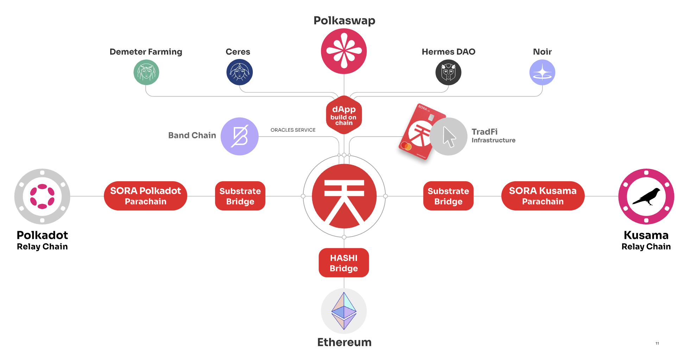

# The SORA Ecosystem

<i>SORA Ecosystem Overview, including parachains and current SORA Builders</i> 

SORA is a community-first network within the Substrate ecosystem. As
of writing, the SORA Kusama parachain is currently active, with the
SORA Polkadot parachain coming soon.
Community members and developers are the key stakeholders of SORA,
therefore feature development is mapped out on the [SORA Integrated Plan](integrated-plan.md), which is open to receive milestone contributions through the RFP
program.

## What You Will Find in This Section

The SORA Integrated Plan as well as its current milestones are hosted
here. You will also find information on
[Polkaswap](https://polkaswap.io/), such as the [Memorandum and
T&C's](polkaswap-terms.md) and the [Polkaswap privacy policy](polkaswap-privacy.md).

Information on the [SORA Synthetics](xst.md) and [SORA Card](sora-card.md) are also available
here. An important part of the SORA ecosystem are the wallets you can
use, in this section you can find information on the [SORA](mobile.md)
and [Fearless](fearless.md)
Wallets.

Finally, in the Request Features section you will find the guide to
contribute to SORA network development, as well as how to submit an
[RFP](rfp.md) with a proposal for new features.
