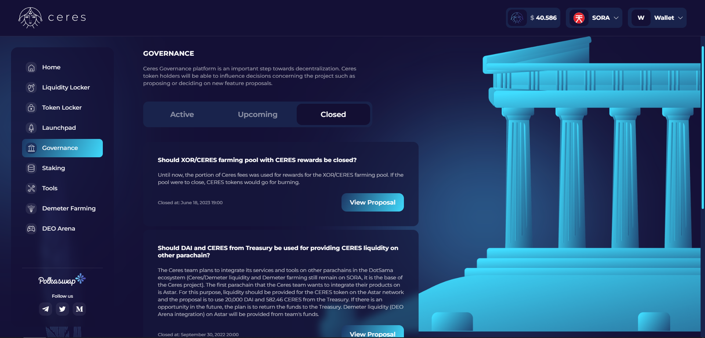

# Plataforma de gobernanza Ceres

La [plataforma Ceres Governance](https://dapps.cerestoken.io/governance) es un paso esencial hacia la descentralización.
Los poseedores de tokens Ceres pueden influir en las decisiones relativas al proyecto, como proponer o implementar nuevas funciones.

