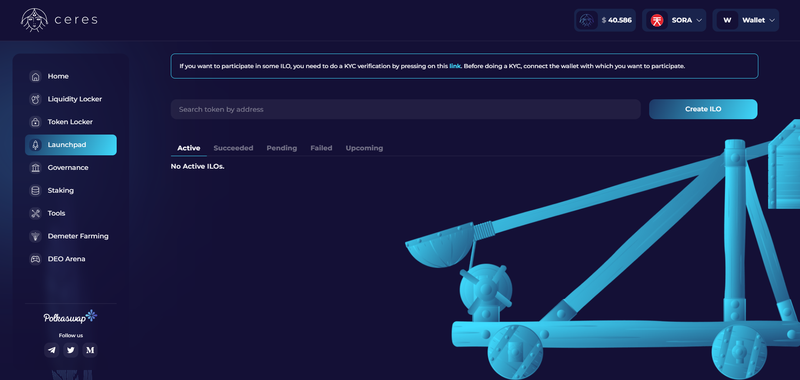

# Plataforma de lanzamiento de Ceres

El [Ceres Launchpad](https://dapps.cerestoken.io/launchpad) es la primera estación para nuevos proyectos en la red SORA.
Con Launchpad, los nuevos proyectos pueden lanzar fácilmente sus tokens en Polkaswap, y los usuarios tienen mayor seguridad y tranquilidad gracias a Ceres Liquidity Locker, que evita los esquemas de bombeo y volcado.
Ceres [Liquidity Locker](liquidity-locker.md) y [Token Locker](token-locker.md) están integrados en Launchpad.

