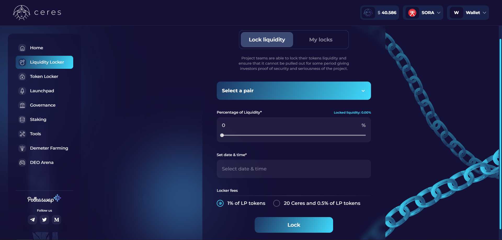

# Casillero de liquidez de Ceres

[Ceres Liquidity Locker](https://dapps.cerestoken.io/liquidity_locker) es una aplicación descentralizada que brinda más transparencia y seguridad a Polkaswap y los ecosistemas SORA y Polkadot.
Los equipos de proyecto pueden bloquear la liquidez de su token y garantizar que no se pueda eliminar/drenar durante un período determinado, brindando a los inversores pruebas de la seguridad y legitimidad del proyecto.

