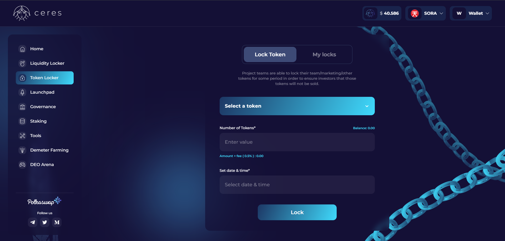

# Casillero de fichas de Ceres

[Ceres Token Locker](https://dapps.cerestoken.io/token_locker) es una aplicación descentralizada que brinda a los equipos de proyecto la capacidad
bloquear su equipo/marketing/otros tokens durante períodos predeterminados para garantizar a los inversores que esos tokens no se venderán.

