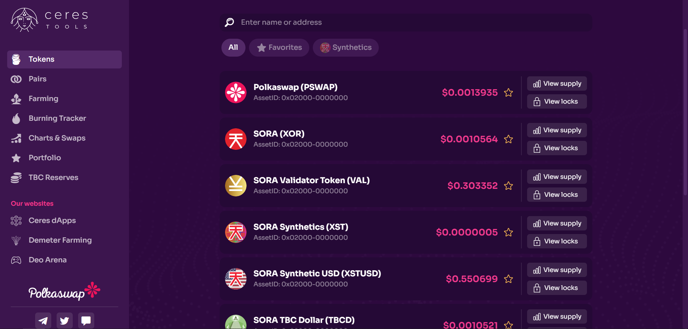
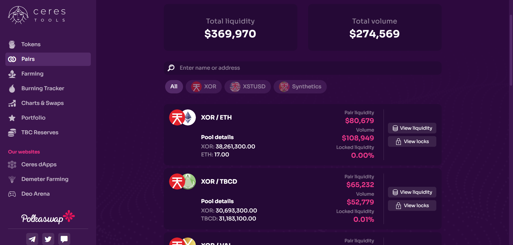
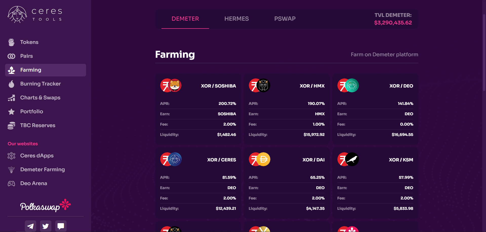
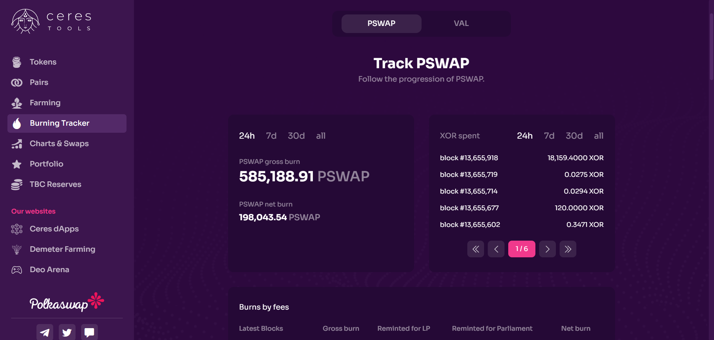
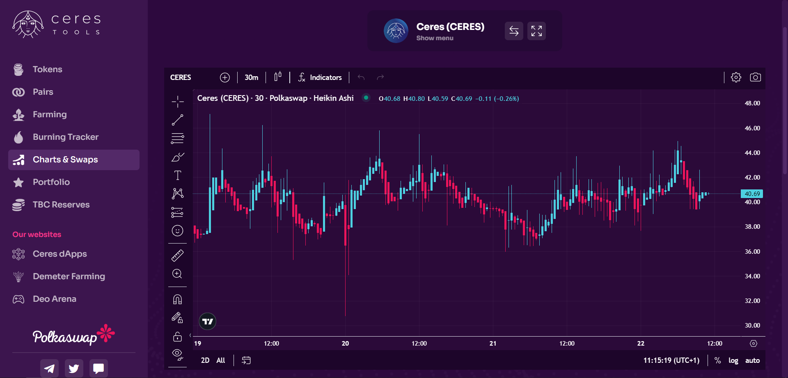
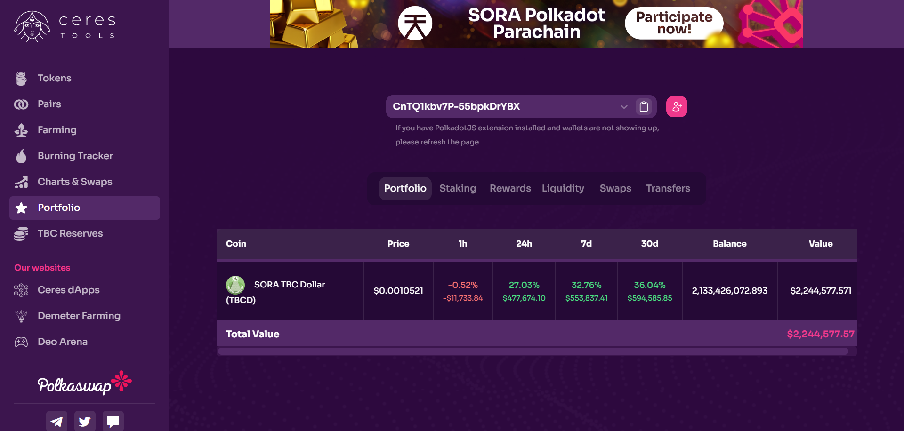
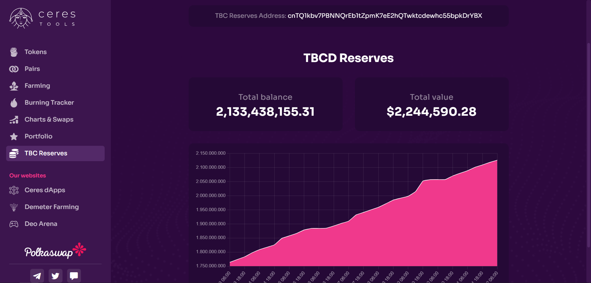

# Herramientas Ceres

[Ceres Tools](https://tools.cerestoken.io) es una plataforma respaldada por la comunidad SORA que muestra datos de Polkaswap DEX.
Los usuarios pueden realizar un seguimiento de los precios de los tokens, pares de liquidez y detalles del pool, billeteras, carteras, swaps, gráficos, volúmenes, etc.
La plataforma también está disponible como aplicación móvil para [Android](https://play.google.com/store/apps/details?id=io.cerestoken.tools) y [iOS](https://apps.apple.com/gb/app/ceres-tools/id1590032285) sistemas operativos.

## Tokens

Los precios de los tokens que figuran en Polkaswap, sus ID de activos, bloqueos de tokens y titulares de tokens se muestran en la sección Tokens.

## Pares

La sección de pares muestra liquidez, volumen de 24 horas y detalles del grupo para cada par comercial como
así como liquidez total, volumen total de 24 horas en Polkaswap y detalles sobre bloqueos de liquidez.
En esta sección, los usuarios también pueden consultar los eventos de liquidez de depósitos/retiros y el historial de cambios de liquidez para cada par.

## Agricultura

La sección de agricultura detalla toda la agricultura y las apuestas en SORA en un solo lugar. Los usuarios pueden consultar la agricultura/replanteo de Demeter, Hermes y PSWAP.

## Rastreador de quemas

En esta sección, los usuarios pueden realizar un seguimiento de la grabación de PSWAP y VAL.

## Gráficos y swaps

En la parte de Gráficos de la sección, los usuarios pueden rastrear el movimiento del precio del token.
listado en Polkaswap, así como realizar un análisis técnico utilizando varios
indicadores. En la parte Swaps de la sección, los usuarios pueden realizar un seguimiento de los swaps.
(compra y venta) por cada token en Ceres Tools.

## Portafolio

La función de cartera permite a los usuarios realizar un seguimiento de las carteras.
tenencias, apuestas, recompensas, liquidez, swaps y transferencias. Los usuarios también pueden
monitorear el movimiento de la cartera en 1h, 24 horas, 7 días y
Intervalos de 30 días.

## Reservas en TBC

Los usuarios pueden realizar un seguimiento de las reservas de SORA TBC (Token Bonding Curve) en esta sección.

