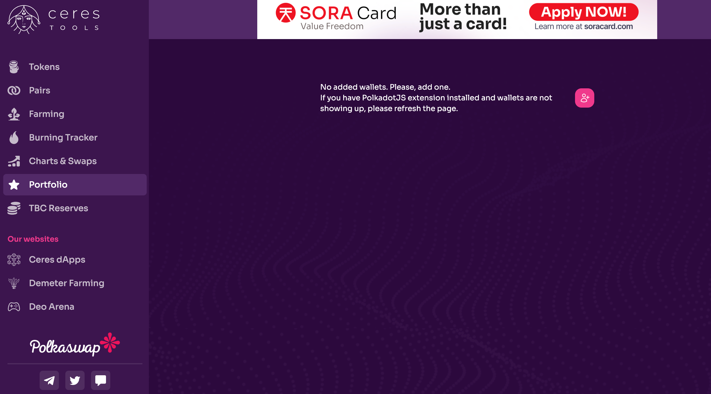

# Consultar Saldos de Usuario

Esta guía te mostrará cómo consultar tus saldos utilizando la
interfaz de Polkadot.js mediante una llamada RPC o a través de la
función de cartera de Ceres Tools.

::: info
Para usuarios nuevos o usuarios sin experiencia en Polkadot.js, se
recomienda utilizar Ceres Tools.
:::

## Vía la Interfaz de Usuario de Polkadot.js

1. Ve a [SORA polkadot.js](https://polkadot.js.org/apps/?rpc=wss%3A%2F%2Fws.sora2.soramitsu.co.jp#/rpc).

2. Haz clic en **Desarrollador** y luego en **Llamadas RPC**

   

3. Selecciona __activos_ → _freeBalance(accountid,assetid)_.

   

4. Completa _AssetID_ y presiona _"Enviar llamada RPC"_.

   ::: info

   Para más IDs de Activos, consulta la [subsección de Tokens de la página de Explorar de Polkaswap.io](https://polkaswap.io/#/explore/tokens). Puedes encontrar los IDs de los tokens principales en la página [Consultar suministro](check-supply.md).
   :::

   

Este es el resultado esperado. En este caso, se ha consultado la cantidad de VAL (observa el AssetID)

Desafortunadamente, Polkadot.js solo admite un activo para la red, por eso muestra XOR. Sin embargo, es realmente el activo que solicitaste: PSWAP, VAL, ETH, DAI, etc.

La letra antes de XOR significa que el número se multiplica por la siguiente cantidad:

| Letra | Multiplicador |
| ----- | ------------- |
| k     | 1000          |
| m     | 1000000       |
| B     | 1000000000    |
| m     | 0.001         |

Entonces, en el ejemplo anterior la cantidad mostrada es 80.434 mXOR = 0.080434 VAL

Para más detalles sobre cómo leer este resultado, [consulta esta guía](check-supply.md#how-to-read-the-results).

## Vía Ceres Tools

1. Ve a Ceres Tools y navega a la [sección de Cartera](https://tools.cerestoken.io/portfolio)

2. Conecta tu billetera y encontrarás información de todos tus
   activos, incluyendo sus saldos.

## Aprender Más

- [Estadísticas de Polkaswap](./statistics-polkaswap.md)
- [Herramientas de Ceres](./ceres/tools.md)
