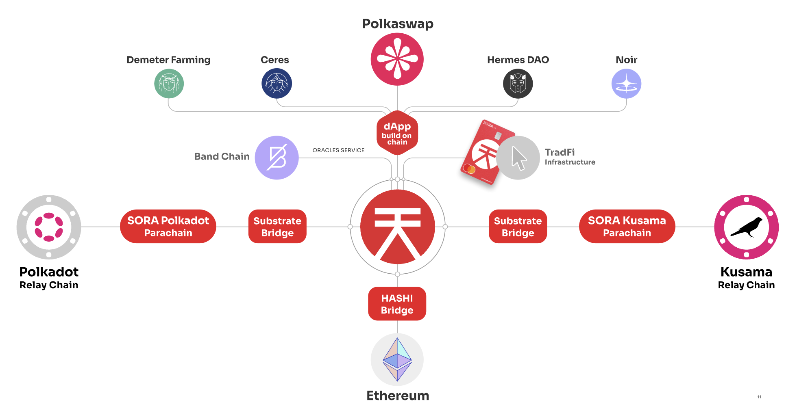

# El Ecosistema SORA

<i>Vista general del Ecosistema SORA, incluyendo parachains y los actuales Constructores SORA</i>

SORA es una red orientada a la comunidad dentro del ecosistema de Substrate. Al momento de escribir, la parachain de SORA en Kusama está actualmente activa, con la parachain de SORA en Polkadot próximamente.
Los miembros de la comunidad y los desarrolladores son los principales interesados de SORA, por lo tanto, el desarrollo de características se planifica en el [Plan Integrado de SORA](integrated-plan.md), que está abierto para recibir contribuciones de hitos a través del programa RFP.

Además del mainnet de SORA, el ecosistema SORA también comprende dos parachains que se conectan a los ecosistemas de Kusama y Polkadot.

- La **parachain de SORA en Kusama** ha asegurado un alquiler en la cadena de relevo de Kusama hasta el **17 de enero de 2025**
- La **parachain de SORA en Polkadot** ha asegurado un alquiler en la cadena de relevo de Polkadot hasta el **20 de noviembre de 2025**

## Lo Que Encontrarás en Esta Sección

El Plan Integrado de SORA, así como sus hitos actuales, se alojan
aquí. También encontrarás información sobre
[Polkaswap](https://polkaswap.io/), como el [Memorando y
T&C's](polkaswap/terms) y la [política de privacidad de Polkaswap](polkaswap/privacy).

Información sobre los [SORA Synthetics](xst.md) y [SORA Card](sora-card.md) también están disponibles
aquí. Una parte importante del ecosistema SORA son las carteras que puedes
usar, en esta sección puedes encontrar información sobre las carteras [SORA](mobile.md)
y [Fearless](fearless.md).

Finalmente, en la sección Solicitar Funciones encontrarás la guía para
contribuir al desarrollo de la red SORA, así como cómo presentar una
[RFP](rfp.md) con una propuesta de nuevas funciones.

## Aprende más

- [Plan Integrado SORA](/integrated-plan)
- [Solicitar funciones en SORA](/rfp)
