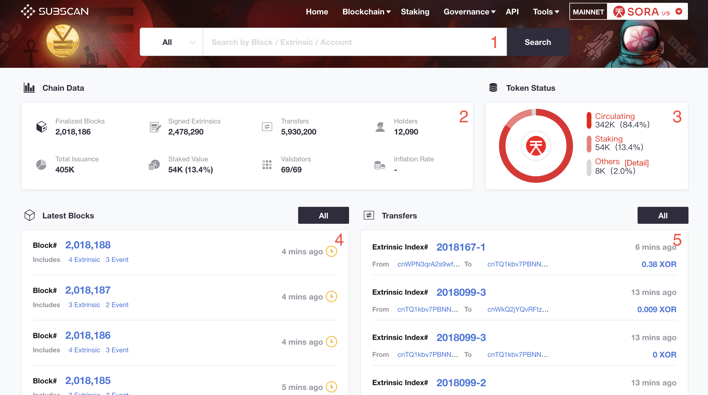
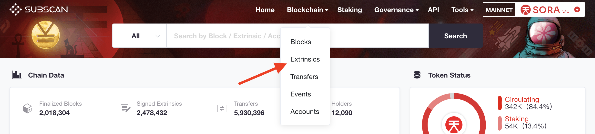
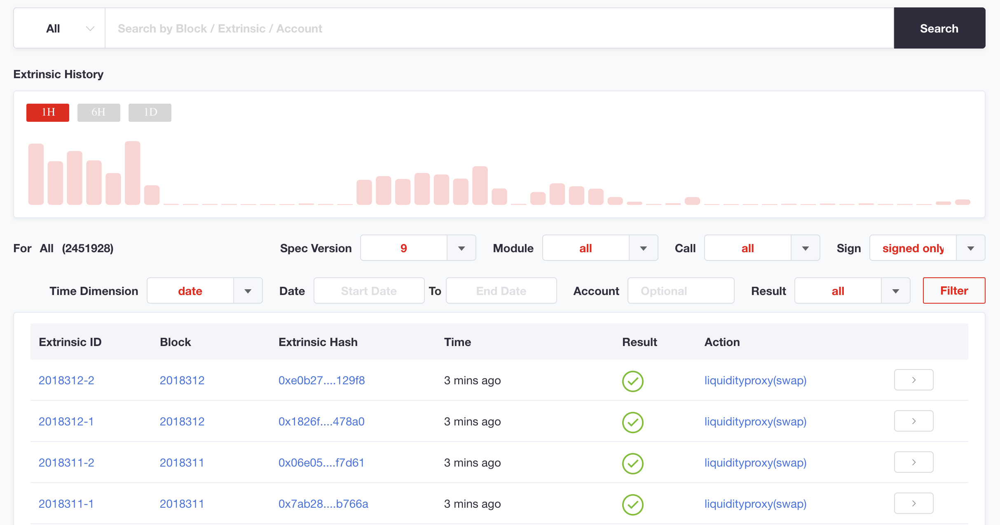

# Exploradores de Bloques

Un **explorador de bloques** es una herramienta que se utiliza para ver todas las transacciones de blockchain en línea. Específicamente, para ver todas las **transacciones** actuales y pasadas en la **blockchain**.

En otras palabras, un explorador de bloques es un navegador de blockchain en línea que revela los datos de bloques y transacciones individuales. Con esta herramienta, podemos monitorear historiales de transacciones y saldos de direcciones.

El mainnet de SORA actualmente implementa el explorador de bloques [Subscan](https://sora.subscan.io/). El explorador de bloques de la red SORA está respaldado por el equipo de Subscan.

Puedes encontrar cualquier información que necesites sobre:

- Detalles del bloque
- Detalles de la transacción
- Eventos de la transacción
- Información de la cuenta

## Práctica

Subscan solo está disponible para el mainnet de SORA. Esto significa que no podrás encontrar transacciones realizadas en el testnet en Subscan.

Abre [Subscan del mainnet](https://sora.subscan.io/):

Aquí verás el panel principal que contiene:

- Caja de búsqueda. Úsala para buscar por cuenta, transacción, id de bloque o número.
- Estadísticas de la red
- Asignación de XOR
- Lista de los últimos bloques
- Lista de las últimas extrínsecas

#### Cómo encontrar una transacción

Si tienes el hash de la transacción o id puedes encontrarla usando la caja de búsqueda. Solo pega el número de la transacción en la caja de búsqueda y haz clic en Buscar.

En la pantalla de Detalles de la Transacción verás toda la información sobre extrínsecas incluyendo parámetros y eventos.

#### Cómo encontrar una cuenta

Si tienes una dirección de cuenta entonces puedes encontrarla usando la caja de búsqueda. Solo pega o introduce la dirección de la cuenta en la caja de búsqueda y haz clic en Buscar.

En la vista de detalles de la cuenta, puedes encontrar información sobre el saldo de XOR, transferencias y transacciones que fueron realizadas por la cuenta.

#### Transacciones

Las transacciones son la parte más importante del explorador de bloques. Puedes encontrar todas las transacciones en Blockchain, luego selecciona Extrínsecas del menú desplegable.

En la página de lista de extrínsecas puedes encontrar el historial de extrínsecas.

Puedes filtrar una extrínseca por fecha o rango de bloques, por cuenta, módulo y llamada. Es muy útil para ver la actividad de una cuenta o el historial de una operación específica.
