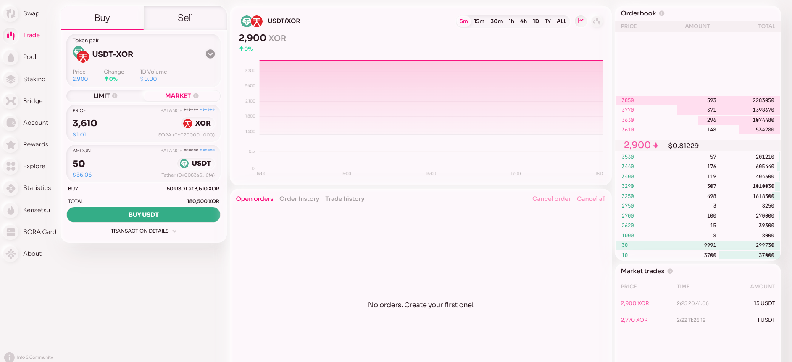
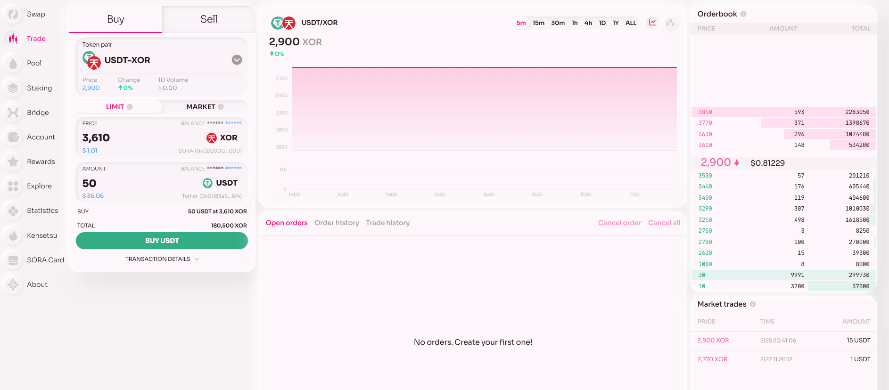
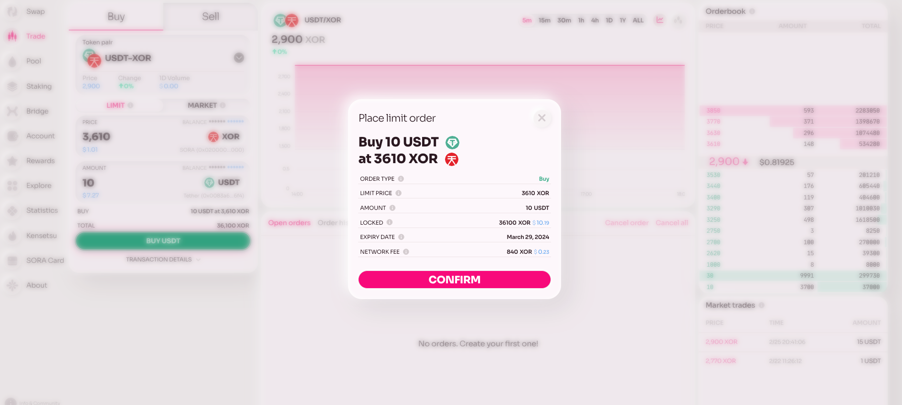

# Polkaswap Trading Avanzado: Libro de Órdenes

## Teoría

Un libro de órdenes es un componente fundamental de un intercambio descentralizado (DEX) que facilita el comercio de activos digitales entre compradores y vendedores de manera transparente y eficiente. Funciona como un meta libro contable virtual que registra todas las órdenes de compra y venta colocadas por los participantes en el mercado.

Este tutorial te guiará a través de los pasos esenciales para comerciar en Polkaswap, enfocándose en conectar tu cartera, comprender la interfaz y ejecutar operaciones. Empecemos.

## Práctica

1. **Conecta Tu Cartera:** Para comenzar a comerciar, conecta tu cartera a Polkaswap. Este es un paso crucial para acceder a tus fondos e iniciar operaciones.

2. **Financia Tu Cartera:** Asegúrate de tener XOR u otra criptomoneda. Necesitarás estos activos para comenzar a comerciar en Polkaswap.

3. **Navega a la Pestaña de Comercio:** Aquí es donde sucede la acción. Haz clic en la pestaña de Comercio para acceder a la interfaz de trading.

### Explora la Interfaz:

Verás varios componentes clave en la interfaz del Libro de Órdenes:

- **El Widget del Libro de Órdenes:** Muestra todas las órdenes agregadas para un par seleccionado.
- **Gráficos:** Muestra representaciones visuales de la actividad comercial.
- **Widgets de Compra y Venta:** Aquí colocarás tus órdenes.
- **Widget de Historial:** Muestra tus actividades comerciales pasadas.
- **Widget de Comercios del Mercado:** Muestra todos los comercios para el par seleccionado.
- **Entendiendo los Gráficos:** El gráfico para el par seleccionado refleja datos relacionados con el comercio del Libro de Órdenes. No agrega liquidez de los swaps.

### Colocando Órdenes:

Elige el par de tokens que deseas comerciar. Hay dos tipos de órdenes:

- **Orden de Mercado:** Se ejecuta al último precio del par, similar a un swap.

- **Orden Límite:** Te permite establecer cualquier precio deseado. Las órdenes se establecen por defecto a un mes y se cancelarán automáticamente después de este período.

1. **Cancelación de Orden:** Puedes cancelar tu orden en cualquier momento sin ninguna tarifa.

2. **Tarifas al Colocar una Orden:** Incurrirás en una tarifa al colocar una orden. La cantidad de la tarifa depende del precio, similar a las tarifas de swap actuales.

   

   

3. **Ejecutando Operaciones desde el Libro de Órdenes:** Si deseas llenar una orden existente, simplemente haz clic en ella. Esta acción prellena el widget de Compra y Venta, permitiéndote ejecutar la operación.

   

¡Eso es todo! Ahora estás listo para comenzar a comerciar en Polkaswap. Recuerda, comerciar implica riesgos, así que entiende el proceso y comercia responsablemente. ¡Feliz trading con Estilo y Libertad

## Aprende más

- [Operaciones de liquidez en Polkaswap](/provide-liquidity-to-xyk-pools-polkaswap)
- [Intercambios en Polkaswap](/swap-polkaswap)