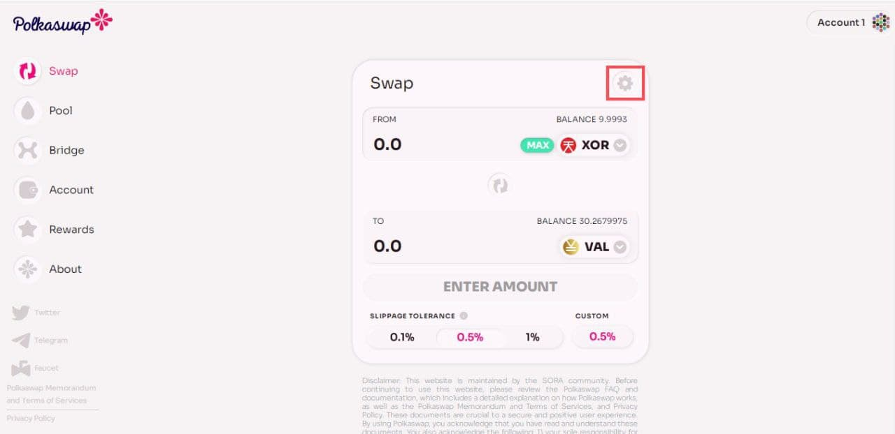

# PREGUNTAS MÁS FRECUENTES

## ¿Cuál es la diferencia entre un intercambio centralizado (CEX) y un intercambio descentralizado (DEX)?

Un intercambio centralizado gestiona políticas de seguridad, datos de intercambio y validación en sus propios servidores internos. Por otro lado, un intercambio descentralizado no tiene intermediarios que manejen sus claves privadas. Todas las operaciones y transacciones se realizan a través de su propia billetera con permiso expreso mediante contratos inteligentes. Lea nuestro artículo que detalla las consideraciones clave al elegir un DEX [aquí](https://medium.com/polkaswap/crypto-exchanges-are-evolving-are-you-82707f240bd7).

## ¿Qué es un fondo común de liquidez?

Un fondo de liquidez es una colección de fondos bloqueados en un contrato inteligente. En Polkaswap, cada par comercial tiene 2 grupos, uno para cada token: los usuarios llamados proveedores de liquidez (LP) agregan un valor igual de dos tokens a un grupo. A cambio de proporcionar fondos, los proveedores de liquidez obtienen tarifas comerciales de las operaciones que se realizan en su grupo, proporcionales a su participación en la liquidez total.

## ¿Quiénes son los proveedores de liquidez?

Los proveedores de liquidez pueden ser cualquiera que pueda suministrar valores iguales de XOR y otro token a un contrato de par de Polkaswap. A cambio, reciben tokens del contrato de intercambio que pueden utilizar para retirar su proporción del fondo de liquidez en cualquier momento. Cada vez que alguien opera en Polkaswap, el comerciante paga una tarifa del 0,3% en XOR que se quema instantáneamente. Una vez al día, un porcentaje del PSWAP quemado se vuelve a acuñar y se distribuye a los proveedores de liquidez. Este porcentaje comienza en el 90% y baja hasta el 35% linealmente en el transcurso de 5 años.

## ¿Cómo funcionan los fondos de liquidez en Polkaswap?

Los fondos de liquidez en Polkaswap funcionan de manera muy similar a otros DEX. Las tarifas se pagan en XOR; se convierten automáticamente en PSWAP y luego se graban. Luego se vuelve a acuñar un porcentaje de la cantidad quemada y se entrega a los proveedores de liquidez. Las recompensas de PSWAP comienzan en el lanzamiento con el 100% de los tokens quemados y llegan al 35% en el transcurso de cinco años.

## ¿En qué se diferencia Polkaswap de otros DEX, como Uniswap?

Polkaswap ha trabajado para resolver algunos de los problemas con los DEX basados en Ethereum. Construido sobre Substrate, Polkaswap ofrece costos de transacción más bajos y transacciones más rápidas. Polkaswap también ofrece intercambios entre las redes Ethereum, Polkadot y Kusama, y se están desarrollando más puentes. Además, con su tecnología de agregación de liquidez, Polkaswap permitirá operaciones con múltiples fuentes de liquidez bajo un algoritmo de agregación de liquidez personalizado. El algoritmo de agregación de liquidez puede agregar liquidez de varias fuentes. Las fuentes de liquidez pueden adoptar la forma de AMM DEX, libros de pedidos o cualquier otro algoritmo. En última instancia, esto ayuda a garantizar que los usuarios encuentren el mejor valor para sus intercambios.

## ¿Cuál es la diferencia entre las funciones SMART y TBC en Polkaswap?

Al hacer clic en Intercambiar en la barra de menú, puede elegir entre las funciones SMART y TBC en Polkaswap, como se muestra en la siguiente imagen.

Usando TBC, su operación se ejecutará en la [curva de vinculación de tokens] (https://wiki.sora.org/token-bonding-curve). La curva de vinculación del token SORA actúa como administrador descentralizado en cadena del token XOR. Funciona tomando activos de reserva y acuñando nuevos XOR, o por el contrario, desmintiendo XOR y liberando activos de reserva. Esta solución a menudo reduce el deslizamiento en grandes operaciones, ya que la curva de vinculación del token aumenta la liquidez del token XOR. Además, existe un incentivo especial cuando un usuario compra XOR recién acuñado en la curva de vinculación de tokens; las recompensas están en PSWAP. Puede leer el artículo completo sobre esta recompensa [aquí](https://medium.com/polkaswap/pswap-rewards-part-2-the-sora-token-bonding-curve-70fab4c3f1b8).

Los precios en la curva de vinculación de tokens y en los pools pueden ser diferentes, en cuyo caso puede utilizar la función SMART para operar al mejor precio posible. Tenga en cuenta que la función SMART no considera las recompensas PSWAP en sus cálculos.

## ¿Cuáles son las tarifas de intercambio?

Por cada operación en Polkaswap se debe pagar una tarifa del 0,3% en XOR. No es necesario mantener XOR para realizar transacciones. Polkaswap puede restar tarifas de la propia operación. Las tarifas se convierten inmediatamente en PSWAP y luego se queman. Después de eso, un cierto porcentaje de las cantidades quemadas se recupera y distribuye a los proveedores de liquidez, al Parlamento y como bonificación estratégica a los usuarios.

Puede obtener más información sobre la recompensa de los proveedores de liquidez [aquí](https://medium.com/polkaswap/introtaining-polkaswap-6f1db4003747) y sobre la concesión de bonificación estratégica en la sección "Recompensas de bonificación PSWAP" de la Wiki.

## ¿Cuándo puedo intercambiar DOT y KSM en Polkaswap?

La red SORA lanzó su [préstamo colectivo] (https://wiki.sora.org/sora-kusama-parachain-crowdloan) en enero de 2022. Una vez que se haya asegurado el espacio, se necesita más tiempo para llevar los tokens KSM y Parachains a Red SORA y Polkaswap.

Parity está desarrollando actualmente un puente Polkadot <> Kusama que llevará el DOT a la red Kusama (incluidos los Parachains).

En última instancia, el objetivo es asegurarse también un puesto en Polkadot. La estrategia es generar reservas tanto de DOT como de KSM utilizando las funcionalidades únicas de la [curva de vinculación de tokens] (https://wiki.sora.org/token-bonding-curve#token-bonding-curve-and-parachain-auctions ).

## ¿Necesito XOR para operar con Polkaswap?

No. Puedes operar en Polkaswap sin tener XOR. Sin embargo, sólo es posible si estás intercambiando **a** XOR. Las tarifas se restarán del importe recibido.

## ¿Existen incentivos para los proveedores de liquidez en Polkaswap?

Sí, existe un programa de incentivos que recompensará a los proveedores de liquidez en Polkaswap durante los próximos 4 años. Se asignan alrededor de 2,5 millones de PSWAP diariamente y, después de un período de adquisición de derechos, los proveedores de liquidez podrán reclamar sus PSWAP. Puede obtener más información [aquí](https://medium.com/polkaswap/pswap-rewards-1-polkaswap-liquidity-reward-farming-3e045d71509)

## ¿Cuáles son los riesgos de proporcionar liquidez a Polkaswap?

El contrato inteligente del protocolo Polkaswap, diseñado con la seguridad como máxima prioridad, ha sido [auditado] (https://sora.org/audit). Sin embargo, no podemos garantizar que no se encuentren errores en el futuro. Haga su propia investigación y tenga siempre cuidado y realice la debida diligencia al operar en Polkaswap. El mayor riesgo al proporcionar liquidez en Polkaswap se conoce como **pérdida impermanente**.

La pérdida impermanente ocurre cuando los precios del token que se depositó en el grupo cambian con respecto al precio al que ingresó. Cuanto mayor sea esta diferencia entre el precio de entrada y el precio actual, mayor exposición estarán los proveedores de liquidez a los riesgos de pérdida no permanente. Veamos un ejemplo de cómo funciona:

Estás proporcionando liquidez al par XOR-DAI. En el momento en que ingresa al grupo, 1 XOR = 100 DAI, por lo que proporciona al grupo 1 XOR y 100 DAI. Polkaswap requiere que los dos activos depositados mantengan una proporción de 1:1. Ahora imagine que el grupo total contiene 10 XOR y 1000 DAI, lo que vale $2000. Esto significa que tiene una participación del 10% del fondo común.

Si el precio de 1 XOR alcanza los 400 DAI, para mantener el equilibrio de una proporción de 1:1, el fondo total se convertiría en 5 XOR y 2000 DAI, de acuerdo con la [_x\*y=k_ fórmula](https: //uniswap.org/docs/v2/protocol-overview/how-uniswap-works/). Si decide retirar fondos durante este tiempo, aún retirará el 10 % del fondo común, ya que esa es su parte, de los cuales se retiran 0,5 XOR y 200 DAI (10 % del fondo común), lo que equivale a $400 (sin incluir las tarifas comerciales). .

Pero si hubiera tenido 1 XOR y 100 DAI en lugar de depositar en un grupo, tendría $500 en activos en lugar de retirar $400. Esto es lo que llamamos pérdida impermanente.

Puede [ver aquí] (https://www.youtube.com/watch?v=8XJ1MSTEuU0) una explicación en vídeo que profundiza más.

Tenga en cuenta que los efectos de las pérdidas no permanentes se mitigan con las tarifas del 0,3% pagadas en cada operación y con el [primer programa estratégico](https://medium.com/polkaswap/pswap-rewards-1-polkaswap-liquidity-reward- agricultura-3e045d71509).

## ¿Cómo puedo ganar tokens PSWAP?

Los fondos de liquidez en Polkaswap funcionan de manera muy similar a otros DEX. Las tarifas se pagan en XOR; se convierten automáticamente en PSWAP y luego se graban. Luego se vuelve a acuñar un porcentaje de la cantidad quemada y se entrega a los proveedores de liquidez.

Hay tres formas principales de ganar PSWAP:

1. La primera forma de ganar tokens PSWAP es ser uno de los proveedores de liquidez en Polkaswap después del lanzamiento. Se asignarán alrededor de 25.000 PSWAP diariamente a proveedores de liquidez en Polkaswap y, después de un período de adquisición de derechos, los usuarios podrán reclamarlos. Para leer el artículo completo sobre el primer programa de incentivos, eche un vistazo [aquí](https://medium.com/polkaswap/pswap-rewards-1-polkaswap-liquidity-reward-farming-3e045d71509).

2. La segunda forma de ganar PSWAP es comprar XOR con ETH, DAI, DOT o KSM de la curva de vinculación de tokens. Comprar XOR con ETH, DAI, DOT o KSM ayudaría a hacer crecer el ecosistema SORA, garantizaría la curva de vinculación y, en el caso de DOT y KSM, ayudaría a SORA a asegurar espacios parachain para las cadenas Polkadot y Kusama respectivamente. Se han asignado 2.500 millones de tokens PSWAP como recompensa para los compradores de XOR.

    Si está interesado en las matemáticas detrás de la curva de vinculación de tokens, lea los detalles [aquí](https://medium.com/polkaswap/pswap-rewards-part-2-the-sora-token-bonding-curve-70fab4c3f1b8 ).

3. La tercera forma de ganar tokens PSWAP es mediante reembolsos de creación de mercado en Polkaswap. Se reservarán 4 millones de PSWAP (200.000 por mes) proporcionalmente para los creadores de mercado que tengan al menos 500.000 transacciones con un promedio de al menos 1 XOR en cada transacción. Puede leer los detalles [aquí](https://medium.com/polkaswap/pswap-rewards-part-3-polkaswap-market-making-rebates-1856f62ccfaa).

## Transferí tokens directamente a un contrato de par (o un contrato de token), ¿hay alguna forma de recuperarlos?

Esos contratos no tienen dueño, por lo que todos los fondos enviados allí se pierden para siempre.

## ¿Polkaswap estará disponible en Fearless Wallet?

Fearless Wallet está diseñado para una integración perfecta con Polkaswap. Fearless Wallet es una aplicación móvil para las redes Kusama y Polkadot, con soporte nativo en plataformas iOS y Android. Obtenga más información [aquí](http://fearlesswallet.io).

**La red SORA consiguió un espacio parachain en la red Kusama el 6 de febrero de 2022.**

No hay más subastas previstas para los próximos meses. Pronto, los tokens KSM estarán disponibles en Polkaswap y los usuarios podrán respaldar futuras subastas usándolos para comprar XOR recién acuñado de la [curva de vinculación de tokens] (https://wiki.sora.org/token-bonding-curve). Al hacerlo, se incrementarán las reservas de la curva de vinculación de tokens, que luego se utilizarán para presentar una oferta en subastas posteriores. Además, existe una recompensa especial en PSWAP al comprar con DOT y KSM, esta recompensa es mayor cuando hay menos reservas, y disminuirá a medida que se acumulen. Puede leer el artículo completo sobre el programa de incentivos [aquí](https://medium.com/polkaswap/pswap-rewards-part-2-the-sora-token-bonding-curve-70fab4c3f1b8).

**Actualización: El contrato de arrendamiento de parachain de SORA Kusama se renovó el 16 de marzo de 2023**

## Aprende más

- [Política de privacidad de Polkaswap](/polkaswap/privacy)
- [Términos y condiciones de Polkaswap](/polkaswap/terms)
