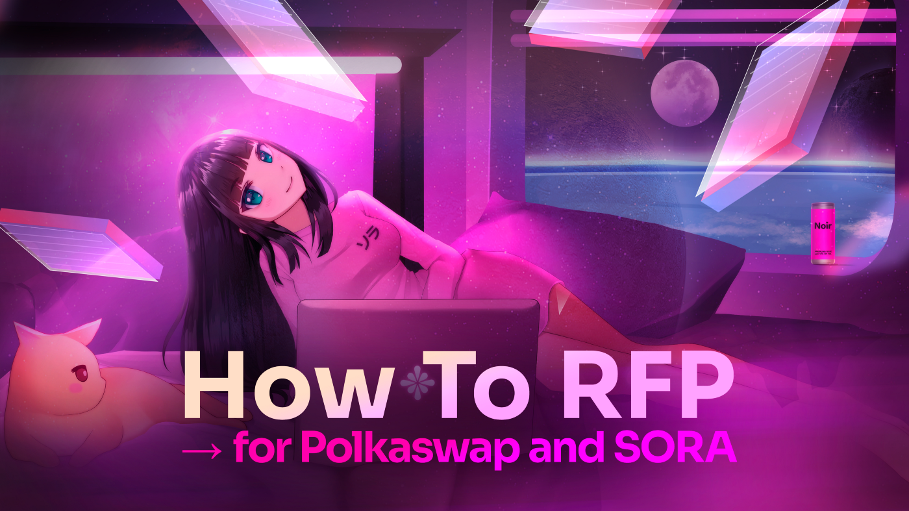
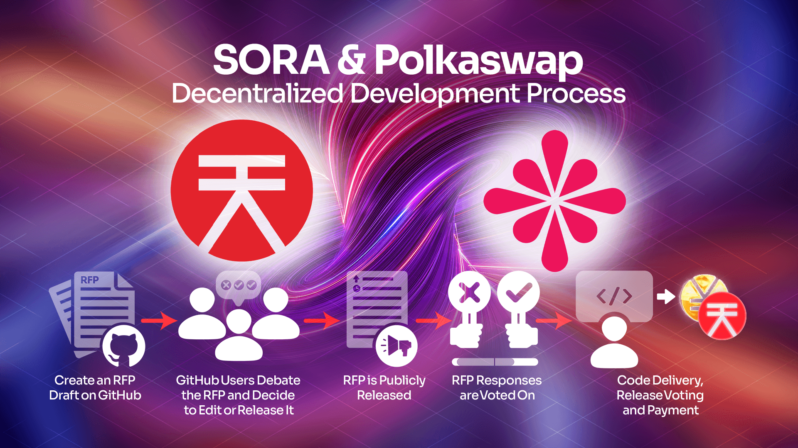
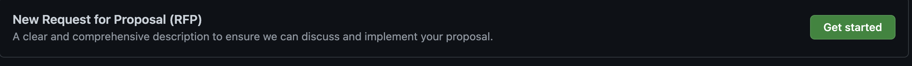
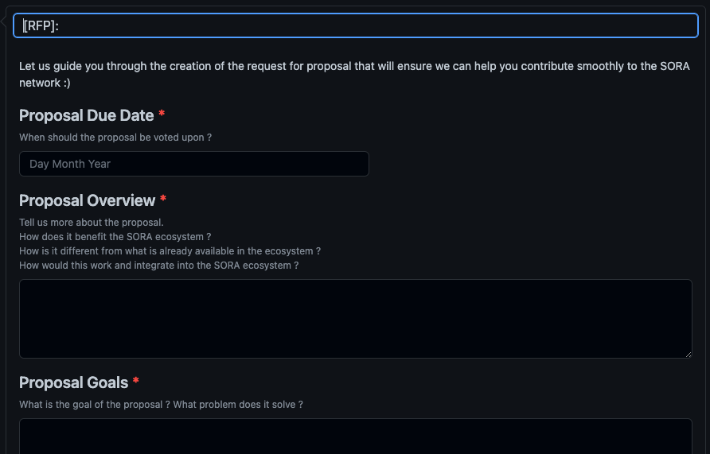
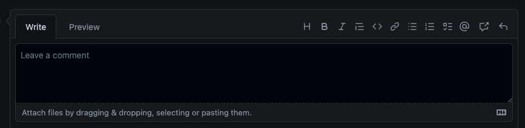
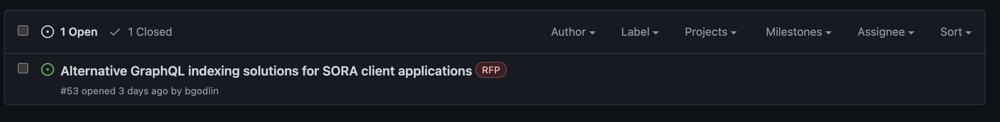

# Cómo RFP, Proponiendo Nuevas Funcionalidades para Polkaswap y la red SORA

### TL;DR

- Al enviar Solicitudes de Propuestas (RFP), los usuarios pueden licitar el desarrollo e implementaciones de funciones que les gustaría tener en Polkaswap y la red SORA
- Debido a que SORA es descentralizada, cualquiera puede participar en el proceso de desarrollo sostenible enviando un RFP para que la comunidad lo vetoe
- El proceso RFP es rápido e inclusivo, incluso para aquellos con poco conocimiento técnico

  

Normalmente, dentro de proyectos centralizados, la comunidad presionaría al equipo de desarrolladores constantemente preguntando cuándo, cuándo, cuándo. Esto a su vez serviría como una guía para dicho equipo para orientar su proceso de desarrollo basado en las necesidades y deseos de la comunidad (alineado con su propia agenda).

En un proyecto completamente descentralizado, la comunidad tiene el privilegio y la responsabilidad de contribuir al desarrollo continuo y la mejora presentando sus propuestas y sometiéndolas a debate comunitario para sopesar las ventajas y beneficios de dichas implementaciones. Como la red SORA y Polkaswap son completamente descentralizadas, todos los miembros de la comunidad pueden enviar su propio RFP para su consideración siguiendo una serie de pasos simples.

## Contribuyendo al Proceso de Desarrollo Descentralizado

A partir de julio de 2021, el Proceso de Desarrollo Descentralizado de SORA y Polkaswap ha estado abierto a presentaciones de la comunidad para proponer, de manera no técnica, cambios que les gustaría ver implementados (si son recogidos y codificados es otro asunto). Hay otro aspecto, sin embargo, equipos de desarrolladores que tienen la experiencia para implementar estos cambios también pueden proponerlos, y si son aprobados, su código podría ser incorporado en una actualización de runtime y también serían recompensados por el trabajo proporcionado.

Todas las RFP deben ser enviadas a [este repositorio de GitHub](https://github.com/sora-xor/rfps) y estarán públicamente disponibles para todos.

El proceso es el mismo para ambos tipos de posibles contribuyentes, vamos a delinear los pasos:

1. El individuo o equipo crea un borrador en GitHub
2. Los usuarios en GitHub debaten la RFP y deciden si implementar cambios, rechazarla o fusionarla en el repositorio.
3. La RFP se anuncia públicamente en GitHub, junto con su respectiva fecha límite y propuestas del equipo de desarrollo.
4. La comunidad SORA vota en cadena si la RFP debe ser implementada, y si es aprobada;
5. El equipo o individuo responsable trabajará en el código según sus propuestas, que luego será lanzado y revisado por usuarios en GitHub, seguido por la implementación en runtime y compensación tras la fusión.

## Tutorial Actualizado de Desarrollo Descentralizado de SORA y Polkaswap

Para aquellos que no tienen experiencia en GitHub, pero consideran que su presentación (no spam) podría ser valiosa, aquí hay una guía rápida para comenzar:

**Los requisitos de formato de RFP delineados dentro de la guía se aplican a todos los contribuyentes.**

- Para hacer el proceso más fácil y accesible, ahora las RFP se enviarán como [problemas de GitHub](https://docs.github.com/en/issues/tracking-your-work-with-issues/about-issues)
- La plantilla de problema tiene los mismos campos que la RFP, por lo que el contenido no cambia
- Una vez que estos problemas hayan sido discutidos y alcanzado consenso, se convertirán en propuestas

Durante las [Actualizaciones del Ecosistema del 24 de agosto](https://medium.com/sora-xor/august-24-2022-ecosystem-updates-for-sora-polkaswap-and-fearless-wallet-3bc949142e17), mencionamos que el proceso RFP estaba recibiendo una revisión que lo haría más fácil e intuitivo para los usuarios enviar sus propuestas, así como para los desarrolladores trabajar en ellas y para la comunidad proporcionar opiniones y retroalimentación sobre estas propuestas. Como las actualizaciones del ecosistema están cambiando constantemente, aquí está el anuncio y la guía para que sigas.

### Actualización del Proceso RFP

Las actualizaciones del Programa de Desarrollo Descentralizado han estado tranquilas recientemente, tanto en términos de presentaciones de la comunidad como de mejora y optimización del programa y estamos felices de anunciar que se ha trabajado mucho detrás de escena para mejorar y facilitar la experiencia para la comunidad que envía sus propuestas, y los desarrolladores que trabajan en ellas y las implementan.

Como el [Plan Integrado de SORA](https://sora.org/plan) fue lanzado recientemente, pensamos que una forma de hacer la experiencia de usar GitHub menos *[mística](https://www.youtube.com/watch?v=Z0lufcRgZlA&list=RDZ0lufcRgZlA&index=1)* y más en sintonía con sistemas de envío de mejoras con los que los usuarios están más cómodos, por lo tanto, hemos implementado RFP como problemas.

Esto significa que en lugar de abrir un PR, ahora puedes [enviar un problema](https://github.com/sora-xor/rfps/issues) que tiene los mismos campos que los necesarios para enviar una RFP. ¿Quién no ha abierto una solicitud de queja o enviado un ticket a un portal de servicio al cliente? *OK, concedido hay personas que no lo han hecho,* también hay muchas personas que sí lo han hecho, ciertamente más que el número de personas que han bifurcado un repositorio y enviado una solicitud de extracción.

## Guía RFP

Esperamos que esto suene interesante y para motivarte aún más a enviar una solicitud o comentar sobre una, aquí hay una guía rápida sobre cómo hacerlo;

1. Navega a [https://github.com/sora-xor/rfps/issues](https://github.com/sora-xor/rfps/issues)

2. Comienza un **Nuevo problema**, luego pulsa **Empezar**.

3. Llena todos los campos como lo harías al enviar una RFP, cada
   campo ahora tendrá pistas sobre qué agregar, en caso de que te atascas en
   cualquier paso.

4. Una vez que hayas terminado de llenar los campos, pulsa **Enviar nuevo problema** y luego mantente atento a cualquier comentario o preocupación que pueda surgir.

5. Como miembro de la comunidad que está observando atentamente las propuestas
   que se están haciendo y está interesado en el desarrollo y
   mejora de la red, puedes proporcionar tu retroalimentación, hacer preguntas y dejar
   comentarios directamente bajo el problema.

En cuanto a los desarrolladores involucrados, tendrán la opción de cerrar el problema una vez que lo hayan abordado e incluido, de lo contrario, la opción de rechazar la propuesta si está fuera del alcance del desarrollo o no es aceptada por la comunidad.

## Próximos Pasos

Después de crear una RFP usando este nuevo proceso, puedes seguir su
progreso en la sección de problemas, donde otros usuarios y desarrolladores
podrán discutir implementaciones y progresos cómoda y
fácilmente, así como marcar la propuesta como completa una vez que se haya
trabajado en ella con éxito.

Esperamos que esto te motive a agregar tus propuestas de desarrollo y esperamos con interés todas las ideas interesantes que tú, como miembro valioso de la comunidad y parte importante de este proyecto, presentes en el mejor interés de la red y sus usuarios.

Continuaremos afinando este proceso y actualizando la guía de Desarrollo Descentralizado de SORA. ¡Por favor, comparte tus pensamientos sobre estas mejoras en los chats de la comunidad de la red SORA en Telegram!

## Aprender Más

- [Plan Integrado de SORA](/integrated-plan)
- [Programa de Constructores de SORA](/sora-builders)
