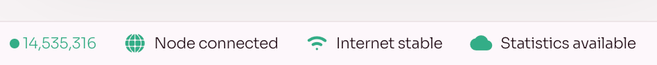

Es realmente fácil cambiar entre diferentes nodos. Puede cambiar de nodo en el pie de página de estado en la parte inferior de la pantalla.

1. Haga clic en el estado Nodo conectado:

    

    Luego verá el nodo al que está conectado.

2. Haga clic en Seleccionar nodo de red para cambiar el nodo:

    

    ::: info
    Si desea agregar su propio nodo, cree una solicitud de extracción en el [repositorio de Polkaswap GitHub] (https://github.com/sora-xor/polkaswap-exchange-web).
    :::

    - Si desea cambiar los nodos a uno de los predefinidos, simplemente haga clic en el botón de opción cerca del nodo con el que desea trabajar. A continuación se comprobará la conexión con el nodo. Si todo está bien, se cambiará el nodo.

        

    - Si desea utilizar un nodo personalizado, haga clic en el botón **Agregar nodo personalizado**. Ingrese un nombre de nodo (_el nombre que desee_) y una dirección, luego haga clic en **Agregar nodo personalizado**:

        

#### Error de red incorrecto

Si intenta agregar un nodo de una red diferente, obtendrá un error. En el siguiente ejemplo, intentamos agregar un nodo Mainnet en [Testnet] (https://test.polkaswap.io/#/swap). **La aplicación verifica el hash del bloque génesis antes de cambiar al nodo.**

