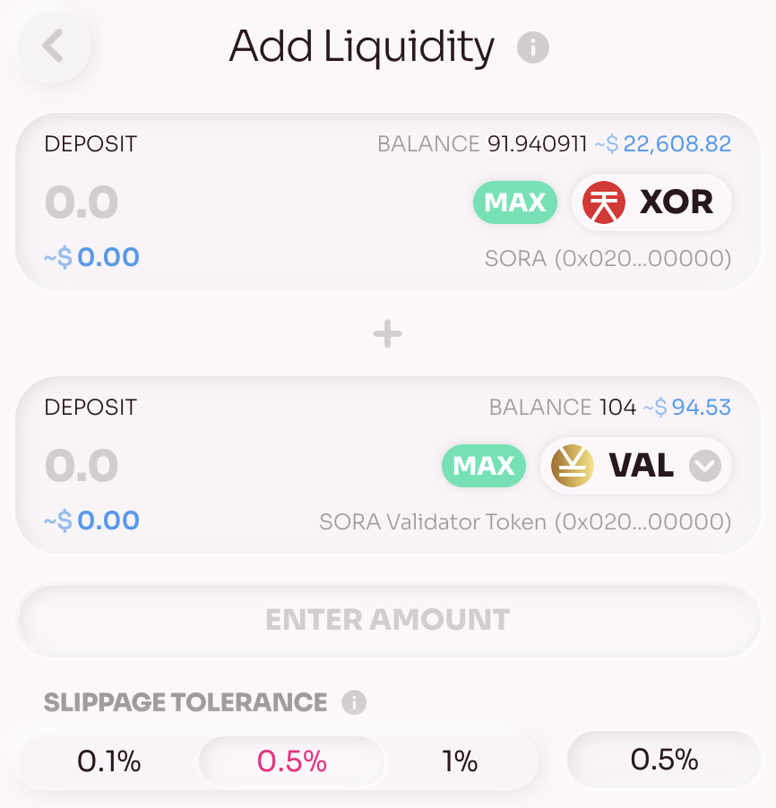
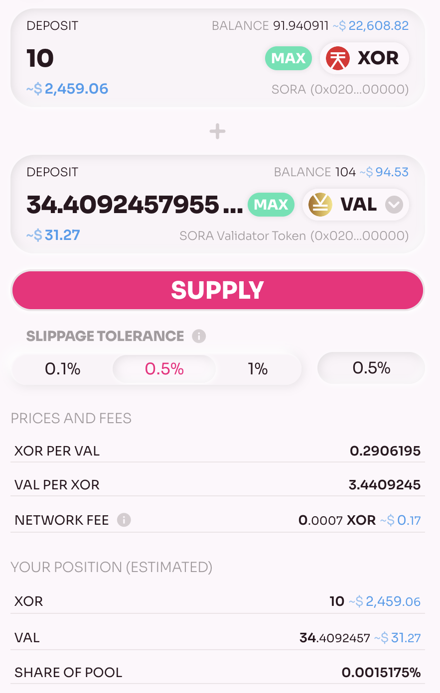
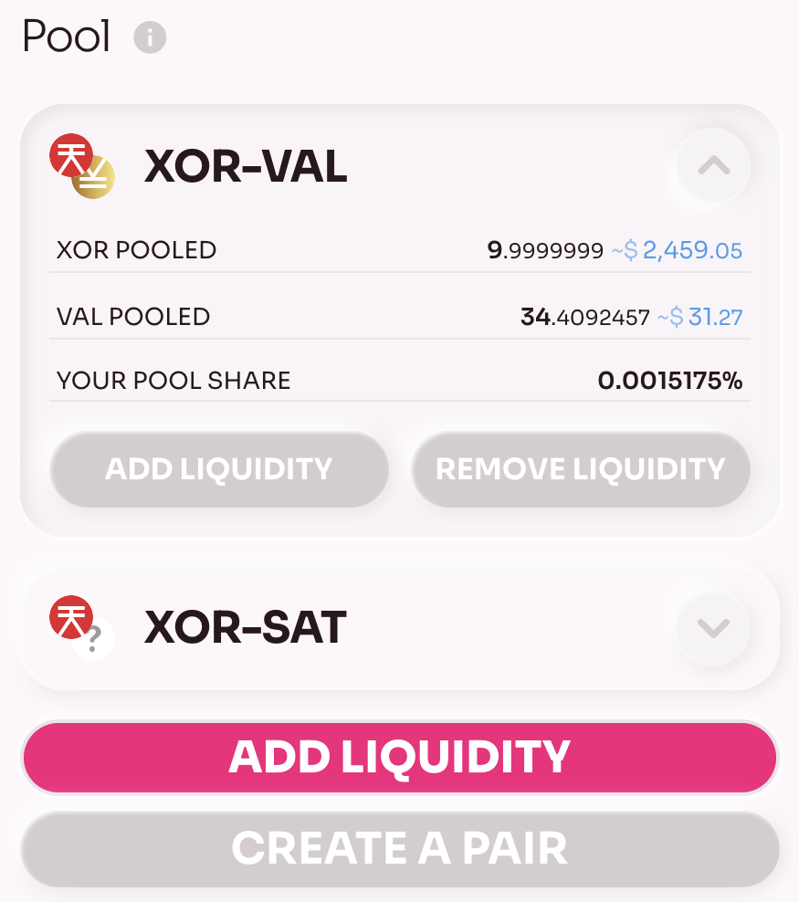

Hay dos opciones donde puedes agregar liquidez:

1. Si ya tiene una participación en un grupo específico, puede hacer clic en **Agregar liquidez** en los detalles del grupo.
2. Si desea proporcionar liquidez a un grupo en el que no tiene una acción, haga clic en **Agregar liquidez** en la página Grupo.

Los siguientes pasos son prácticamente los mismos. Si selecciona el grupo donde ya tiene una acción, entonces el par de tokens será preseleccionado; de lo contrario, deberá seleccionar los tokens usted mismo.

1. Seleccione el par de tokens.

    

2. Ingrese la cantidad del activo de origen o del activo de destino.

    ::: info
    Si ingresa el monto de un activo de origen, el monto del activo de destino se calculará de acuerdo con las matemáticas del grupo. Si ingresa la cantidad del activo de destino, la cantidad del activo de origen también se calculará de acuerdo con las matemáticas del grupo.
    :::

    

    Describamos los parámetros:

    - **XOR por VAL** es el precio de XOR en tokens VAL si un usuario comerciará utilizando este grupo
    - **VAL por XOR** es el precio de VAL en tokens XOR si un usuario comerciará utilizando este grupo
    - **Tarifa de red** - la tarifa por procesar la transacción
    - **Participación del fondo**: el porcentaje de tus tokens en el fondo

3. Si todo está bien, confirma y firma la transacción.

    

Ahora puedes ver tu parte del grupo en la página del grupo.

