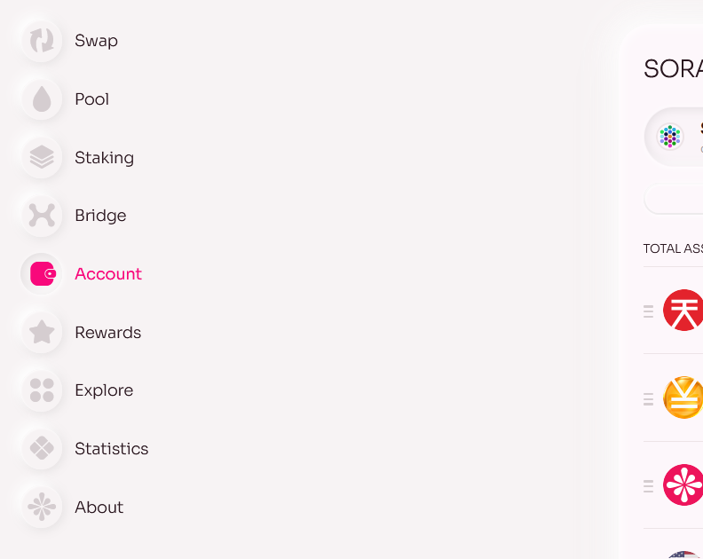
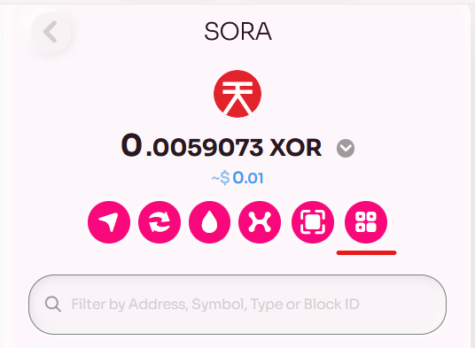
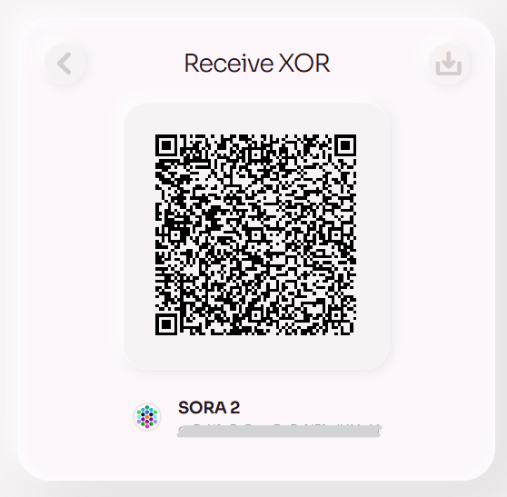

1. Vaya a la [pestaña Cuenta] (https://polkaswap.io/#/wallet) en Polkaswap.

2. Elija el activo que desea recibir y haga clic en el botón "Recibir".

3. Seleccione el activo que le gustaría recibir. Serás redirigido a una página con la dirección de tu billetera en formato de texto y código QR.

5. Copie la dirección de su billetera o comparta el código QR con el remitente.
6. Luego, el remitente puede usar la dirección de su billetera o escanear el código QR para enviarle el activo deseado.
