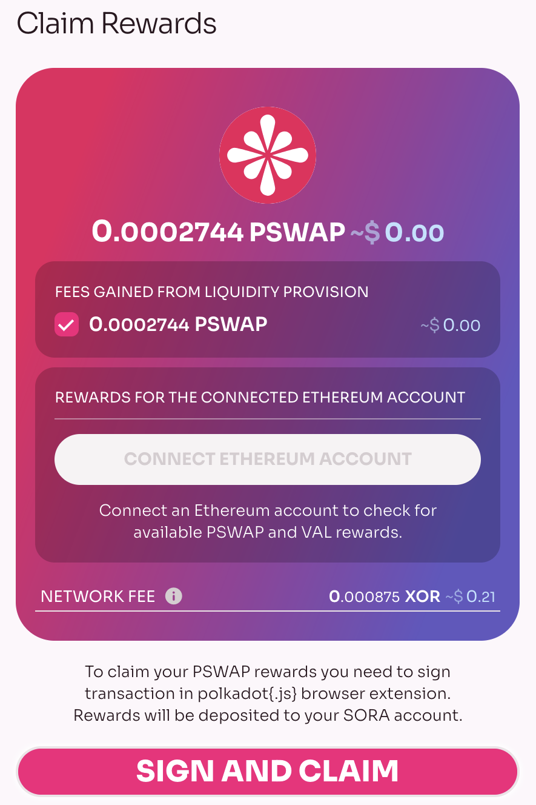
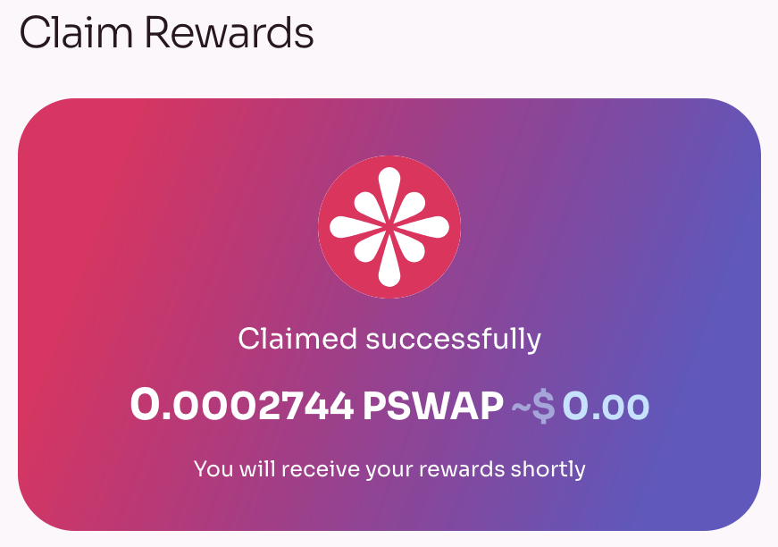
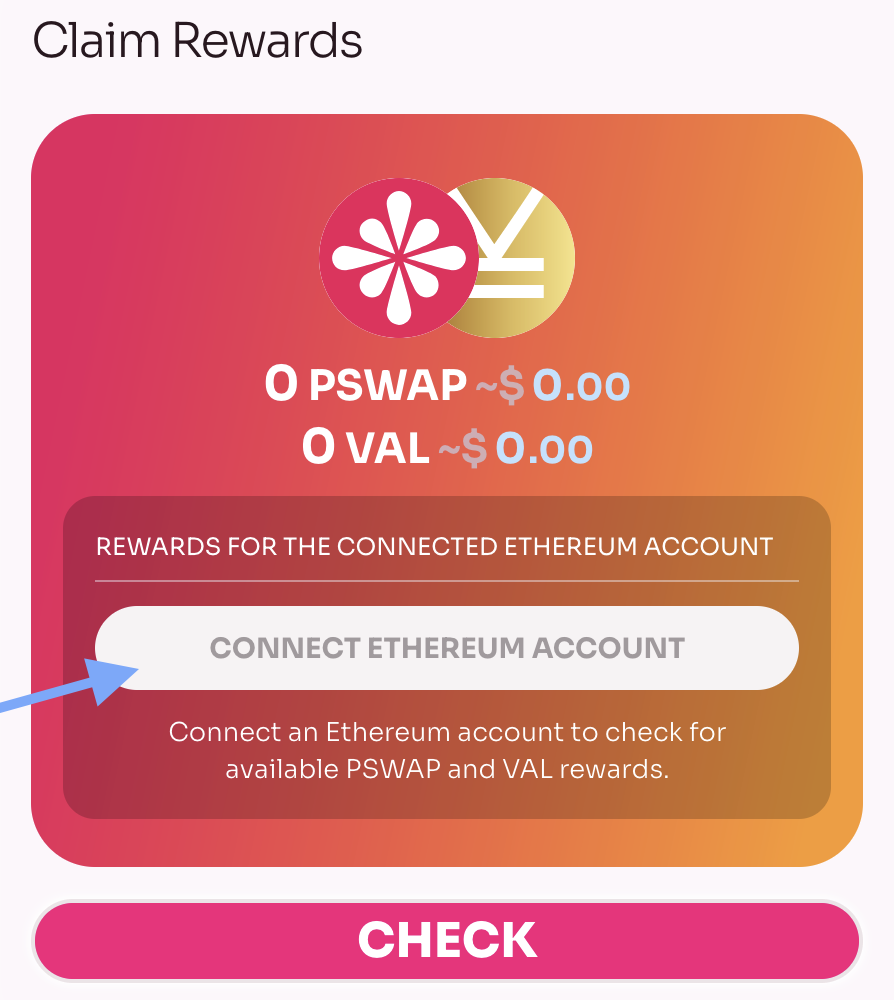

Puede reclamar **Recompensas para creadores de mercado**, **Tarifas de LP**, **Recompensas de bonificación de agricultura de LP** y **Recompensas por comprar en TBC** usando [Polkaswap.io](http://polkaswap .io) con su cuenta SORA. Simplemente abre la sección **Recompensas**.

Si tiene alguna recompensa, se mostrará con el motivo por el cual la recibe. Seleccione las recompensas que desea reclamar (_puede haber más de una_), confirme y luego firme la transacción.

#### Reclamando VAL para titulares de XOR erc-20

Si desea reclamar VAL adquirido, porque tenía XOR erc-20 cuando se realizó la instantánea, entonces debe conectar la cuenta de Ethereum donde tenía los tokens XOR erc-20. Utilice el complemento del navegador [Metamask](https://metamask.io/download.html) para hacer esto y luego haga clic en **Conectar cuenta Ethereum.**

Si hay tokens PSWAP o VAL disponibles, podrás reclamarlos.
