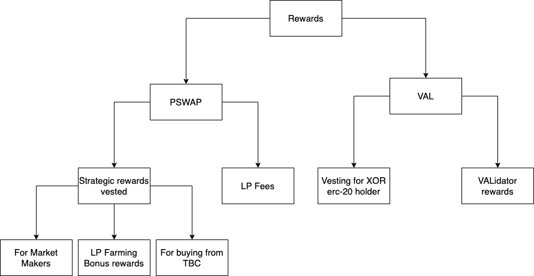
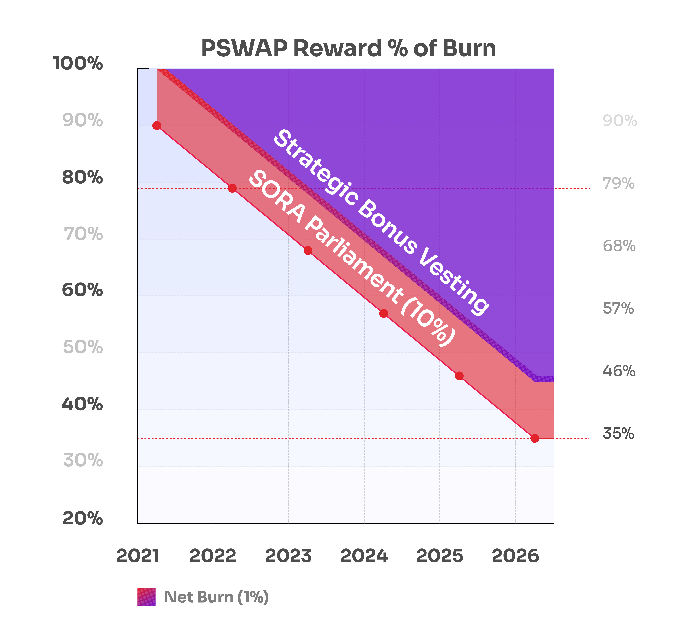

Se incentiva a los usuarios a proporcionar liquidez, utilizar la red SORA y respaldar el conjunto de validadores de la red. Existen diferentes tipos de recompensa según la actividad.

Describamos en detalle todas las recompensas disponibles actualmente:

- Recompensas para **Creadores de Mercado** (Inactivos)
- LP **Recompensas de bonificación agrícola**
- Recompensas por **comprar en TBC**
- **Tarifas LP**
- **VAL de adquisición de derechos** para soportes XOR erc-20
- **Recompensas del VALidador**

Aquí hay un resumen rápido de cada recompensa.

#### Recompensas para creadores de mercado (inactivo)

Polkaswap distribuía una cantidad de PSWAP proporcional al volumen comercial a los creadores de mercado que realizaban al menos 500 transacciones por mes, con un monto por transacción de 1 XOR o más (_excluyendo los costos de transacción_).

#### Recompensas de bonificación agrícola de LP

Los usuarios de Polkaswap obtendrán tokens PSWAP por proporcionar liquidez en cualquier grupo emparejado XOR.
Si contribuye a los grupos XOR-VAL, XOR-PSWAP, XOR-DAI, XOR-ETH o XOR-DOT, su recompensa se duplica.

#### Recompensas por comprar en TBC

Una curva de vinculación de tokens es un contrato inteligente que toma un token como entrada y genera otro, utilizando una fórmula matemática. Una curva de vinculación de tokens puede emitir, vender y comprar tokens automáticamente a precios determinados por las funciones matemáticas utilizadas.

Las recompensas PSWAP que se pueden ganar se calculan exponencialmente en función de las reservas actuales: cuanto más bajas sean las reservas en un momento dado, mayores serán las recompensas por ayudar a impulsarlas.

#### Tarifas de LP

La primera forma de ganar recompensas PSWAP en Polkaswap es proporcionar liquidez en DEX con XOR y cualquier otro token. Los proveedores de liquidez obtienen el 0,3% de cada swap en tarifas para que ganen PSWAP por proporcionar liquidez al grupo. Entonces, cuantos más usuarios operen, más liquidez obtendrán los proveedores.

#### Adquisición de VAL para soportes XOR erc-20

Antes del lanzamiento de SORA, se tomó una instantánea del soporte XOR erc-20. El número de bloque de la instantánea en la red Ethereum es 12225000. Cada titular de XOR de esta instantánea recibirá tokens VAL a través de la concesión.

El VAL se otorga por día a cada XOR de la instantánea, de una porción restante del VAL que se quema todos los días (_cantidad quemada -10% - recompensa diaria del validador %_).

**Concesión de PSWAP para creadores de mercado, proveedores de LP y compradores de TBC**

**Las recompensas no se pueden reclamar al instante.** La velocidad de adquisición de derechos depende de la cantidad de PSWAP quemado de las tarifas de uso de Polkaswap. Los PSWAP tienen **Adquisición de bonificación estratégica**, donde el monto adquirido es un porcentaje del monto diario de PSWAP quemado en tarifas de transacción, como se muestra en la siguiente figura.

Como puede ver, en el lanzamiento, el porcentaje de PSWAP quemado que se asigna como bonificación estratégica es del 0% y aumenta linealmente en 5 años hasta el 55%, y luego se mantendrá constante. El otro PSWAP quemado está reservado para el Parlamento SORA (10%) y como recompensa para los proveedores de liquidez. Esta recompensa es similar a la que se obtiene al proporcionar liquidez en Uniswap, es decir, el 0,3% en cada operación.

<figure><figcaption></figcaption></figure>

Un ejemplo que puede ser útil para aclarar:

_Supongamos que actualmente, cuando se queman 100 PSWAP, se acuñan 81 PSWAP para recompensar a los proveedores de liquidez, luego, se acuñan 10 PSWAP para el Parlamento y se acuñan 9 PSWAP como recompensa adicional. Eso significa que 3 PSWAP (33%) están reservados como recompensa estratégica para los proveedores de liquidez, 3 PSWAP (33%) están reservados para compradores de TBC y 3 PSWAP (33%) están reservados para los creadores de mercado. Cada usuario recibirá recompensas proporcionales al monto de su adquisición._

Una consecuencia importante de este diseño es que garantiza que un suministro repentino de tokens no inundará inmediatamente el mercado y brinda una orientación clara sobre el suministro de tokens en circulación, que se espera que permanezca constante.

#### Recompensas del VALidador

Los usuarios pueden apostar con validadores SORA para obtener recompensas VAL. O pueden ejecutar su propio nodo de validación.

Las recompensas de VALidator deben reclamarse mediante la interfaz de usuario de las aplicaciones Polkadot js.

Artículos relacionados:

- [Recompensas Polkaswap] (https://medium.com/polkaswap/pswap-rules-everything-around-me-tres-pathways-to-polkaswap-rewards-63842caf88c0)
- [Recompensas del VALidator SORA](https://medium.com/sora-xor/sora-validator-rewards-419320e22df8?source=search_popover-------------------- -----------------)
- [Cómo nominar Validadores (apuesta tu XOR)](https://wiki.sora.org/guides/how-to-nominate-validators-stake-your-xor)
- [Cómo ejecutar un nodo SORA Testnet](https://medium.com/sora-xor/how-to-run-a-sora-testnet-node-a4d42a9de1af)
- [Cómo reclamar recompensas de nominadores y validadores](https://wiki.sora.org/guides/how-to-claim-s Taking-rewards)
- [Implementación de SORA v2](https://medium.com/sora-xor/sora-v2-implementation-1febd3260b87)