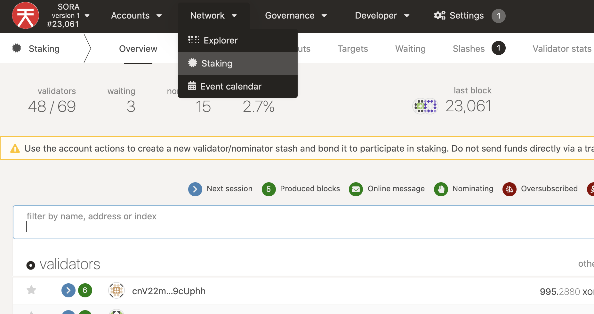
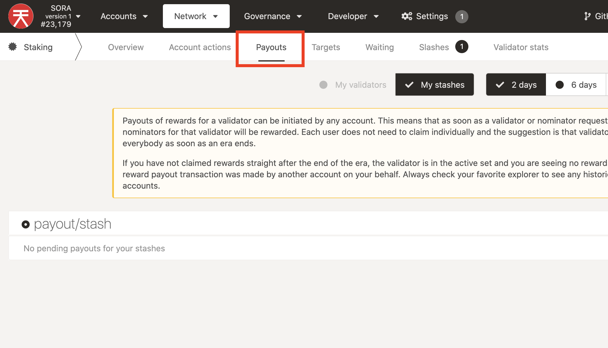
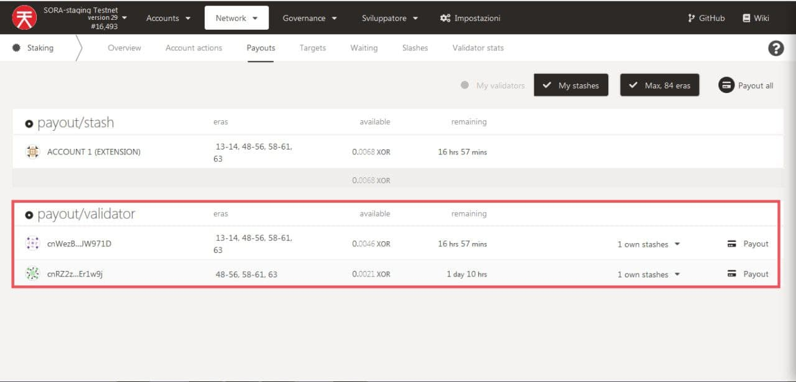
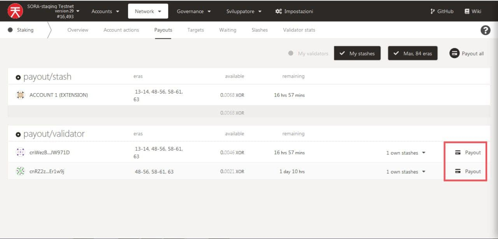

**Importante**: cuando un nominador o el propio validador reclama recompensas, estas se envían a todas las cuentas que han recibido una recompensa, por lo que basta con que una persona reclame por todas. Esta puede ser la razón por la que a menudo no ves ninguna recompensa en el sitio web.

1. Vaya a [polkadot.js](https://polkadot.js.org/apps/?rpc=wss%3A%2F%2Fws.sora2.soramitsu.co.jp#/s Taking), haga clic en "Red" y luego "Replantear". Asegúrate de estar conectado a la red SORA, deberías ver el logo en la parte superior izquierda.

2. Haga clic en "Pagos":

    

    Si hay una recompensa de apuesta que puedes reclamar, deberías verla, como se muestra en la siguiente captura de pantalla:

    

3. Haga clic en "Pago" y luego siga el flujo propuesto.

4. Una vez completado, firme con la extensión según se le solicite.

::: info
Tenga en cuenta que Polkadot.js solo admite un activo para la red, por eso muestra XOR. Sin embargo, en realidad es **VAL**.

:::

::: advertencia

**Las recompensas caducan** después de 84 eras. En **SORA**, son aproximadamente 21 días.

:::