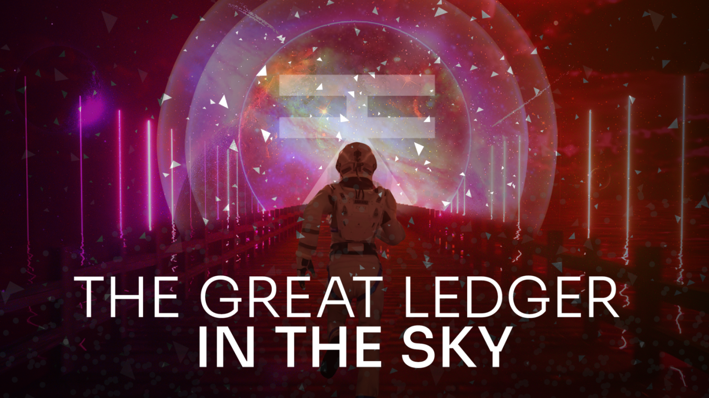
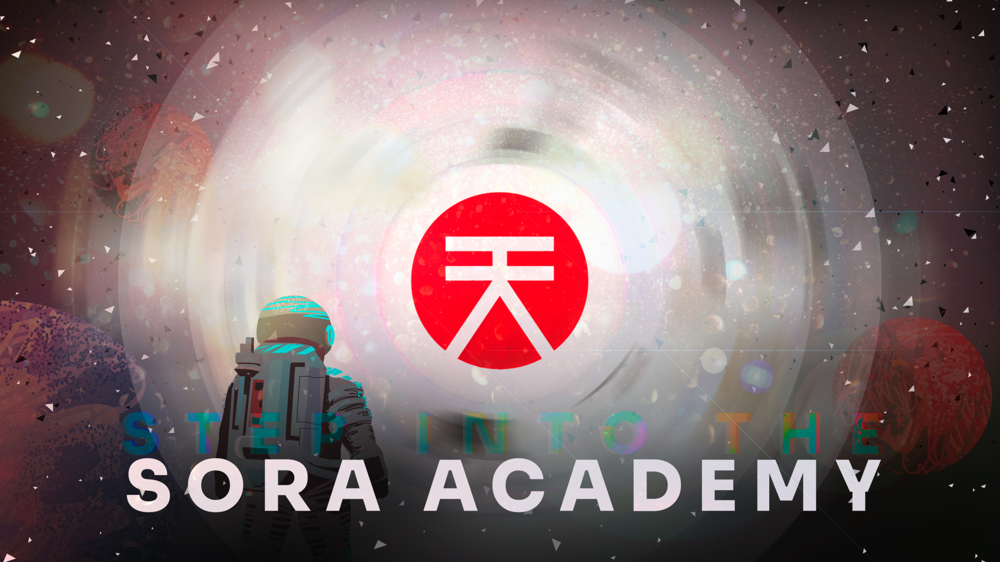

# Academia SORA

Gracias a la tecnología blockchain, las finanzas se han vuelto más inclusivas y menos centralizadas, dando lugar a un sector conocido como Finanzas Descentralizadas, y con acceso a una billetera de activos cripto, las personas pueden participar en actividades como intercambio de tokens (exchanges), provisión de liquidez, Mercados NFT, y más. La Academia SORA es la mejor manera de comenzar en DeFi en la red SORA.

## El Gran Libro Contable en el Cielo: Una Introducción a los Activos Blockchain

Intenta imaginar por un momento un libro contable de un contador en el cielo, donde se registran las transacciones entrantes y salientes, y todos pueden ver todas las transacciones registradas. Ahora imagina que, en lugar de un contador, hay una gran cantidad de ellos, todos compitiendo para verificar las transacciones que ocurren en este gran libro. Podrías decir que esto es una blockchain en pocas palabras.

Ahora imagina que en este libro, puedes agregar contratos que no requieren interferencia humana (aparte de la persona que escribió el código en el contrato). Estos contratos son auditados por firmas externas para asegurarse de que no tengan fallas en ellos, y recurren a fuentes externas de información llamadas "oráculos" para proporcionar datos sobre el mundo, como la temperatura, condiciones climáticas, valores del mercado de valores o incluso puntajes de eventos deportivos. Gracias a estos oráculos, los contratos inteligentes pueden cumplir las condiciones codificadas en ellos sin necesidad de liquidación o interacción humana, todo en un libro contable que es constantemente validado y completamente transparente para todo el internet ver.

Con esa base sólida, ahora viene el aspecto de la interacción. ¿Cómo se participa en este libro contable en el cielo? A través de una billetera de activos cripto, o simplemente billetera para abreviar. Dentro de la billetera están tus claves secretas, así como tu firma. Los tokens viven en tu billetera como transacciones no gastadas.

Ninguna transacción puede llevarse a cabo en tu nombre o con tus activos si no has firmado y aprobado, por lo que **es primordial mantener tus claves (que generalmente están en forma de una frase semilla) y firma (en la mayoría de los casos una contraseña de tu elección) privadas y seguras.** Muchas personas las escriben en papel y luego las almacenan en su caja fuerte u otro lugar seguro que saben que no será manipulado, pero también recordarán.

Hay casos en los que las personas pierden esta frase semilla y no pueden acceder a su cuenta, [a veces perdiendo millones…](https://www.cbc.ca/radio/asithappens/as-it-happens-friday-edition-1.5875363/this-man-owns-321m-in-bitcoin-but-he-can-t-access-it-because-he-lost-his-password-1.5875366) Y si se agotan los intentos para ingresar tu frase semilla, todo el contenido de la billetera queda encriptado permanentemente.

Esto suena como algo extremo, pero la verdad es que las personas pierden su información de acceso todos los días, por lo que se recomienda un almacenamiento seguro pero accesible. También hay cuentas multi-firma que requieren la firma de más de una persona para transacciones, pero soluciones como esta pueden mitigar el riesgo de perder todos tus fondos si tus claves se extravían o pierden.

Tu billetera te proporcionará una dirección (identidad) en la blockchain, generalmente una cadena de letras y números que es única para ti. No necesitas recordar esto de memoria, ya que muchas billeteras ofrecen una forma de simplemente pegar tu dirección, o generar un código QR que otros pueden escanear para recibir fondos.

Genial, ahora sabes qué es una blockchain y cómo interactuar con ella, así que vamos a la parte importante — **Finanzas Descentralizadas.**

## Descentralización y Finanzas

Cuando participas en cualquier actividad financiera hoy en día, como invertir en acciones o bonos, hay varios obstáculos que debes superar para comenzar a operar, tu identidad debe ser verificada y debes abrir una cuenta con un servicio intermediario para operar. Aunque algunos de esos servicios ofrecen la opción de agruparse con otros usuarios y comprar fracciones de acciones, en lugar de toda la acción, como era la norma hasta que se desarrollaron estos servicios.

Solía ser que la diferencia entre comprar un token y una acción era que podías comprar una fracción de un token, por ejemplo, comprar y poseer €1000 de BTC, mientras que un token completo de BTC cuesta €36,771.31 (cuando se escribió este artículo), pero solo podías comprar una acción completa. Como se mencionó anteriormente, ahora hay servicios que fraccionan las acciones, por lo que esto ya no es el caso.
La gran diferencia entre las finanzas centralizadas y descentralizadas, sin embargo, es que en una plataforma descentralizada, tú posees tus claves.

Esto significa que todos los requisitos que necesitas son una billetera y algunos tokens. Si fueras a hacer estas actividades a través de una plataforma cripto de finanzas centralizadas, necesitarías proporcionar identificación personal para un proceso conocido como KYC (conoce a tu cliente), que es necesario para que la plataforma cumpla con las políticas de lucha contra el lavado de dinero (AML).
Después de configurar una cuenta, esta plataforma a veces te daría la facilidad de comprar tokens usando una tarjeta de crédito u otros medios de pago (con una identidad verificada), sin embargo, no poseerías las claves de tu cuenta. En otras palabras, tus tokens realmente no te pertenecen, a menos que decidas moverlos de la aplicación CeFi a tu billetera (generalmente pagando una tarifa de transferencia).

Por el contrario, utilizando una interfaz DeFi, tu billetera sirve como tu identificación, y las transacciones que haces se realizan directamente con tu billetera, lo que significa que posees todo lo que recibes y no tienes que hacer ninguna transferencia después.

_Ahora conoces la diferencia entre ambos modelos, pero ¿qué es exactamente las finanzas descentralizadas?_

## Definiendo DeFi

Según [Coingecko, existen más de 9990 tokens cripto](https://www.coingecko.com/), y contando, en varias blockchains. Todos teniendo diferentes valores y funciones en diferentes redes. Debido a los contratos inteligentes mencionados anteriormente, hay varias herramientas financieras (o dApps, es decir, Aplicaciones Descentralizadas) que los usan como base. Las actividades DeFi más importantes son intercambiar (cambiar tokens por otros), Agrupar (agregar liquidez a un par de tokens), y más recientemente, comercio NFT (el equivalente digital de ser un coleccionista de arte o comerciante).

A través de intercambiar y agrupar, diferentes tokens pueden aumentar su valor de mercado. Cuando intercambias, compras tokens usando un token base de tu elección, esto podría considerarse como la versión digital de un cambio de divisas, donde intercambias una moneda por otra basada en la tasa de cambio. Esto es directamente proporcional a agrupar, donde alguien que posee una cantidad de ambas monedas deposita una cantidad equivalente de ambas en un grupo, donde otros usuarios tienen tokens depositados también, y cada vez que alguien hace un intercambio de las monedas en un grupo al que perteneces, recibes una comisión proporcional a la cantidad de liquidez que has proporcionado.

Una forma diferente de explicar esto sería la comisión que la oficina de cambio de divisas mantiene del total de dinero que has intercambiado. En el caso de DeFi, la comisión va a más personas, y el precio de cualquiera de las monedas (tokens) está definido por la cantidad de liquidez en el grupo.

Por último, pero no menos importante, el comercio y coleccionismo NFT es una de las formas más nuevas de DeFi, hay artículos que han hecho titulares debido al valor exorbitante que obtienen cuando se venden, como el [CryptoPunk #7523](https://news.artnet.com/market/sothebys-natively-digital-sale-1979174), vendido en una subasta de Sotheby’s por millones de dólares. Antes de que preguntes, sí, este es el mismo Sotheby’s que vende arte de Picasso y Van Gogh.

Cómo una imagen pixelada de una figura humanoide puede costar tanto es en parte porque fue uno de los primeros NFT jamás creados (acuñados) en la blockchain de Ethereum, pero también debido a las mismas sutilezas que hacen que las muñecas Cabbage Patch Kids o las tarjetas coleccionables de Pokémon sean artículos de colección. Sin embargo, es importante notar que los NFT no son solo imágenes, sino que hay muchos artículos que pueden convertirse en NFT, como videos, canciones e incluso artículos para usar en juegos. Las opciones son infinitas (y también lo es el valor que pueden obtener).

En este punto, es posible que te preguntes dónde se registran todas estas transacciones. Parece muy abstracto que cada plataforma pueda interactuar con sus contratos inteligentes subyacentes, pero en tu billetera, las transacciones no especifican qué está pasando. Pero las blockchains se supone que fomentan la transparencia, ¿verdad? Ahí es donde entran los exploradores de bloques. Un explorador de bloques te permite revisar transacciones dentro de cada bloque de la cadena. Puedes auditar una amplia gama de operaciones, desde transferir tokens de una cuenta a otra hasta las operaciones DeFi más complicadas. Es importante notar que hay diferentes exploradores para cada blockchain, y algunos tienen más de un explorador.

_Con esa pregunta inminente, vamos a sumergirnos en…_

## DeFi y la Academia SORA

Dentro de la red SORA, también hay varias formas de DeFi, en Polkaswap puedes intercambiar tokens y proporcionar liquidez en grupos con diferentes pares de XOR, y pronto incluso podrás convertirte en un coleccionista de NFT, ya que la comunidad de SORA recientemente aprobó un referéndum que agregará la acuñación de NFT a la red SORA.

Por otro lado, usando [Fearless Wallet](https://fearlesswallet.io/), puedes participar en subastas de parachain de la red Polkadot y Kusama, también conocidas como Crowdloans. En estos crowdloans, puedes contribuir con $KSM o $DOT para que un proyecto asegure una parachain. Si el proyecto gana la parachain, tu contribución se bloqueará por la duración del slot (generalmente 48 semanas), y recibirás recompensas en forma del token del proyecto (las recompensas varían por proyecto), sin embargo, una vez que la lease de la parachain haya terminado, tu contribución inicial al crowdloan te será devuelta. De manera similar, si el proyecto no obtiene el slot, tu contribución se devuelve de inmediato.

Afortunadamente, hay mucho contenido para comenzar con DeFi en la red SORA en la Academia SORA. Hay artículos con tutoriales de los pasos más importantes para comenzar con DeFi (y si algo no está cubierto, se puede solicitar documentación sobre el tema). Algunas lecturas recomendadas para principiantes son [cómo abrir cuentas en SORA](create-an-address.md) y [cómo hacer transferencias en SORA](transfer.md). Una vez que te sientas cómodo con estos pasos iniciales y tengas una cuenta lista, puedes comenzar a usar las funciones DeFi de Polkaswap. Hay lecciones como una [introducción a Polkaswap](polkaswap.md), que describe los fundamentos de [Intercambiar tokens](swap.md), así como [Liquidez en Polkaswap](provide-liquidity-to-xyk-pools) que te muestra cómo participar en grupos de liquidez. Finalmente, también hay una guía sobre [Comercio Avanzado en Polkaswap](advanced-trading.md) una vez que te sientas cómodo con la plataforma, y el contenido más avanzado, respecto a [Exploradores de bloques](explore-blocks.md) y cómo revisar transacciones en una blockchain.

La mejor parte de DeFi en SORA es que también tienes derecho a [recompensas](rewards.md) por usar plataformas como [Polkaswap](https://polkaswap.io/#/rewards) para proporcionar liquidez o por hacer muchas transacciones dentro de un cierto marco de tiempo. Hay una explicación detallada sobre las Recompensas en Polkaswap que puedes recibir.

Con todos estos recursos, no queda nada más que hacer que [sumergirse en DeFi!](https://polkaswap.io/#/swap) Asegúrate de investigar siempre los proyectos que te interesan (#DYOR), y si suena demasiado bueno para ser verdad, generalmente lo es.

## Aprende Más

- [Crear una Cuenta en SORA](/create-an-address.md)
- [Enviar y Recibir un Activo](/send-and-receive.md)

