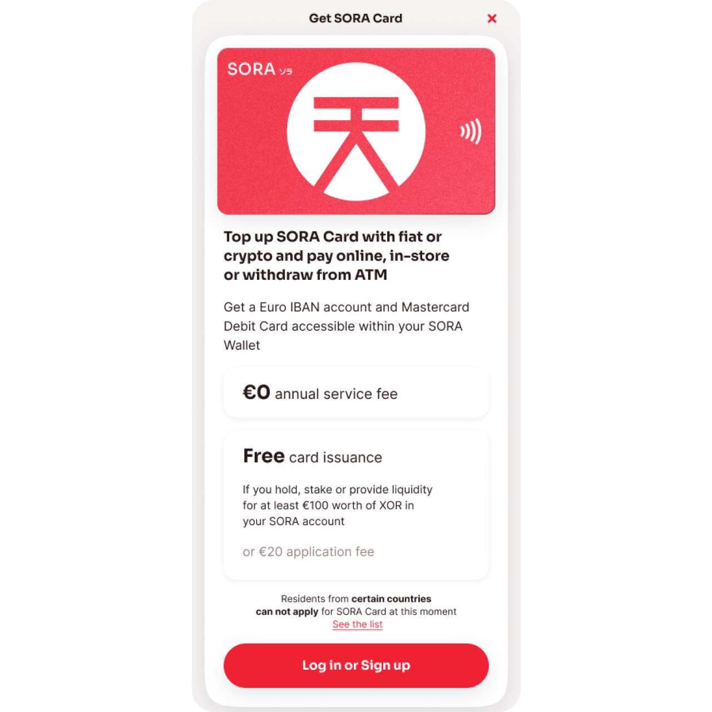
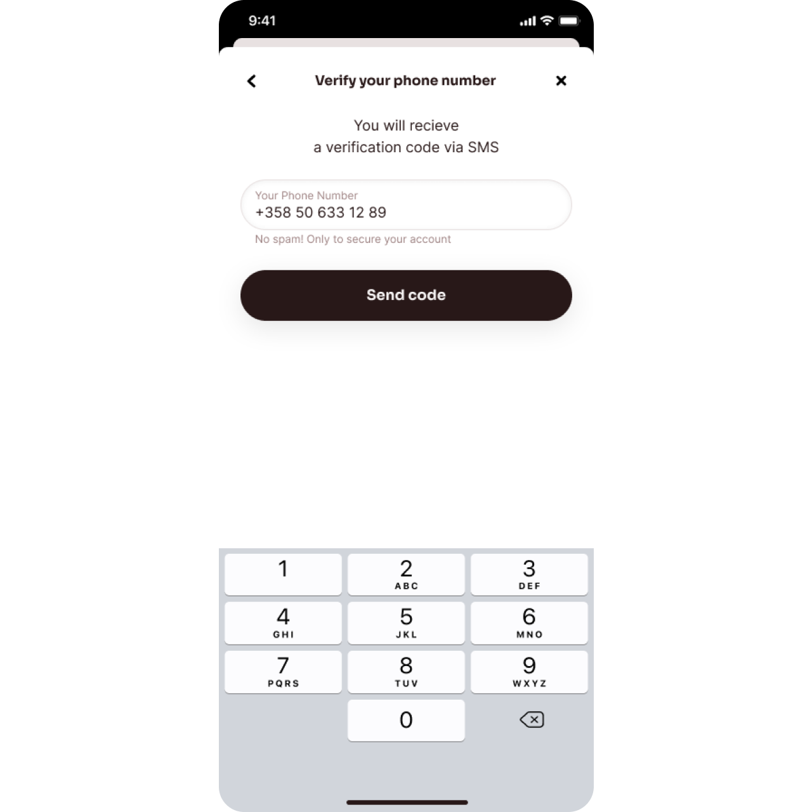
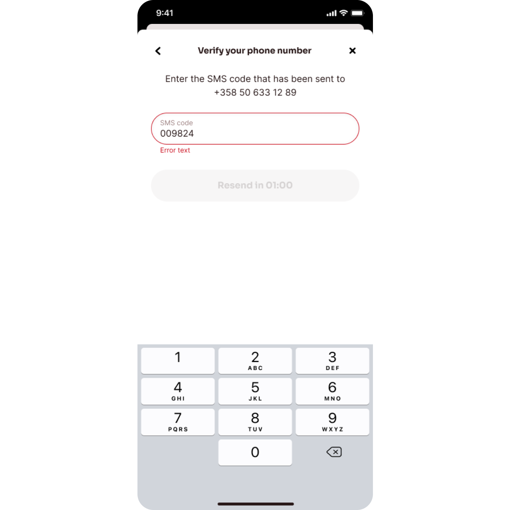
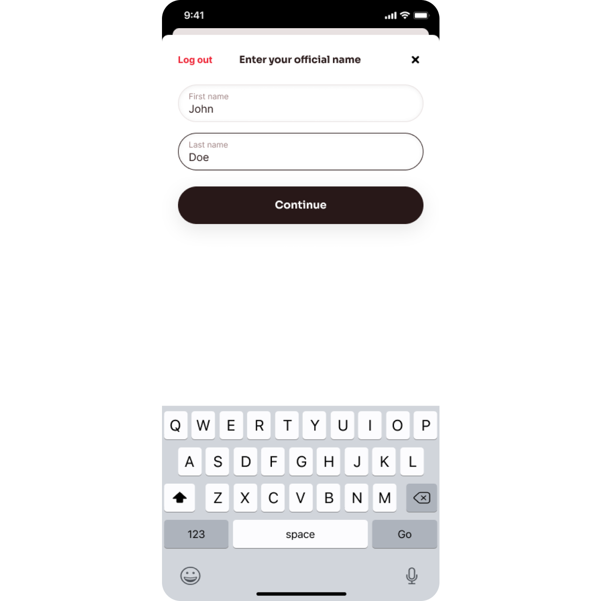
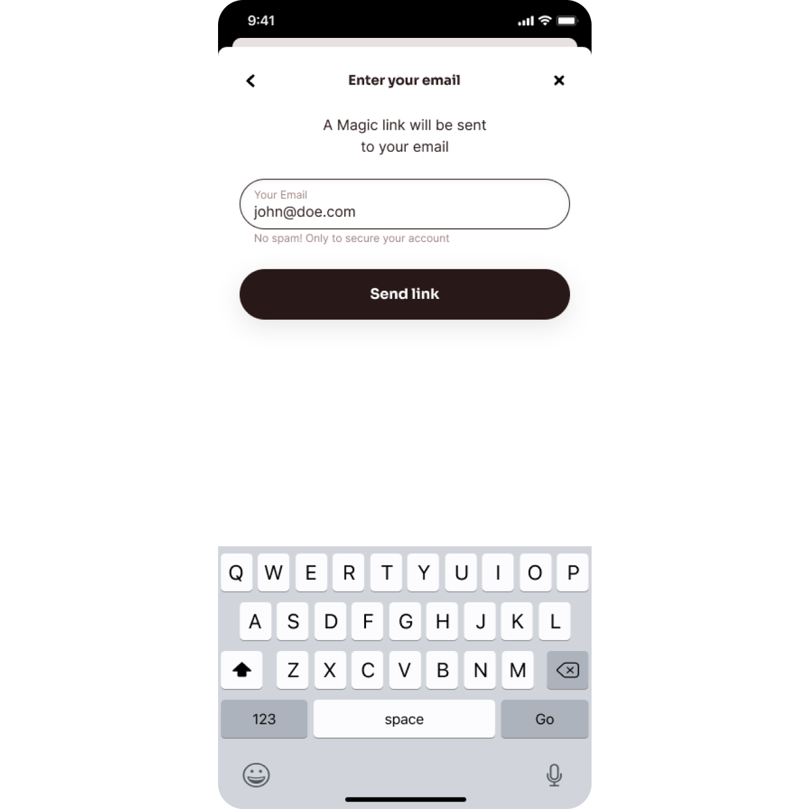
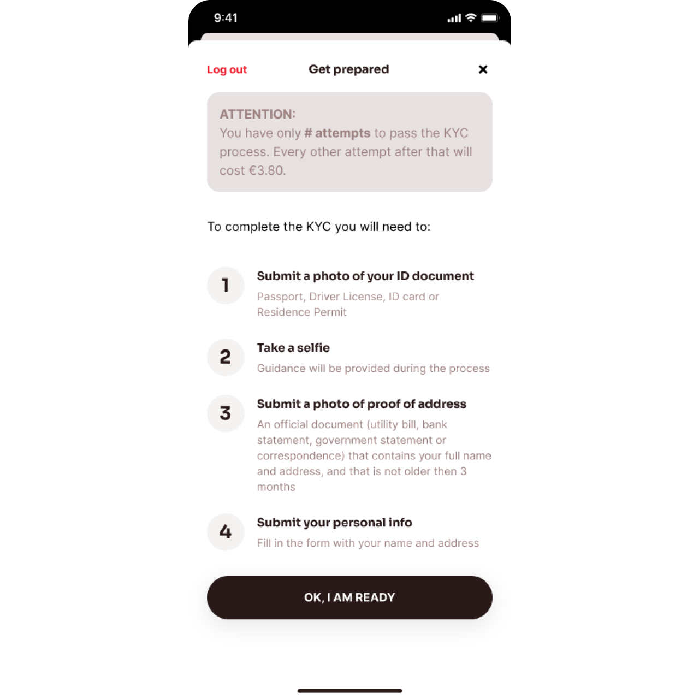
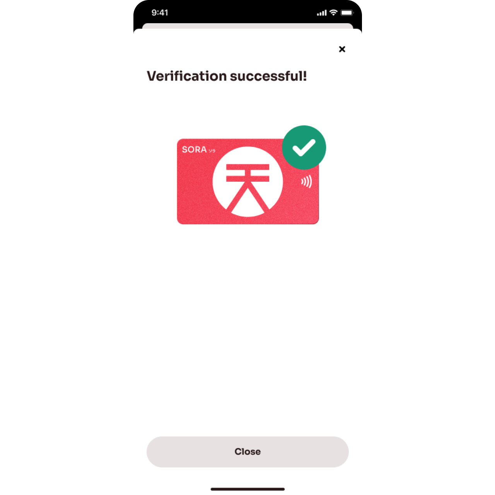
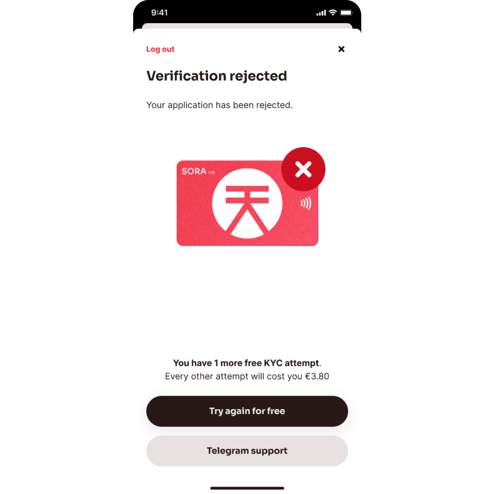

# Cómo Registrarse para la Tarjeta SORA, un Recorrido

Aunque registrarse y pasar por el KYC para la Tarjeta SORA es sencillo, este artículo te ayudará a resolver cualquier duda que puedas tener.

::: info
Es importante notar que actualmente solo los residentes de la UE son elegibles para pasar por el proceso de KYC. Esto cambiará pronto.
:::

Este proceso solo aplica para cuentas de consumidores.

**En este artículo, encontrarás:**

1. Los canales y opciones para solicitar la Tarjeta SORA
2. Los documentos e información que deberías preparar para un proceso de KYC sin problemas
3. El flujo de registro y KYC

Puedes leer más sobre dónde registrarte y los prerequisitos en el [artículo que anunció las inscripciones para la Tarjeta SORA](https://medium.com/sora-xor/sora-card-sign-ups-are-live-b88d89892a3c). Lo hemos resumido nuevamente abajo.

## 1. Canales y opciones para solicitar la Tarjeta SORA

Hay dos canales para solicitar una Tarjeta SORA:

1. En el dApp de [polkaswap.io](http://polkaswap.io/)
2. A través de la aplicación móvil de SORA Wallet (disponible en [Google Play](https://play.google.com/store/apps/details?id=jp.co.soramitsu.sora&hl=en&gl=US&pli=1) y la [Apple App Store](https://play.google.com/store/apps/details?id=jp.co.soramitsu.sora&hl=en&gl=US&pli=1))

::: tip
Si acabas de descargar SORA Wallet, guarda tu frase semilla de forma segura.
:::

Y las tres opciones para solicitar la Tarjeta SORA, junto con las tarifas para cada opción, son:

1. **Si ya tienes más de €100 en valor de XOR en tu cuenta, apostado, o en un pool donde proporcionas liquidez**: la aplicación con tu dirección de SORA es gratuita;
2. **Si deseas comprar XOR para tener el saldo de €100 para un pedido gratuito**, puedes comprar XOR por un valor de hasta €700 dentro de la aplicación con solo un KYC suave requerido (detalles abajo);
3. **Si no tienes €100 en valor de XOR y no deseas comprarlo**, habrá una tarifa de €20 para aplicar por el KYC y la Tarjeta SORA disponible en la segunda fase. Este pago se puede realizar con cualquier tarjeta de débito/crédito de Mastercard®, Visa®, Discover®, Diners Club® o JCB®.

## 2. Documentos requeridos y datos personales

A. En caso de que ya tengas €100 en valor de XOR en la cuenta, **continúa al punto B**. Para **comprar hasta €100 en valor de XOR** con un KYC suave, necesitarás proporcionar tu

- Nombre
- Dirección de hogar
- Dirección de correo electrónico
- Nacionalidad

::: info
Desafortunadamente, no puedes acceder a este servicio si eres de [uno de estos países](https://x1ex.com/en/countries). Aún puedes comprar XOR por medios alternativos.

Las alternativas actuales son: intercambiando en [polkaswap.io](http://polkaswap.io/) y Uniswap. Así como comprar desde [Gate.io](http://gate.io/) y luego hacer el puente a tu cuenta SORA en [Polkaswap.io](http://polkaswap.io/).
:::

B. Para pasar por el **KYC para la Tarjeta SORA,** necesitas preparar los siguientes documentos e información:

- **Tu número de teléfono móvil**. Este será verificado con un código enviado a este número.
- **Nombre completo** como aparece en tus documentos oficiales
- **Dirección de correo electrónico personal**. Se enviará un enlace de verificación.
- **Foto de tu documento de identidad**
- **Foto de prueba de dirección**: un documento oficial (factura de servicios, estado de cuenta bancario, declaración gubernamental o correspondencia) que contenga tu nombre completo y dirección y no tenga más de 3 meses de antigüedad.
- **Dirección de residencia**
  ::: info
  Desafortunadamente, no puedes acceder al servicio si resides en uno de los [países de esta lista](https://soracard.com/blacklist/).
  :::
- **Una Selfie** que se tomará durante el proceso de KYC.

## 3. Flujo de Registro y KYC

A continuación, encontrarás el flujo de registro que inicia el proceso de KYC.
El proceso de KYC se realiza a través de la integración del software SumSub, que solo divulgará tus datos al socio bancario que revisa tu solicitud.

1. Para iniciar el proceso de KYC, ingresa tu número de teléfono, luego solicita el código de verificación. Asegúrate de ingresar tu número de teléfono en el formato internacional (comenzando con el código de país).

2. Ingresa el código recibido por SMS.

3. Después de verificar tu número de teléfono, ingresa tu nombre completo tal como aparece en el documento de identificación oficial que uses para el proceso de KYC.

4. Ingresa tu dirección de correo electrónico y haz clic en el enlace mágico recibido en tu bandeja de entrada. Después de completar la verificación, regresa a la pantalla de KYC de la aplicación.

5. Cada solicitante tiene un crédito de 2 intentos de KYC incluidos en la solicitud. Esto aplica para todos los solicitantes, incluidos los solicitantes con €100 en valor de XOR en su cuenta de SORA y los solicitantes que ordenan la Tarjeta SORA pagando €20.

Para evitar un costo adicional de €3.80 por intento adicional, por favor asegúrate de lo siguiente:

- Tu documento de identificación es válido y legible
- Tu selfie es clara y sigue la guía proporcionada
- Tu documento de prueba de dirección es válido y legible
- El formulario de información personal está completado honesta y precisamente.

En cualquier caso, **el banco retiene el derecho a la decisión final sobre tu solicitud**.

6. Cuando la verificación de tu solicitud sea exitosa, tu IBAN se habilitará en breve (ETA 1 semana), y tu Tarjeta SORA se te enviará una vez que la Fase 2 de la Tarjeta SORA esté activa. (se te enviará un correo electrónico sobre el estado una vez que el envío de la tarjeta física esté disponible).

7. Si tu solicitud es rechazada, verás esta pantalla con la razón del rechazo.

Cuando veas esta pantalla, has usado tus intentos complementarios de KYC, y los intentos adicionales tienen un costo de €3.80 por intento. El KYC adicional pagado estará disponible a partir de una futura versión en adelante.

Si tienes algún problema o pregunta, puedes contactar a nuestro soporte comunitario en [Telegram](https://t.me/SORAhappiness) o a través del botón de Soporte en la aplicación.

## Próximos pasos

El equipo de la Tarjeta SORA continuará proporcionando actualizaciones regulares para mejorar el producto y la experiencia del usuario basándose en tus comentarios. Tu IBAN será habilitado y activado poco después de que tu KYC haya sido aprobado. Esto permitirá transacciones en euros, como transferencias SEPA, hacia y desde tu cuenta.

En la próxima gran actualización, recibirás una tarjeta virtual y física,
y se habilitará el intercambio de cripto a euro así como un intercambio.
Si tienes más preguntas o comentarios, por favor
contacta en los chats de [SORA principal](https://t.me/sora_xor), [Tarjeta
SORA](https://t.me/soracardofficial) y [Felicidad
SORA](https://t.me/sora_happy)

## Aprender Más

- [Introducción a la Tarjeta SORA](/sora-card)
- [Polkaswap](/polkaswap)
