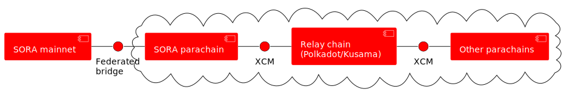
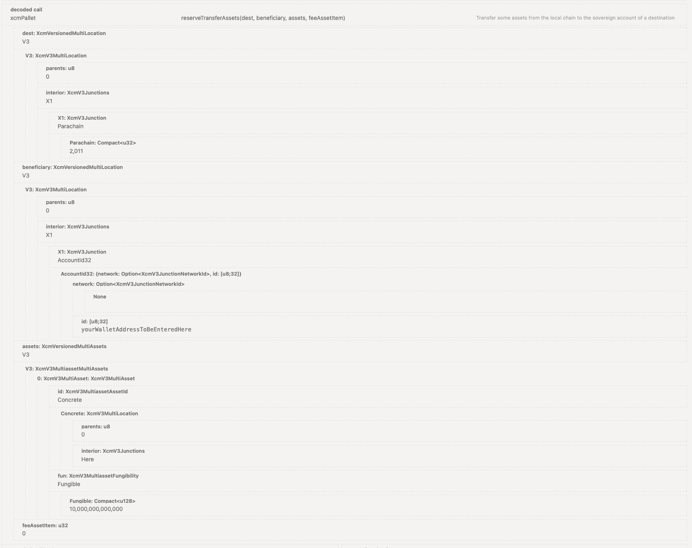
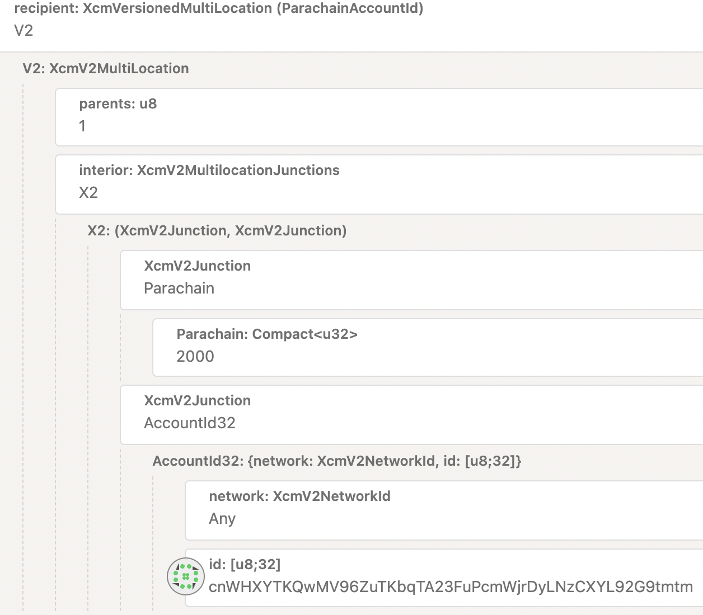

# Puente Substrate

## Componentes Principales

La interacción de SORA con Polkadot/Kusama y otras cadenas de relevo se visualiza en el siguiente diagrama:



<details>
  <summary>Código del diagrama UML</summary>

```

@startuml

skinparam component {
  BorderColor white
  BackgroundColor red
  FontColor white
}

skinparam interface {
  BorderColor black
  BackgroundColor red
}

Component [SORA mainnet]
interface "Federated\nbridge" as FB

cloud {
  [SORA parachain] as SP
  [Relay chain\n(Polkadot/Kusama)] as RC
  interface "XCM" as XCM1
  interface "XCM" as XCM2
  [Other parachains] as OP
}

[SORA mainnet] - FB
FB - SP
SP - XCM1
XCM1 - RC
RC - XCM2
XCM2 - OP
@enduml

```

</details>

Repasemos todos los componentes mencionados en la figura:

### SORA Mainnet

Una red independiente desarrollada sobre la blockchain Substrate es el objeto principal de esta documentación. Tiene todos los mensajes entrantes y salientes a otros sistemas cruzando el **Puente Federado**, que es una puerta de entrada central al ecosistema externo.

### Puente Federado

Puedes leer sobre el Puente Federado en [Interoperabilidad](./interoperability).

### SORA Parachain

La parachain de SORA sirve como una puerta de enlace blockchain, permitiendo una integración sin fisuras entre SORA y cualquier ecosistema de cadena de relevo. Facilita transferencias automáticas de tokens, eliminando la necesidad de que los usuarios envíen tokens a través de extrínsecas en la parachain de SORA.
Por diseño, la parachain de SORA elimina el requisito de firmas de transacción adicionales. La parachain mantiene un registro completo de tokens que pueden transferirse, con información de registro almacenada en el pallet XCMApp. Esta información incluye el mapeo entre el AssetId de SORA mainnet y XCM Multilocation para cada token.

### Cadena de Relevo

En los ecosistemas de Polkadot y Kusama, la cadena de relevo se refiere a la red blockchain principal que sirve como columna vertebral para toda la red de parachains conectadas. Actúa como un centro o coordinador para múltiples parachains, facilitando su comunicación e interoperabilidad.

La cadena de relevo proporciona varias características importantes, incluyendo mensajería entre cadenas (XCM), seguridad compartida, escalabilidad y capacidad de actualización. Permite a las parachains comunicarse entre sí a través del protocolo de Paso de Mensajes entre Cadenas (usualmente utilizando el formato de mensajes XCM), permitiendo la transferencia de activos y datos entre diferentes cadenas.

### Parachains

Las parachains son blockchains especializadas que se conectan a la cadena de relevo. Pueden tener sus propios mecanismos de consenso, modelos de gobernanza y funcionalidad específica. Dependen de la cadena de relevo para la seguridad y la capacidad de interactuar con otras parachains dentro del ecosistema. Como su nombre sugiere, la parachain de SORA también es una parachain dentro de esta arquitectura.

::: warning

La ejecución de transferencias XCM y el manejo de mensajes entrantes variará entre diferentes cadenas. Cada parachain conectada debería tener su propia referencia dedicada en la documentación, detallando específicamente la implementación en aplicaciones cliente. Esta referencia debe especificar la versión exacta del mensaje XCM que se utiliza, así como las uniones utilizadas y pobladas.

:::

## Flujos

Profundizando en los detalles de las transferencias entre cadenas, puedes consultar los siguientes diagramas de nivel superior que ilustran los diversos flujos direccionales:

### SORA a Parachain


_¹ El activo de la cadena lateral (registrado a través de [register_sidechain_asset](https://sora-xor.github.io/sora2-network/master/doc/substrate_gen/runtime/runtime_types/parachain_bridge_app/pallet/enum.Call.html#variant.register_sidechain_asset) ) será quemado. El activo de SORA (registrado a través de [register_thischain_asset](https://sora-xor.github.io/sora2-network/master/doc/substrate_gen/runtime/runtime_types/parachain_bridge_app/pallet/enum.Call.html#variant.register_thischain_asset)) será reservado._


### Parachain a SORA


_¹ Los activos pueden provenir de varias fuentes, incluyendo otras parachains o la Relay Chain, y la acción resultante (reservar o quemar) en la cadena de origen depende de su implementación específica (típicamente iniciada llamando a `xcmPallet.reserveTransferAssets` o `xTokens.transfer`). Finalmente, la parachain SORA permanece sin conocimiento del resultado final, ya que solo recibe un mensaje XCM que será posteriormente retransmitido a la red principal._

## Paletas Comunes

Existen varias paletas comunes utilizadas en el proyecto SORA, proporcionando funcionalidad de puente tanto en el lado de la parachain como en el lado de la red principal de SORA:

- **SubstrateDispatch**: Desarrollado por SORAMITSU ([código fuente](https://github.com/sora-xor/sora2-common/tree/develop/pallets/dispatch)). Esta paleta decodifica y verifica mensajes, realiza llamadas en tiempo de ejecución y crea un origen de puente para ejecutar extrínsecos **XCMApp** y **ParachainBridgeApp**. Solo el origen del puente puede llamar a estos extrínsecos.

- **SubstrateBridgeInboundChannel**: Desarrollado por SORAMITSU ([código fuente](https://github.com/sora-xor/sora2-common/tree/develop/pallets/substrate-channel/src/inbound)). Esta paleta maneja la presentación de mensajes entrantes. Aunque presentar mensajes puede ser llamado desde cualquier cuenta, se utiliza un retransmisor para esta función. Utiliza **BeefyLightClient** o **MultisigVerifier** para la verificación de mensajes y **SubstrateDispatch** para la llamada de mensajes.

- **SubstrateBridgeOutboundChannel**: Desarrollado por SORAMITSU ([código fuente](https://github.com/sora-xor/sora2-common/tree/develop/pallets/substrate-channel/src/outbound)). Esta paleta es responsable de enviar mensajes salientes. Es utilizada por **ParachainBridgeApp** y **XCMApp** para enviar mensajes a otras redes.

### Paletas de SORA Mainnet

En el lado de SORA Mainnet, se utilizan las siguientes paletas:

- **ParachainBridgeApp**: Desarrollado por SORAMITSU ([código fuente](https://github.com/sora-xor/sora2-common/tree/develop/pallets/parachain-app)). Esta paleta sirve como el principal punto de entrada para que los clientes envíen activos a través del puente. También envía mensajes a la parachain (**XCMApp**) para registrar activos. El puente requiere la vinculación de **ParachainBridgeApp** en el Mainnet y **XCMApp** en la Parachain. Utiliza SubstrateBridgeOutboundChannel para enviar mensajes a través del puente y es utilizada por **SubstrateDispatch** para ejecutar mensajes.

Extrínsecos raíz: `finalizeAssetRegistration`, `registerThischainAsset`, `registerSidechainAsset`, `addAssetIdParaId`, `removeAssetIdParaId`, `mint`.
Extrínseco a ser llamado por el usuario: `burn`.

- **Assets**: Desarrollado por SORAMITSU ([código fuente](https://github.com/sora-xor/sora2-network/tree/master/pallets/assets)). Esta paleta implementa activos en SORA 2 Mainnet. Es utilizada por **ParachainBridgeApp** para registrar, acuñar y quemar activos.

### Componentes de SORA Parachain

En el lado de la parachain SORA, se utilizan los siguientes componentes:

- **XCMApp**: Desarrollado por SORAMITSU ([código fuente](https://github.com/sora-xor/sora2-parachain/tree/develop/pallets/xcm-app)). Este pallet establece la conexión entre el Mainnet SORA 2 y una relay chain/parachain. Mantiene un mapeo desde el AssetId de Mainnet SORA 2 (un array de 32 bytes) a una XCM Multilocation general. Permite la transferencia de activos entre el Mainnet SORA 2 y una relay chain/parachain. Solo el origen del puente puede acceder a los extrínsecos del pallet. Utiliza **SubstrateBridgeOutboundChannel** para enviar mensajes a través del puente y es utilizado por **SubstrateDispatch** para ejecutar mensajes.

- **XTokens**: Desarrollado por el Open Web3 Stack ([código fuente](https://github.com/open-web3-stack/open-runtime-module-library)). Este componente es utilizado por **XCMApp** para enviar tokens a una relay chain/parachains.

- **XCMExecutor**: Desarrollado por Parity. Aunque no es un pallet, es un componente crucial para ejecutar Mensajes XCM. Utiliza **XCMApp** como transactor y convertidor de AssetId.

### Pallets del Puente Federado

El Puente Federado en SORA se basa en los siguientes pallets:

- **BridgeDataSigner**: Desarrollado por SORAMITSU ([código fuente](https://github.com/sora-xor/sora2-common/tree/develop/pallets/data-signer)). Este pallet es responsable de recoger firmas de diferentes relayers y verifica que el mensaje esté firmado por un par válido.

Extrínsecos raíz: `registerNetwork`, `addPeer`, `removePeer`, `submit`.
Mensajes: ver [`BridgeCall` enum](https://github.com/sora-xor/sora2-common/blob/2f0aeec218e7646c295f371c4f553f4260e59eff/pallets/types/src/substrate.rs#L126)

- **MultisigVerifier**: Desarrollado por SORAMITSU ([código fuente](https://github.com/sora-xor/sora2-common/tree/develop/pallets/multisig-verifier)). Este pallet independiente es utilizado por **SubstrateBridgeInboundChannel** y **BeefyLightClient** para la verificación de mensajes. También es utilizado por `SubstrateDispatch` para decodificar y despachar llamadas de puente.

Extrínsecos raíz: `initialize`, `addPeer`, `removePeer`.

- **El Relayer**: Desarrollado por SORAMITSU ([código fuente](https://github.com/sora-xor/sora2-network/tree/master/relayer)). El Relayer es un servicio separado y no un pallet. Juega un papel crucial en el Puente Federado, pasando mensajes y manteniendo claves privadas para firmas, similar a la implementación del puente Beefy.

## Guías

### Registro de Activos

Para ejecutar una transferencia de tokens entre cadenas, se requiere un proceso de registro para el token deseado de antemano. El registro de tokens implica el uso de los extrínsecos raíz `ParachainBridgeApp.registerSidechainAsset` y `ParachainBridgeApp.registerThischainAsset`. Por ejemplo, para registrar un token nativo en la red Rococo, se sigue el siguiente procedimiento:


De manera similar, para registrar un token nativo de otra blockchain como transferible a través de una parachain, también conocido como whitelisting, el proceso es el siguiente:


Estos extrínsecos envían mensajes a la Parachain SORA 2, habilitando el registro de mapeos de activos. Sin este registro, los tokens no pueden ser transferidos a través de la parachain. Una vez que el token está exitosamente registrado, se pueden iniciar las transferencias.

### Transferencias

::: advertencia

Solo mensajes XCM específicos para/desde las redes correspondientes han sido probados y utilizados en las aplicaciones cliente, como Polkaswap. Al construir tus propios mensajes, ejerce precaución: existe la posibilidad de que tus fondos puedan perderse permanentemente.

:::

#### SORA <-> Polkadot

Esta sección muestra varios escenarios para transferencias bidireccionales entre el mainnet de SORA y Polkadot.

##### Polkadot -> mainnet de SORA

Para transferir activos desde Polkadot a la red SORA, además del `XOR` para la transacción de la red SORA, necesitarás mantener tokens `DOT` para pagar las tarifas de transacción de la red Polkadot.

Para llenar los datos de la llamada con información de la figura, sigue este [enlace](https://polkadot.js.org/apps/?rpc=wss://rpc.polkadot.io#/extrinsics/decode/0x95028400ccba123cc29c8e6464bb6d5d51236a1d9b4c5b61b86061850a7e85434833203501f683e251cc059cf488abe703192669ba3f6d2440e8fc9740cf85d8f0924a245916133f564d1fe0b248c97ef51008ce52fe1442856b6699283d20b28c5ed3a78f5501350100630203000100a51f0300010100ccba123cc29c8e6464bb6d5d51236a1d9b4c5b61b86061850a7e85434833203503040000000007000c77420300000000). Asegúrate de modificar el destinatario así como la cantidad de tokens a ser enviados, si es necesario.


El extrínseco a enviar es `xcmPallet` luego `reserveTransferAssets(dest,beneficiary,assets,feeAssetitem)`:

- El dest: es `V3`
  - El `interior:XCMV3Junctions` es `X1`
  - El `Parachain` es `2025`
- Luego en la siguiente sección, `Beneficiary:XCMVersionedMultiLocation` es `V3`
  - Bajo `V3:XCMMultilocation` el `interior:XCMV3Junctions` es `X1`
  - El `X1:XCMV3Junction` es `Accountid32`, y en la sección `id:[u8:32]`, ingresa tu dirección de cuenta de la red SORA (como el destinatario de la transferencia)
- Hasta ahora, ya tienes el emisor y el receptor para la transferencia, ahora vamos a ingresar el activo.
  - En `assets`: `XcmVersionedMultiAssets` selecciona `V3`, luego haz clic en `Agregar Elemento`
  - En el campo `Fungible:Compact<128>` añade el número de tokens a ser transferidos. **Tienes que añadir diez ceros después de la cantidad**.

Finalmente, envía la transacción y firma en el pop-up utilizando tu contraseña. Después de la transacción exitosa, notarás que tu balance de `DOT` se reduce en Polkadot y ha aumentado proporcionalmente en tu cuenta de SORA. Ahora, probemos una transacción en la dirección opuesta;
::: tip
Aunque las transacciones de SORA son usualmente casi instantáneas, las transacciones entre redes tomarán entre 3-4 minutos.
:::

##### Mainnet de SORA -> Polkadot

Para transferir activos desde la red SORA a la relay chain de Polkadot, necesitarás tokens XOR y DOT para pagar las tarifas de la transacción, similar a antes. Para llenar los datos de la llamada con información de la figura, sigue este [enlace](https://cloudflare-ipfs.com/ipns/dotapps.io/?rpc=wss%3A%2F%2Fmof2.sora.org#/extrinsics/decode/0x670001020003b1dbee890acfb1b3bc12d1bb3b4295f52755423f84d1751b2545cebf000b020301010100ccba123cc29c8e6464bb6d5d51236a1d9b4c5b61b86061850a7e854348332035008075199d106b0f0000000000000000). Asegúrate de modificar el destinatario así como la cantidad a ser enviada, si es necesario.


El extrínseco a enviar es `bridgeProxy` luego `burn`:

- El `networkId` es `Sub` ya que estamos realizando una transferencia a otra cadena basada en Substrate
  - Como tipo `Sub` elige `Kusama`
  - Como `assetId`, ingresa la dirección del token `DOT` `0x0003b1dbee890acfb1b3bc12d1bb3b4295f52755423f84d1751b2545cebf000b`
- Pasando a la configuración del destinatario;
  - Elige `Parachain`
  - La versión es `V3`
  - El padre es `1` para apuntar a Kusama
- Ingresa tu dirección de cuenta de la red Kusama como `accountId`
- Finalmente, ingresa la `cantidad` deseada a ser enviada. **Tienes que añadir dieciocho ceros después de la cantidad**.

Luego, envía la transacción y firma en el pop-up utilizando tu contraseña. Después de la transacción exitosa, notarás que tu balance de `DOT` se reduce en la red SORA y ha aumentado en Polkadot.

::: tip
Aunque las transacciones de SORA son usualmente casi instantáneas, las transacciones entre redes tomarán entre 3-4 minutos.
:::

#### SORA <-> Kusama

Esta sección muestra varios escenarios para transferencias bidireccionales entre el mainnet de SORA y Kusama.

##### Kusama -> Mainnet de SORA

Para transferir activos desde Kusama a la red SORA, adicional al `XOR` para la transacción de la red SORA, necesitarás mantener tokens `KSM` para pagar las tarifas de transacción de la red Kusama.

Para llenar los datos de la llamada con información de la figura, sigue este [enlace](https://polkadot.js.org/apps/?rpc=wss%3A%2F%2Fkusama-rpc.polkadot.io#/extrinsics/decode/0x6302030001006d1f0300010100796f757257616c6c657441646472657373546f4265456e7465726564486572650304000000000b00a0724e180900000000). Asegúrate de modificar el destinatario así como la cantidad de tokens a ser enviados, si es necesario.



El extrínseco a enviar es `xcmPallet` luego `reserveTransferAssets(dest,beneficiary,assets,feeAssetitem)`:

- El dest: es `V3`
  - El `interior:XCMV3Junctions` es `X1`
  - El `Parachain` es `2011`
- Luego en la siguiente sección, `Beneficiary:XCMVersionedMultiLocation` es `V3`
  - Bajo `V3:XCMMultilocation` el `interior:XCMV3Junctions` es `X1`
  - El `X1:XCMV3Junction` es `Accountid32` y en la sección `id:[u8:32]`, ingresa tu dirección de cuenta de la red SORA (como el destinatario de la transferencia)
- Hasta ahora, ya tienes el emisor y el receptor para la transferencia, ahora vamos a ingresar el activo.
  - En `assets`: `XcmVersionedMultiAssets` selecciona `V3`, luego haz clic en `Agregar Elemento`
  - En el campo `Fungible:Compact<128>` añade el número de tokens a ser transferidos. Tienes que añadir doce ceros después de la cantidad. En este caso, estamos enviando `10`, por lo que la entrada es `10000000000000`

Finalmente, envía la transacción y firma en el pop-up utilizando tu contraseña. Después de la transacción exitosa, notarás que tu balance de `KSM` se reduce en Kusama y ha aumentado proporcionalmente en tu cuenta de SORA. Ahora probemos una transacción en la dirección opuesta;
::: tip
Aunque las transacciones de SORA son usualmente casi instantáneas, las transacciones entre redes tomarán entre 3-4 minutos.
:::

##### Mainnet de SORA -> Kusama

Para transferir activos desde la red de SORA a la cadena de relevo de Kusama, necesitarás tokens XOR y KSM para pagar las tarifas de la transacción, similar a antes. Para completar los datos de la llamada con información de la figura, sigue este [enlace](https://polkadot.js.org/apps/?rpc=wss%3A%2F%2Fmof3.sora.org#/extrinsics/decode/0x6700010100117b0fa73c4672e03a7d9d774e3b3f91beb893e93d9a8d0430295f44225db8020301010100796f757257616c6c657441646472657373546f4265456e7465726564486572650000e8890423c78a0000000000000000). Asegúrate de modificar el destinatario así como la cantidad a enviar, si es necesario.


La extrínseca a enviar es `bridgeProxy` luego `burn`:

- El `networkId` es `Sub` ya que estamos haciendo una transferencia a otra cadena basada en Substrate
  - Como tipo `Sub` elige `Kusama`
  - Como `assetId`, ingresa la dirección del token `KSM` `0x00117b0fa73c4672e03a7d9d774e3b3f91beb893e93d9a8d0430295f44225db8`
- Continuando con la configuración del destinatario;
  - Elige `Parachain`
  - La versión seleccionada es `V3`
  - El padre es `1` para apuntar a Kusama
- Ingresa tu dirección de red de Kusama como `accountId`
- Finalmente, ingresa la `cantidad` deseada a enviar. Tienes que agregar dieciocho ceros después de la cantidad. En este caso, estamos enviando `10`, por lo que la entrada es `10000000000000000000`

Entonces, envía la transacción y firma en el pop-up usando tu contraseña. Después de la transacción exitosa, notarás que tu saldo de `KSM` se reduce en la red de SORA y aumenta en Kusama.

::: tip
Aunque las transacciones de SORA suelen ser casi instantáneas, las transacciones entre redes tardarán entre 3-4 minutos.
:::

### SORA <-> Rococo

Esta sección muestra varios escenarios para transferencias bidireccionales entre el mainnet de SORA y Rococo.

#### SORA mainnet -> Rococo

Para transferir un token a una cadena de relevo, se utiliza la extrínseca `ParachainBridgeApp.burn`. Por ejemplo, para transferir un token ROC a la cadena de relevo Rococo, se sigue el siguiente procedimiento:


Para especificar una parachain como destino de la transferencia, se debe realizar la siguiente solicitud:



Siguiendo estos pasos, las transferencias entre cadenas pueden ejecutarse con éxito, permitiendo el movimiento sin problemas de tokens entre diferentes cadenas dentro de la red.

### Cómo Rastrear el Estado de la Transferencia

#### Otra Parachain -> SORA mainnet

1. Después de ejecutar la transacción que inicia un mensaje XCM, se emite el evento `xcmpQueue.XcmpMessageSent`.


2. Después de un cierto período de tiempo y tras la llegada exitosa del mensaje a la Parachain de SORA, se emite el evento `xcmpQueue.Success`. Este evento tendrá el mismo hash de mensaje que se muestra en el ejemplo de (1). Como resultado, será posible encontrar `substrateBridgeOutboundChannel.MessageAccepted` del mismo extrínseco. El evento contendrá el nonce del mensaje, que se pasará al mainnet.


3. La Parachain enruta el mensaje al mainnet. Una vez que llega, se emite el evento `substrateDispatch.MessageDispatched` con el mismo nonce que en (2).


