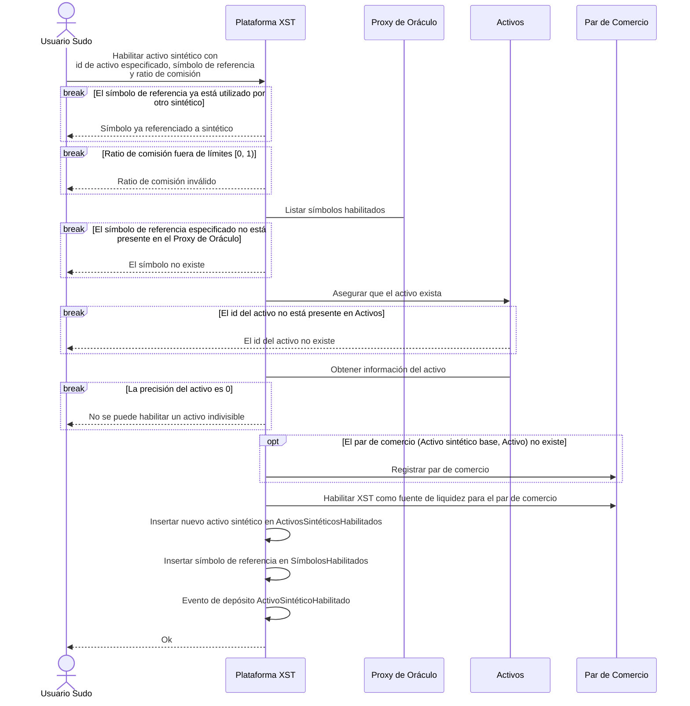
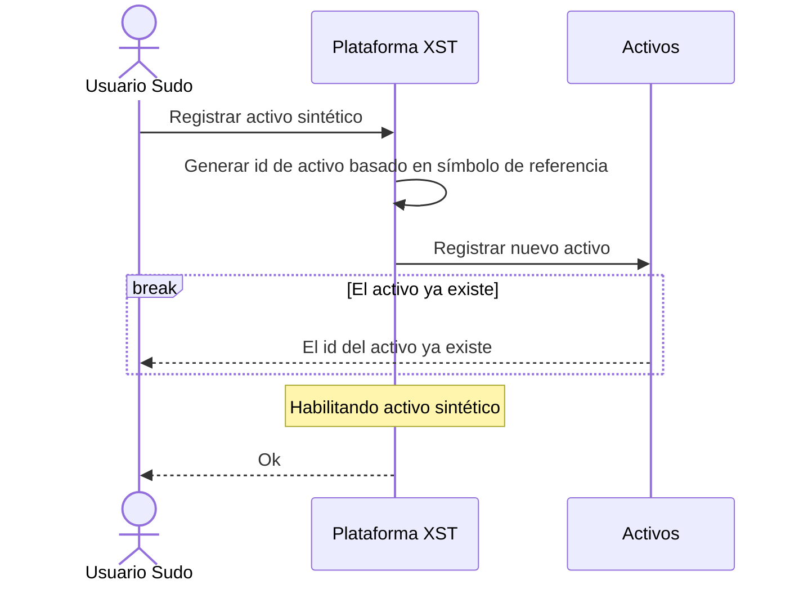
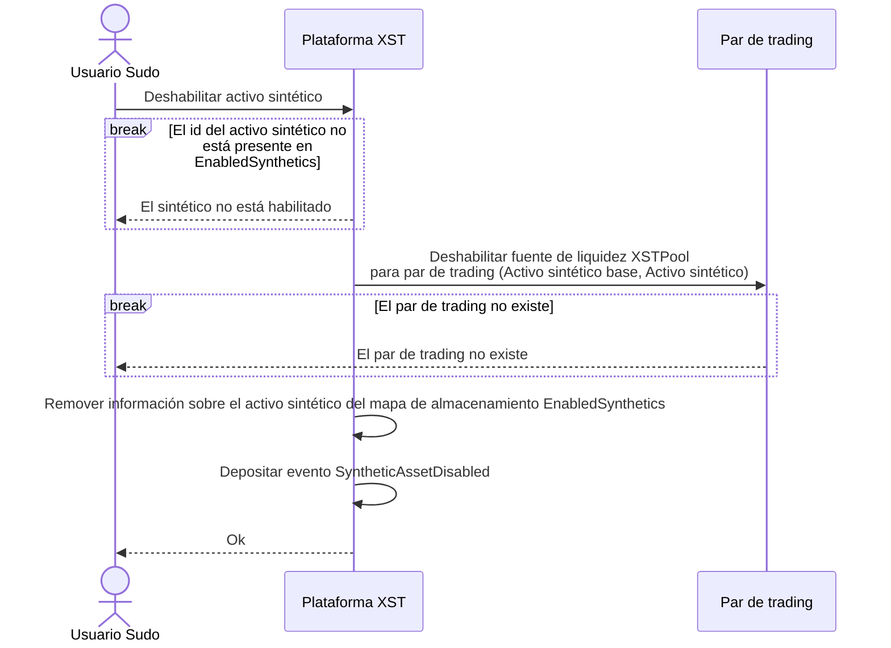
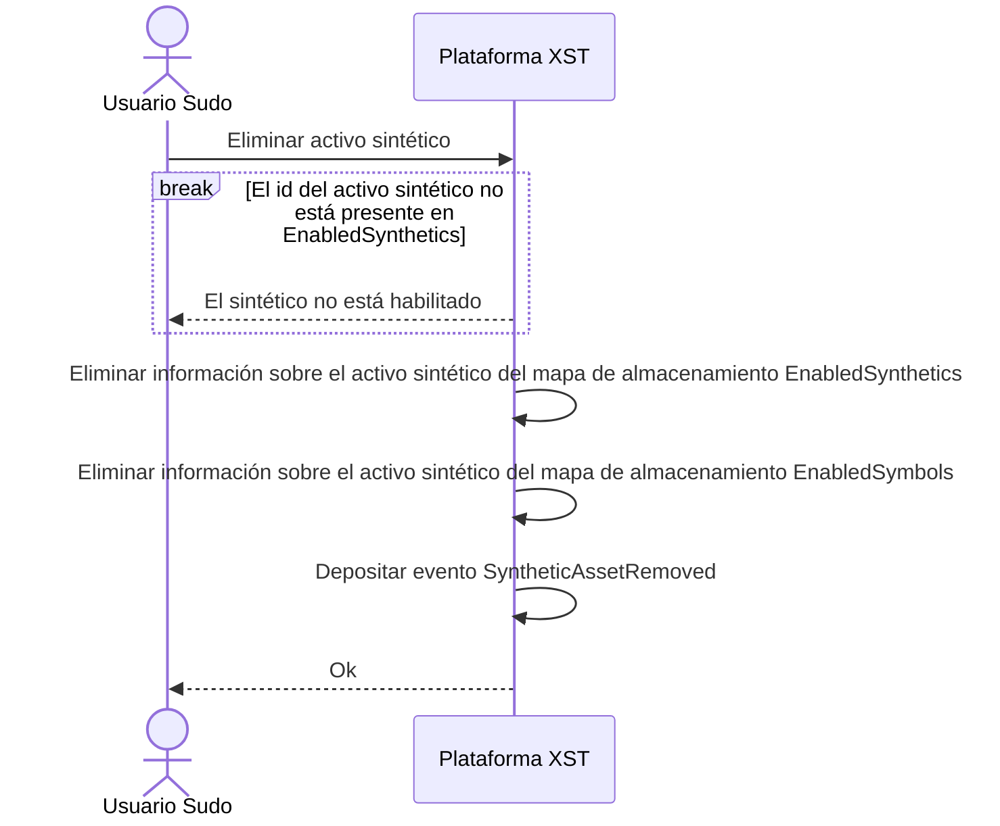
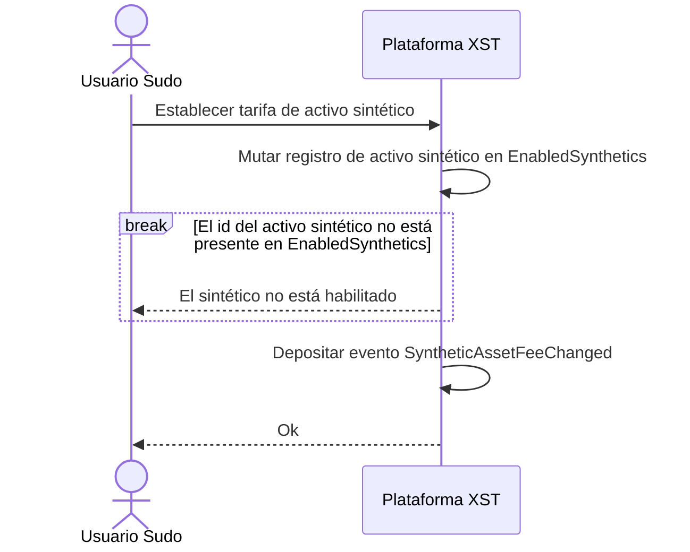
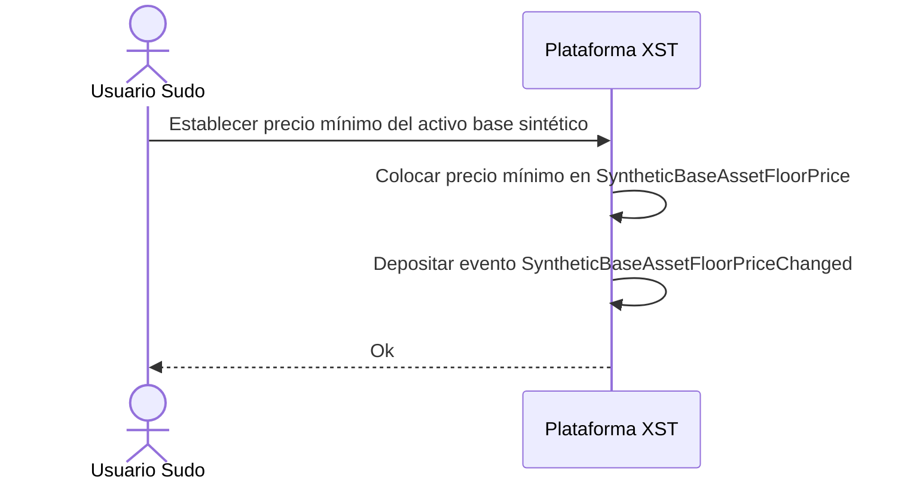
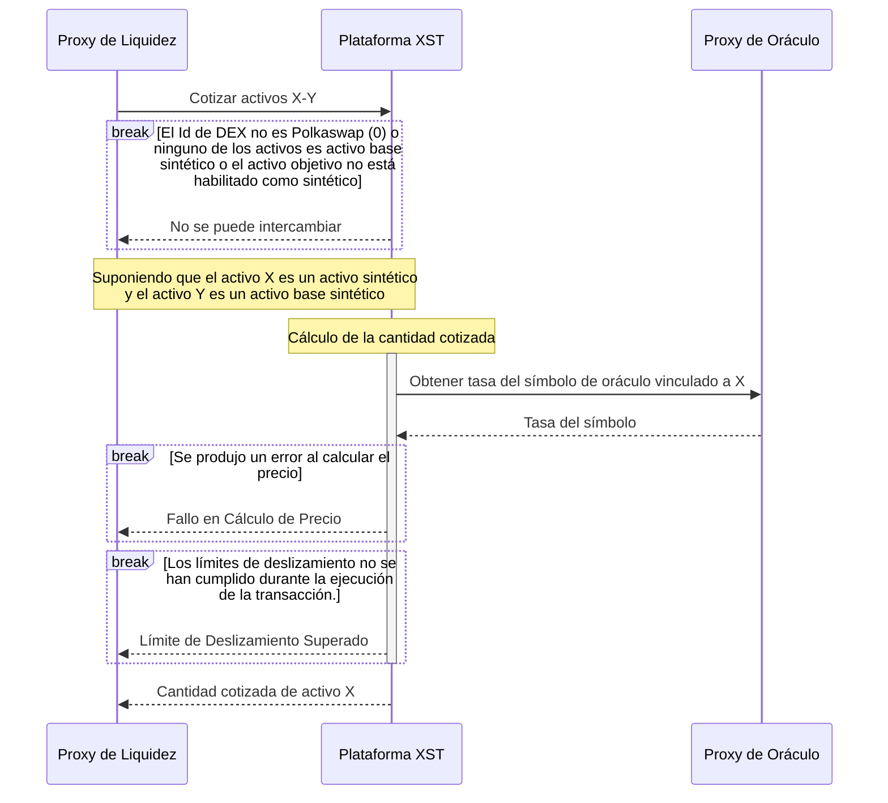
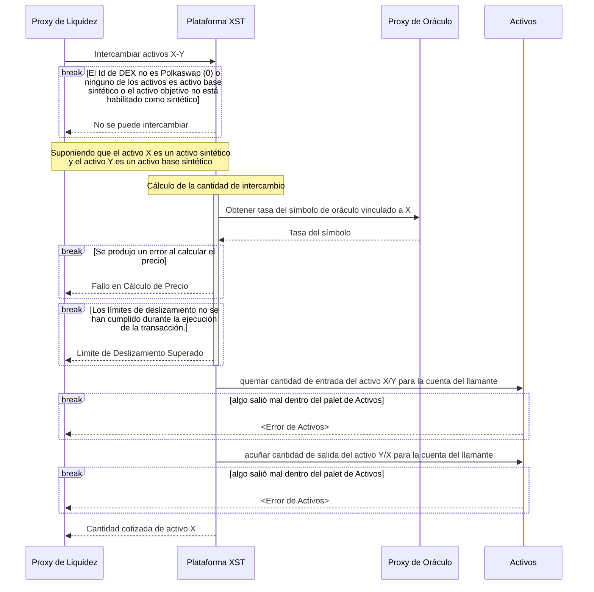
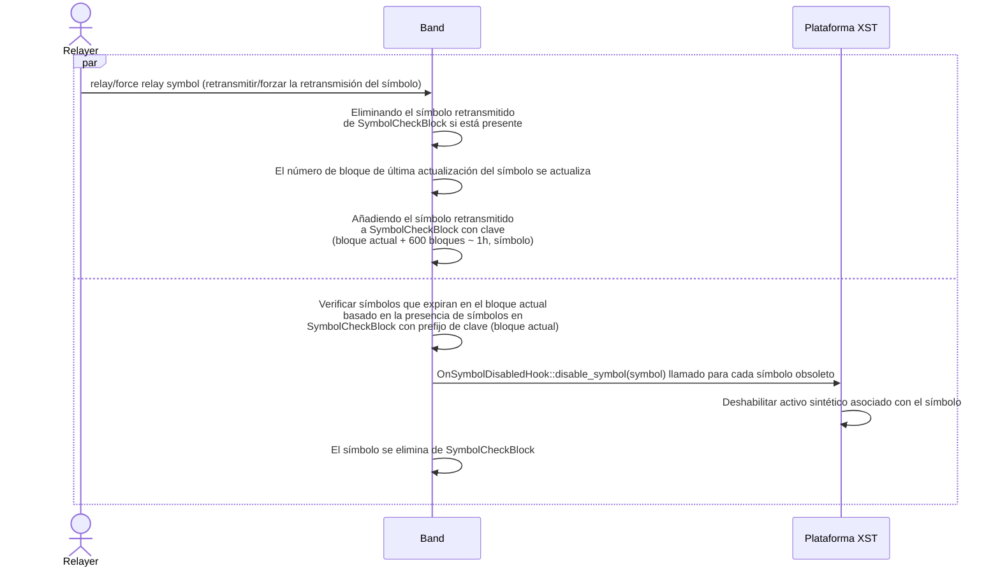

---
titulo: “Explicación de SORA Synthetics. Cómo funcionan los activos sintéticos de SORA"
cabecera:
  - - meta
    - nombre: descripcion
      contenido: “Sumérgete en la Documentación de SORA Synthetics - Una Guía Completa para Crear y Gestionar Pruebas Sintéticas. Eleva el Rendimiento y la Fiabilidad de Tu Aplicación. Esta guía ofrece un recorrido detallado para diseñar, implementar y monitorear pruebas sintéticas para un rendimiento óptimo de la aplicación. Explora ejemplos de código, estrategias y mejores prácticas para aprovechar al máximo las capacidades de monitoreo sintético de SORA"
  - - meta
    - nombre: palabras_clave
      contenido: “SORA Synthetics, activos sintéticos, rendimiento de aplicaciones, ejemplos de código, mecanismo de tarifa dinámica, mecanismo de respaldo, precio mínimo, gobernanza en cadena, límite de comercio, pozos de liquidez, totalmente colateralizado, en cadena, índices fuera de cadena, operaciones DeFi, resistente a la censura, datos oraclizados, XSTUSD, comunidad, token especializado, colateral, ecosistema SORA, mejores prácticas, monitoreo sintético, plataforma SORA, optimización del rendimiento"
  - - link
    - rel: hoja_de_estilo
      href: https://cdnjs.cloudflare.com/ajax/libs/KaTeX/0.5.1/katex.min.css
---

# SORA Synthetics

## ¿Qué son los activos sintéticos?

Los activos sintéticos son activos ligados a un índice utilizando solo colateral en cadena. [XSTUSD (SORA Synthetic USD) es un gran ejemplo de un activo sintético](https://www.forbes.com/sites/tatianakoffman/2021/11/23/the-rise-of-decentralized-money-on-polkadotnew-algorithmic-stablecoin-launches-on-sora/), ya que está ligado al valor del Dólar Estadounidense, pero actualmente respaldado por la canjeabilidad a XST, lo que significa que puedes obtener el valor nominal de XSTUSD dado en XST recién acuñado.


Los activos sintéticos son importantes porque los activos que están totalmente colateralizados en cadena, pero están vinculados a índices fuera de cadena, son increíblemente poderosos. Los activos puramente sintéticos se pueden utilizar para representar muchos tipos de valor, como para rastrear las acciones de instrumentos financieros y valores. Ya sea que el índice sea una moneda fiduciaria como el USD, un commodity como el XAU (oro), o un valor como TSLA, tener activos completamente en cadena para representar estos valores permite una multitud de operaciones DeFi componibles mientras es imposible de censurar. ¡Los posibles usos son verdaderamente infinitos, y solo están limitados por la imaginación de los desarrolladores y datos de oráculo confiables!

SORA está recibiendo datos oraclizados para habilitar prácticamente cualquier activo sintético posible en la red. La implicación de esto es que de repente muchos nuevos activos sintéticos, similares a XSTUSD, podrían ser creados, si la comunidad desea construirlos. Para potenciar esto, se ha creado un token especializado para ser el colateral de activos sintéticos en el ecosistema SORA: XST.

## ¿Por qué la gente suele sentirse atraída por los activos sintéticos?

- **Acceso a Mercados Globales**: Los activos sintéticos permiten a los usuarios obtener exposición a una amplia gama de activos tradicionales y digitales de diferentes mercados globales. Los usuarios pueden invertir en activos que de otro modo serían inaccesibles debido a limitaciones geográficas o regulatorias.

- **Inclusión Financiera**: Los activos sintéticos pueden contribuir a la inclusión financiera al proporcionar a las personas con acceso limitado a servicios financieros tradicionales la oportunidad de participar en mercados globales y oportunidades de inversión.

- **Barreras de Entrada Más Bajas**: Los activos sintéticos eliminan ciertas barreras de entrada que existen en los mercados financieros tradicionales. Los usuarios pueden comenzar a comerciar con requisitos de capital más bajos, opciones de propiedad fraccionada y costos de transacción reducidos en comparación con la negociación de activos tradicionales.

- **Oportunidades de Comercio**: Los activos sintéticos proporcionan a los usuarios oportunidades de comercio adicionales, permitiéndoles capitalizar tendencias del mercado, diferencias de precios o oportunidades de arbitraje. Los usuarios pueden participar en el comercio apalancado o explorar estrategias de comercio complejas.

- **Diversificación**: Los activos sintéticos permiten a los usuarios diversificar sus carteras de inversión al obtener exposición a una variedad de clases de activos, como acciones, commodities, índices o monedas.

## **Usuarios típicos de activos sintéticos**

1. **Comerciantes de Cripto**: Dado que los activos sintéticos solo reflejan el valor nominal de un índice, permiten comerciar grandes cantidades sin impactar el precio de mercado de los activos subyacentes (por ejemplo, Bitcoin).
2. **Inversores Internacionales**: Los activos sintéticos permiten comerciar en múltiples monedas de diferentes países, abriendo nuevas oportunidades para inversiones internacionales.
3. **Comerciantes de FX**: Los activos sintéticos brindan una oportunidad única para que los comerciantes de cripto diversifiquen sus carteras y aprovechen las oportunidades de comercio en el mercado de FX, sin la necesidad de regulaciones KYC, reduciendo las barreras de entrada y aumentando la accesibilidad.
4. **Inversores Con Aversión al Riesgo**: Los activos sintéticos ofrecen una reducción potencial del riesgo a través de la diversificación de la cartera y la reducción del deslizamiento y el riesgo de pérdida impermanente. También ofrece la posibilidad de mantener tus activos en un activo sintético estable de tu elección, por ejemplo, si tu moneda local está sujeta a mayor volatilidad.
5. **Inversores Conscientes de los Costos**: Comerciar activos sintéticos no incurre en cargos por intereses, lo que lo convierte en una opción de inversión rentable.
6. **Inversores Con Aversión a los Impuestos**: Realizar transacciones con activos sintéticos sin incurrir en impuestos brinda beneficios financieros significativos para inversores con aversión a los impuestos

## **Historias de usuarios**

### Historia de usuario 1: Comerciar activos sintéticos para diversificación

Como inversor, quiero comerciar activos sintéticos en un intercambio descentralizado (DEX) para poder diversificar mi cartera y ganar exposición a una amplia gama de activos sin mantener directamente los activos subyacentes. Quiero poder comerciar varios activos sintéticos que representen diferentes criptomonedas, acciones y commodities para reducir el riesgo y maximizar los retornos potenciales.

### Historia de usuario 2: Cobertura contra la volatilidad del mercado con activos sintéticos

Como comerciante, necesito la capacidad de usar activos sintéticos en un DEX para protegerme contra la volatilidad del mercado. Al comerciar derivados sintéticos que rastrean los movimientos de precios de activos específicos, puedo proteger mis posiciones de posibles pérdidas y gestionar el riesgo de manera efectiva, incluso durante condiciones de mercado turbulentas.

### Historia de usuario 3: Aprovechando los activos sintéticos para el comercio especulativo

Como comerciante de alto riesgo, quiero aprovechar los activos sintéticos en un DEX para amplificar mis ganancias potenciales de los movimientos de precios a corto plazo. Al comerciar derivados sintéticos con apalancamiento, puedo magnificar mis ganancias sin mantener grandes cantidades de colateral, lo que me permite participar en oportunidades especulativas con mayor flexibilidad financiera.

### Historia de usuario 4: Accediendo a activos tradicionales en un DEX con activos sintéticos

Como inversor en cripto, deseo tener la capacidad de ganar exposición a activos tradicionales como acciones, índices y monedas fiduciarias a través de activos sintéticos en un DEX. De esta manera, puedo acceder y comerciar en mercados tradicionales de manera descentralizada, directamente desde mi billetera de criptomonedas, sin la necesidad de pasar por intermediarios financieros tradicionales.

### Historia de usuario 5: Farming de rendimiento y provisión de liquidez con activos sintéticos

Como entusiasta de DeFi, quiero participar en el farming de rendimiento y en la provisión de liquidez utilizando activos sintéticos en un DEX. Al suministrar liquidez a los pools de activos sintéticos, puedo ganar recompensas y comisiones, ayudando a asegurar la disponibilidad y estabilidad de estos activos para otros comerciantes e inversores en el ecosistema descentralizado.

## ¿Cómo funcionan los activos sintéticos de SORA?

XST es el activo de colateral que respalda todos los activos sintéticos de SORA. También es una moneda de reserva de la Curva de Vinculación de Tokens de SORA, junto con ETH, DAI, VAL, PSWAP y TBCD.

XST ayuda a resolver el problema de la liquidez de XOR creando activos sintéticos respaldados por una cantidad variable de XST y ligados a un índice objetivo (por ejemplo, una moneda). El token XST se acuña/desacuña (quemado) para garantizar siempre el valor del índice objetivo. Por esa razón, XST ha sido referido como un _token de plataforma_ porque es la base, o colateral, para todos los activos sintéticos en SORA.

XST no requiere sobrecolateralización y los usuarios de activos sintéticos no corren el riesgo de liquidación. Esto se debe a que siempre se puede acuñar nuevo XST para proporcionar el valor completo de un activo sintético al intercambiarlo de vuelta al token de plataforma XST.

En el caso de los activos sintéticos, ya que están respaldados por el token de plataforma XST, XST puede ser acuñado o desacuñado algorítmicamente para proporcionar el valor completo para los activos sintéticos a demanda. El Creador de Mercado Primario de XST que acuña/desacuña activos sintéticos y el token de plataforma XST están integrados como una fuente de liquidez en el agregador de liquidez de Polkaswap, por lo que los compradores/vendedores siempre obtendrán el valor completo en tokens de plataforma XST por sus activos sintéticos, y el precio nunca se desviará (más bajo o más alto) del precio del activo. Por lo tanto, los activos sintéticos no están sujetos a deslizamiento de precios o falta de liquidez. Esto funciona, por ejemplo, en el caso de XSTUSD, porque un solo XSTUSD es un reclamo por $1 USD *valor de XST*, y **no un reclamo por el $USD real**.

## Ad Astra

Nuevos activos sintéticos pueden ser vinculados a la fuente de datos de un oráculo a través de la gobernanza en cadena para crear nuevos activos sintéticos (por ejemplo, XSTXAU para un activo sintético de oro). La única limitación es obtener la fuente de datos del oráculo transmitida a SORA.

## Límites de compra/venta del activo sintético base

Para proteger contra actividades manipulativas potenciales en el inicio de la plataforma sintética, se introduce un límite de comercio en el activo base (XST). Se establece un límite de 10 millones de XST para la compra y venta de activos sintéticos.
Las operaciones que excedan este umbral provocarán un mensaje de error.

## Extrínsecos

<!-- TODO considere hacer referencia a la documentación RUST generada en lugar de describir todos los parámetros extrínsecos aquí -->

<!-- TODO Piense en sustituir los diagramas de secuencia por los diagramas de actividades -->

## Extrínsecos

### Habilitando activo sintético

- **[`XSTPool::enable_synthetic_asset`](https://sora-xor.github.io/sora2-network/xst/pallet/struct.Pallet.html#method.enable_synthetic_asset)**



### Registro de nuevo activo sintético

- **[`XSTPool::register_synthetic_asset`](https://sora-xor.github.io/sora2-network/xst/pallet/struct.Pallet.html#method.register_synthetic_asset)**



### Configuración del activo de referencia

- **[`XSTPool::set_reference_asset`](https://sora-xor.github.io/sora2-network/xst/pallet/struct.Pallet.html#method.set_reference_asset)**

```mermaid
sequenceDiagram
    actor S as Usuario Sudo
    participant X as Plataforma XST
    participant A as Activos
    S->>X: Establecer activo de referencia
    X->>A: Asegúrese de que el activo exista
    rotura de la identificación del activo no está presente en Activos
        A-->>S: El ID del activo no existe
    fin
        X->A: Obtener información del activo
    Ruptura precisión del activo = 0
        X-->>S: Activo de referencia indivisible
    fin
    X->>X: Poner la identificacion del activo en ReferenceAssetid
    X->>X: Evento de depósito ReferenceAssetChanged
    X-->>S: Ok
```

### Deshabilitar activo sintético

- **[`XSTPool::disable_synthetic_asset`](https://sora-xor.github.io/sora2-network/xst/pallet/struct.Pallet.html#method.disable_synthetic_asset)**



### Eliminación de activos sintéticos

- **[`XSTPool::remove_synthetic_asset`](https://sora-xor.github.io/sora2-network/xst/pallet/struct.Pallet.html#method.remove_synthetic_asset)**



### Establecer la tarifa de activo sintético

- **[`XSTPool::set_synthetic_asset_fee`](https://sora-xor.github.io/sora2-network/xst/pallet/struct.Pallet.html#method.set_synthetic_asset_fee)**



### Establecer el precio mínimo del activo base sintético

- **[`XSTPool::set_synthetic_base_asset_floor_price`](https://sora-xor.github.io/sora2-network/xst/pallet/struct.Pallet.html#method.set_synthetic_base_asset_floor_price)**



## Implementación del rasgo LiquiditySource

### Cotización de activos sintéticos



### Intercambio de activos sintéticos



## Mecanismo de reserva

El mecanismo de respaldo en la plataforma XST garantiza la desactivación oportuna de símbolos obsoletos.



## Mecanismo de tarifa dinámica

### Notación

| Notación    | Descripción                                        |
| ----------- | -------------------------------------------------- |
| $\delta$    | Umbral de desviación de la alimentación de precios |
| $P_i$       | Precio oráculo de la época actual (i)              |
| $\tau$      | Constante de decadencia de la tarifa dinámica      |
| $\mu$       | Tarifa dinámica mínima                             |
| $\phi_t(i)$ | Tarifa dinámica de la época actual (i)             |

donde época denota el período de tiempo entre actualizaciones del oráculo.

### Cálculo de la tarifa dinámica

Para disuadir el comercio explotativo potencial basado en cambios anticipados del precio oráculo (a saber, frontrunning), estamos implementando una tarifa dinámica, que se cobra durante cualquier comercio que involucre un activo sintético. Esta tarifa se ajusta basada en el cambio porcentual en el precio del símbolo oráculo.

Tarifa dinámica calculada como:

$\phi_{D} ( i ) = \tau * \phi_{D} ( i-1 ) + max ( [P_{i} / P_{i-1} - 1  - 2 \delta- \mu], 0 )$

$\phi_D(0) = 0$

Los parámetros constantes se almacenan dentro del pallet Band.

### Cómo se cobra la tarifa

La tarifa dinámica se incorpora en el término $S_{f}$ (que se define en la sección **Proceso de cálculo de la cantidad de cotización/intercambio**). El $S_{f}$ se define, por lo tanto, como la suma de la relación de la tarifa dinámica y la relación de la tarifa base de un activo sintético, que se establece a través de `XSTPool::set_synthetic_asset_fee`.

## Proceso de cálculo de la cantidad de cotización/intercambio

### Notación

| Notación           | Descripción                                                                                   |
| ------------------ | --------------------------------------------------------------------------------------------- |
| $S_f$              | Relación de tarifa asociada con el activo sintético seleccionado                              |
| $S_o$              | Tasa del símbolo oráculo asociada con el activo sintético seleccionado                        |
| $B_p^b$            | Precio de compra de referencia del activo sintético base en unidades del activo de referencia |
| $B_p^s$            | Precio de venta de referencia del activo sintético base en unidades del activo de referencia  |
| $\overline{R_p^b}$ | Precio de compra de referencia del activo de referencia en unidades XOR                       |
| $\overline{R_p^s}$ | Precio de venta de referencia del activo de referencia en unidades XOR                        |
| $O$                | Cantidad de salida                                                                            |
| $I$                | Cantidad de entrada                                                                           |
| $F_{XOR}$          | Tarifa (en XOR)                                                                               |

### Cálculo de precio de PriceTools

Antes de profundizar en cómo se calculan las cantidades de cotización e intercambio, es crucial entender cómo se calcula el precio de un activo sintético base en unidades de referencia.

El pallet PriceTools almacena dos precios promedio distintos para cada activo encontrado en el Pool XYK. Estos promedios se recalculan cada bloque en relación a sus valores anteriores, asegurando que su diferencia no exceda ciertos límites de ratio superior e inferior. Se almacenan dos valores porque hay dos escenarios: uno podría **comprar** XOR con algún activo o **vender** XOR por algún activo. Los límites de ratio inferior y superior varían en cada escenario, introduciendo asimetría. El límite de ratio inferior en casos de compra es igual al límite de ratio superior en el caso de venta, y viceversa.

Si se está comprando el activo sintético base, su precio se calcula de la siguiente manera:

$B_p^b = \frac{\overline{R_p^b}}{\overline{B_p^s}}$

Esta ecuación calcula el precio que uno obtendría al intercambiar el activo de referencia por XOR (es decir, **comprar** XOR) y luego comprar el activo sintético base con XOR (es decir, **vender** XOR).
El precio de venta del activo sintético base se calcula de la siguiente manera:

$B_p^s = \frac{\overline{R_p^s}}{\overline{B_p^b}}$

### Precio mínimo del activo base sintético

Si el precio calculado del activo base sintético excede el límite en `SyntheticBaseAssetFloorPrice`, entonces el precio se establece en este límite.

### Caso de venta (Vender base sintética a algún activo sintético)

#### Con entrada deseada

$O = \frac{(I - I\times S_f)\times B_p^s}{S_o}$

Dado que la tarifa se calcula en XST y debe pagarse en XOR, necesitamos convertirla

$F_{XOR} = \frac{I\times S_f}{\overline{B_p^s}}$

#### Con salida deseada

$I = \frac{O \times S_o}{B_p^s} \times \frac{1}{1 - S_f}$

$F_{XOR} = \left (I - \frac{O \times S_o}{B_p^s} \right ) \times \frac{1}{\overline{B_p^s}}$

### Caso de compra (Comprar base sintética con algún activo sintético)

#### Con entrada deseada

$O = \frac{I \times S_o}{B_p^b} \times (1 - S_f)$

$F_{XOR} = \frac{I \times S_o}{B_p^b} \times S_f \times \frac{1}{\overline{B_p^s}}$

#### Con salida deseada

$O_{w/\ fee} = \frac{O}{1 - S_f}$

$I = \frac{O_{w/\ fee} \times B_p^b}{S_o}$

$F_{XOR} = \frac{O_{w/\ fee} - O}{\overline{B_p^s}}$

## Aprender más

- [Tokenomics de XST](/xst)
- [Solicitar características en SORA](/rfp)


