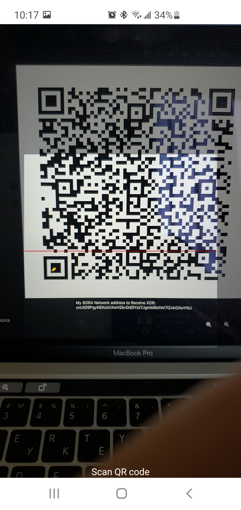

# Transferencia

Las transferencias se utilizan para enviar tokens de una cuenta a otra. Puedes realizar transferencias usando las aplicaciones de Polkadot.js, Polkaswap y la aplicación móvil de SORA.

La lógica de transferencia está implementada en el pallet `assets`. SORA admite múltiples activos y cada activo puede ser transferido.

Transferir es una transacción, por lo que se debe pagar una tarifa de red. La tarifa se calcula en XOR, así que incluso si transfieres VAL, PSWAP o cualquier otro token, deberías tener algo de XOR para cubrir la tarifa.

::: info
Las tasas para realizar transferencias en SORA pueden variar. A menudo se realizan propuestas de gobernanza para ajustar las tasas de transacción. La tasa actual puede diferir de la mostrada en los ejemplos.
:::

## Práctica

::: tip
Recomendamos usar el testnet de SORA para ejercicios prácticos. Aquí están los enlaces del Testnet:

1. [Aplicación de prueba de Polkaswap](https://test.polkaswap.io/)
2. [Aplicación de testnet de Polkadot js para SORA](https://polkadot.js.org/apps/?rpc=wss%3A%2F%2Fws.stage.sora2.soramitsu.co.jp#/explorer)
3. [Aplicación de testnet para Android](https://play.google.com/store/apps/details?id=jp.co.soramitsu.sora.communitytesting&hl=en&gl=US)
4. [Aplicación de testnet para iOS](https://testflight.apple.com/join/670hF438)
   :::

<iframe width="560" height="315" src="https://www.youtube.com/embed/RdJ6yFFl06k" title="Reproductor de video de YouTube" frameborder="0" allow="accelerometer; autoplay; clipboard-write; encrypted-media; gyroscope; picture-in-picture; web-share" allowfullscreen></iframe>

### Obtener Tokens de Prueba

Puedes practicar con transferencias usando tokens de prueba en el testnet de SORA.

1. Abre el [faucet](https://testfaucet.polkaswap.io/)

2. Introduce tu dirección de SORA, selecciona el token y la cantidad de tokens que necesitas.

3. Haz clic en **Enviar testnet VAL (XOR, PSWAP).**

::: info
Ten en cuenta que cada transacción en SORA requiere una tarifa en XOR. Transferir es una transacción, así que no olvides solicitar algunos XOR del faucet.
:::

### Enviar Tokens

#### Vía Polkaswap

La aplicación web de Polkaswap tiene una cartera que puedes usar para enviar tokens.

1. Abre la sección **Cuenta** y haz clic en el icono de enviar (una flecha cerca del activo)

2. Introduce la dirección del destinatario y la cantidad de tokens que te gustaría enviar

   

   Si introduces una dirección que no comienza con `cn`, verás una notificación sobre la conversión de direcciones. <!-- (como se menciona en la sección de prefijo de cuenta de [Cuentas en SORA](/accounts-in-sora.md#converting-the-address-format)). -->

   

3. Haz clic en Enviar y confirma la transacción.

4. Después de que aparezca la confirmación de la transacción de la extensión de Polkadot.js, introduce tu contraseña y confirma la transacción:

::: tip

Luego puedes encontrar tu transacción en la pestaña de Actividad:

:::

#### Vía Aplicación Móvil

La aplicación móvil de SORA proporciona una buena experiencia de usuario para enviar y recibir tokens.

1. Abre la pantalla de cartera y toca el icono de enviar en la esquina superior derecha.

2. Selecciona el token a enviar:

3. Introduce la dirección del destinatario:

4. Introduce la cantidad de tokens a enviar:

 

5. Confirma la transacción:

Serás redirigido a la pantalla de Cartera:

::: tip

Toca en la transacción en el historial para ver los detalles:

:::

##### Enviar Tokens Usando un Código QR

Usar un código QR reduce el número de errores y simplifica el proceso de introducir direcciones y tokens. La información del token y la dirección están codificadas dentro del código QR, y la aplicación lo decodifica.

1. Toca en el icono de Escanear en la esquina superior derecha y permite el acceso a la cámara.

2. Escanea el código QR y luego introduce la cantidad de tokens que te gustaría enviar.

<!-- Probablemente no sea necesario 

 -->

#### Recibir Tokens Usando un Código QR

Si deseas recibir tokens usando un código QR:

1. Toca el icono de QR en la esquina superior derecha de la pantalla de cartera:

2. Selecciona el activo:

3. Comparte el QR generado usando el icono de compartir o copiando la imagen:

