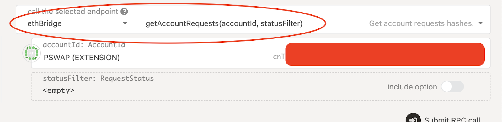

# Cómo Desatascar Transacciones SORA→ETHEREUM

::: info
Esta guía fue escrita por el miembro de la comunidad "Frasier Man" y revisada por el equipo de SORA. Si quieres agradecer a Frasier man, por favor dona a: `5D4pKyFNRjU8yoYKgiH1UqrjzayjCkttt82HsAdwQ6FTsQyv`
:::

### Cuándo Usar Esta Guía:

- Tu transacción de puente de SORA está atascada en pendiente o ha fallado.
- El comando "reintentar" en la [interfaz de puente](https://polkaswap.io/#/bridge/) no funciona/no está disponible.
- Tus fondos han salido de tu cuenta de SORA y no han llegado a tu cuenta de Ethereum después de algún tiempo.

## Visión General de los Pasos en esta Guía

- [Paso 1](#Paso-1) Verifica si tu transacción de puente está realmente atascada o solo está pendiente.

- [Paso 2](#paso-2) Encuentra el hash de la transacción para tu transacción atascada.

- [Paso 3](#paso-3) Obtén los datos necesarios para desatascar la transacción (obteniendo tu prueba).

- [Paso 4](#paso-4) Usa tu prueba para llamar manualmente a tu transacción de Ethereum para recibir tus tokens.

::: info
[Paso 4](#paso-4) es ligeramente diferente para cada token, así que asegúrate de seguir la subsección correcta.\*\*
:::

:::info
Si al final del Paso 4, Ethereum te pide una tarifa de transacción GRANDE, NO CONFIRMES LA TRANSACCIÓN. Significa que los datos han sido ingresados incorrectamente, verifica nuevamente tu entrada.
:::

### Paso 1

Verifica si tu transacción está realmente atascada o solo está pendiente.

1. Conéctate a la aplicación Polkadot.js: [https://polkadot.js.org/apps/rpc=wss%3A%2F%2Fws.sora2.soramitsu.co.jp#/rpc](https://polkadot.js.org/apps/?rpc=wss%3A%2F%2Fws.sora2.soramitsu.co.jp#/rpc)

2. Haz clic en "Desarrollador", luego selecciona "Llamadas RPC":
   

3. Haz clic en “autor”, luego selecciona “Ethbridge”. Por defecto “getAccountRequests(accountId, statusFilter)” debería estar seleccionado, si no, selecciónalo.
   

4. Asegúrate de que tu cuenta esté seleccionada debajo, haz clic en "incluir opción" y elige "Pendiente", luego envía la llamada RPC
   

Si tu resultado contiene algún hash de transacción, estas AÚN están pendientes y pueden tardar algún tiempo en procesarse. **Si tu resultado se ve como abajo y no produce hashes, entonces tu transacción de puente de SORA ha sido aprobada y deberías continuar a través de la guía para desatascar tu transacción.**


### Paso 2

Encuentra el hash de transacción de tu transacción aprobada (pero atascada).

1. Si continúas desde el paso 1, tu llamada RPC solo necesita un ligero ajuste. Haz clic en “incluir opción” pero esta vez selecciona “Aprobaciones Listas”, luego envía la llamada RPC
   

El resultado es una lista de todas las transacciones de puente de SORA que han sido aprobadas en el lado de SORA. Tu última transacción de puente es la última (desplázate hacia abajo si es necesario). Si has realizado más transacciones de puente SORA>ETH después de la atascada, necesitarás ir desde el fondo hacia arriba de la lista hasta que encuentres tu transacción atascada.

2. Copia el hash de tu transacción “atascada”, se verá así:

`0x57533dc46a5d257b6dj0nhagb0f8s4dfedfl6cpppcoaidu99dd0sdc4def4g6b`


### Paso 3

Usa tu hash de transacción para obtener los datos requeridos (prueba) para el paso 4.

1. Continuando desde el paso 2, haz clic en “get**Account**Requests(accountId, statusFilter)” y cámbialo a “get**Approved**Requests(requestHashes, networkId)


2. Haz clic en “Añadir ítem”.
3. Pega tu hash de transacción Aprobado del paso 2 en lugar de 0x000…
4. Haz clic en “Incluir Opción” y deja el id de red como 0.
5. Envía la llamada RPC:


El resultado es tu “Proof”, contiene todos los datos necesarios para el paso 4.

::: details Expand para ver un ejemplo de prueba

```
Transfer: {

currency_id: {

TokenAddress: 0x6b175474e89094c44da98b954eedeac495271d0f

},

amount: 30,000,000,000,000,000,000,000,

to: 0xd7230339a4b355ae6d24a7378cc910o85l34k5nb,

from: 0x6ef01fd3b42ed7a3fa0e7ca366d0a464dc71016d,

tx_hash: 0x235517c869f0288ad8jjhag6f0de0jbkelf6ooi5ycct5g9d945d73d40d987y6b,

network_id: 0x0000000000000000000000000000000000000000000000000000000000000000,

raw: 0x6b175474e89094c44da98b954eedeac495271d0f00000000000000000000000000000000000000000000069c1d44c523e2f80000d7330339a1b395ae5d24ab376cc610085034458c6
{

r: 0x7a42sefc5dh232j34g61d22c53b28cn9600f4jhggf70fdfeh83kb4l7d9s2bcea,

s: 0x79b1e77bb20663953981d267fbc01d53f9cc3x34s63aa7h3f4385l04td9be9c43,

*v: 0

},

{

r: 0xcc9fcee0fd50bfa29ekb10ldlkjh3tdef02f9beb74a1v295ac0c5x01253f8f8f,

s: 0xkafvd79ffa27g10h928jb88066e8252dec3d58fb6ebf0862c6839d880f858a8f,

v:
```

:::

Aquí tienes la guía sobre cómo debes preparar **tus** datos para el siguiente paso.

::: tip
Estarás copiando y pegando datos de tu prueba. La primera vez que hagas esto, es más fácil si primero copias y pegas toda la prueba en un bloc de notas, y editas los resultados como se describe a continuación, listo para usar en el paso 4.
:::

| Campo               | Descripción                                                                                                                                                                                                                                     | Ejemplo                                                              |
| ------------------- | ----------------------------------------------------------------------------------------------------------------------------------------------------------------------------------------------------------------------------------------------- | -------------------------------------------------------------------- |
| Dirección Token     | Esto puede ser copiado y pegado tal como está, sin comas ni espacios.                                                                                                                                                                           | `0x6b175474e89094c44da98b954eedeac495271d0f`                         |
| Cantidad            | Copia y pega este número y elimina todas las comas. (esta cantidad reflejará la cantidad que has transferido pero será un número mucho más grande, por ejemplo, la cantidad en este ejemplo de puente era en realidad 30000)                    | `30000000000000000000000`                                            |
| A                   | Esto puede ser copiado y pegado tal como está, sin comas ni espacios. **NOTA - Esta es la dirección de Ethereum que estaba conectada al puente cuando se hizo la transacción, debe ser la misma dirección utilizada al conectar en el Paso 4.** | `0xd7230339a4b355ae6d24a7378cc910o85l34k5nb`                         |
| De                  | Esto puede ser copiado y pegado tal como está, sin comas ni espacios.                                                                                                                                                                           | `0x6ef01fd3b42ed7a3fa0e7ca366d0a464dc71016d`                         |
| Hash de Transacción | Esto puede ser copiado y pegado tal como está, sin comas ni espacios.                                                                                                                                                                           | `0x235517c869f0288ad8jjhag6f0de0jbkelf6ooi5ycct5g9d945d73d40d987y6b` |

**Los siguientes (R, S y V) tienen dos números, el número superior y el
inferior, deben ser puestos en un arreglo, esto significa poner los
datos entre corchetes cuadrados, separados con una coma, el número superior primero
y el número inferior segundo.**

| Campo | Descripción                                                                                                                                                          | Ejemplo                                                                                                                                   |
| ----- | -------------------------------------------------------------------------------------------------------------------------------------------------------------------- | ----------------------------------------------------------------------------------------------------------------------------------------- |
| R     | Empieza con un corchete cuadrado abierto, luego pega el “R” superior, luego escribe una coma y pega el “R” inferior, luego termina con un corchete cuadrado cerrado. | `[0x7a42sefc5dh232j34g61d22c53b28cn9600f4jhggf70fdfeh83kb4l7d9s2bcea,0xcc9fcee0fd50bfa29ekb10ldlkjh3tdef02f9beb74a1v295ac0c5x01253f8f8f]` |

**Asegúrate de que no haya espacios en el arreglo, verifica dos veces después de la coma que no haya un espacio.**

| Campo | Descripción                                                                                                                                                                       | Ejemplo                                                                                                                                                                                                                    |
| ----- | --------------------------------------------------------------------------------------------------------------------------------------------------------------------------------- | -------------------------------------------------------------------------------------------------------------------------------------------------------------------------------------------------------------------------- |
| S     | Igual que R pero usa el “S” superior e inferior                                                                                                                                   | `[0x79b1e77bb20663953981d267fbc01d53f9cc3x34s63aa7h3f4385l04td9be9c43,0xkafvd79ffa27g10h928jb88066e8252dec3d58fb6ebf0862c6839d880f858a8f]`                                                                                 |
| V     | El formato de V también debe ponerse en un arreglo, hay dos versiones, una es para desatascar XOR y la otra es para todos los demás tokens. **Para todos los tokens excepto XOR** | Si tu `v = 0` entonces debes poner `27` en el arreglo Si tu`v = 1` entonces debes poner `28` en el arreglo. Para nuestro ejemplo, el v superior es`0` y el v inferior es `1`entonces nuestro arreglo sería `[27,28]`       |
| V     | Para XOR                                                                                                                                                                          | Si `v = 0` entonces debes poner `0x1b` en el arreglo, Si `v = 1` entonces debes poner `0x1c` en el arreglo. Para nuestro ejemplo, el v superior es `0` y el v inferior es `1` entonces nuestro arreglo sería `[0x1b,0x1c]` |

- Resultado de la Prueba

Ahora tienes todo lo que necesitas para el paso 4, de nuestro ejemplo de prueba tenemos lo siguiente, el tuyo se verá similar a esto.

```
0x6b175474e89094c44da98b954eedeac495271d0f

30000000000000000000000

0xd7230339a4b355ae6d24a7378cc910o85l34k5nb

0x6ef01fd3b42ed7a3fa0e7ca366d0a464dc71016d

0x235517c869f0288ad8jjhag6f0de0jbkelf6ooi5ycct5g9d945d73d40d987y6b

[0x7a42sefc5dh232j34g61d22c53b28cn9600f4jhggf70fdfeh83kb4l7d9s2bcea,0xcc9fcee0fd50bfa29ekb10ldlkjh3tdef02f9beb74a1v295ac0c5x01253f8f8f]

[0x79b1e77bb20663953981d267fbc01d53f9cc3x34s63aa7h3f4385l04td9be9c43,0xkafvd79ffa27g10h928jb88066e8252dec3d58fb6ebf0862c6839d880f858a8f]

[27,28] (para todos los tokens excepto XOR) o [0x1b,0x1c] (para XOR)
```

### Paso 4

Usa los datos de tu prueba para llamar a la transacción de ethereum.

Hay cuatro métodos diferentes dependiendo del token que estás
desatascando, salta al método correcto y ten tus datos de prueba listos
para pegar.

- [XOR](#xor)
- [VAL](#val)
- [PSWAP & CERES](#pswap-ceres)
- [Todos los demás tokens ERC-20](#todos-los-demás-tokens-erc-20-por-ejemplo-eth-dai-uni-etc)

##### XOR

1. Abre https://web3playground.io/QmfPMVGCCSHYtk5Z6DYYzv5hZ1SDakpB3bwA5w9rDTPB9A.
2. Tu metamask te pedirá que te conectes, asegúrate de que la cartera correcta esté seleccionada.
3. Ingresa tus datos de prueba en los campos superiores dentro del código. Nota que para XOR solo debes pegar los datos en sí, deja fuera los corchetes del arreglo y las comas ya que están en su lugar en el código.
4. Hay una prueba de ejemplo ya en la página, solo debes reemplazar los datos, dejando las comillas en su lugar.

A continuación se muestra los datos de muestra que verás al abrir el enlace, ten en cuenta que puede que tengas que desplazarte hacia la derecha para ver todo el código, las palabras en verde (por ejemplo, // Dirección del token) son para que sepas qué datos pegar.


A continuación se muestra nuestra prueba de ejemplo del PASO 3 ingresada en el código, nota cómo las comillas deben dejarse en su lugar. Así es como debes pegar tus datos.


5. Haz clic en ejecutar, esto debería abrir tu metamask para que confirmes. Recuerda si el precio del gas es excesivo (cientos de dólares), entonces algunos de los datos están mal. Una vez confirmado, tus XOR deberían llegar a tu cartera. Recuerda agregar la dirección del token a tu cartera si es necesario.

##### VAL

1. Abre https://etherscan.io/address/0xd1eeb2f30016fffd746233ee12c486e7ca8efef1
2. Haz clic en “Contrato”
3. Haz clic en “Escribir como Proxy”
4. Haz clic en “Conectar Web 3”.
5. Asegúrate de tener tu dirección de eth y un círculo verde mostrado después de la conexión.
6. Haz clic en “mintTokensByPeers”


7. Introduce tus datos de prueba en los campos a continuación, esto se basa en nuestro ejemplo de prueba del Paso 3. Así es como debes pegar tus datos. (nota: beneficiary = to)


8. Haz clic en "write", esto debería abrir tu metamask para que confirmes. Recuerda que si el precio del gas es excesivamente alto (cientos de dólares), entonces algo en los datos está incorrecto. Una vez confirmado, tu VAL debería llegar a tu billetera. Por favor, recuerda añadir la dirección del token a tu billetera si es necesario.

##### PSWAP & CERES

1. Abre https://etherscan.io/address/0x1485e9852ac841b52ed44d573036429504f4f602
2. Haz clic en “Contract”
3. Haz clic en “Write Contract”
4. Haz clic en “Connect Web 3”
5. Asegúrate de que tu dirección de eth aparezca y se muestre un círculo verde después de la conexión
6. Haz clic en “receiveBySidechainAssetID”


7. Introduce tus datos de prueba en los campos a continuación, esto se basa en nuestro ejemplo de prueba del Paso 3. Así es como debes pegar tus datos. (nota: sideChainassetid = dirección del token)


8. Haz clic en "write", esto debería abrir tu metamask para que confirmes. Recuerda que si el precio del gas es excesivamente alto (cientos de dólares), entonces algo en los datos está incorrecto. Una vez confirmado, tu PSWAP debería llegar a tu billetera. Por favor, recuerda añadir la dirección del token a tu billetera si es necesario.

##### Todos los demás tokens ERC-20 (p. ej., ETH, DAI, UNI, etc.)

1. Abre https://etherscan.io/address/0x1485e9852ac841b52ed44d573036429504f4f602
2. Haz clic en “Contract”
3. Haz clic en “Write Contract”
4. Haz clic en “Connect Web 3”
5. Asegúrate de que tu dirección de eth aparezca y se muestre un círculo verde después de la conexión
6. Haz clic en “receiveByEthereumAssetAddress”


7. Introduce tus datos de prueba en los campos a continuación, esto se basa en nuestro ejemplo de prueba del Paso 3. Así es como debes pegar tus datos.


8. Haz clic en "write", esto debería abrir tu metamask para que confirmes.
   **Recuerda que si el precio del gas es excesivamente alto (cientos de dólares), entonces algo en los datos está incorrecto.**
   Una vez confirmado, tus tokens deberían llegar a tu billetera. Por favor, recuerda añadir la dirección del token a tu billetera si es necesario.


