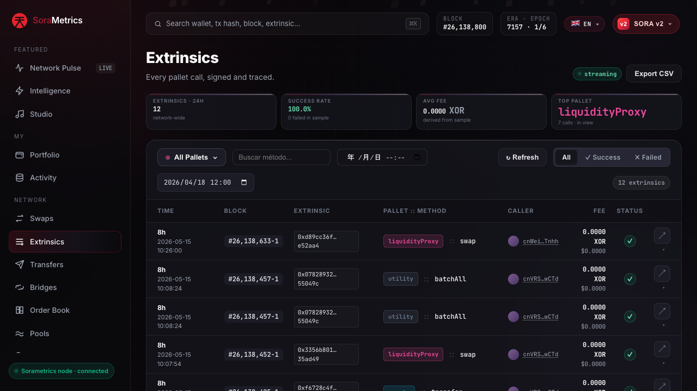
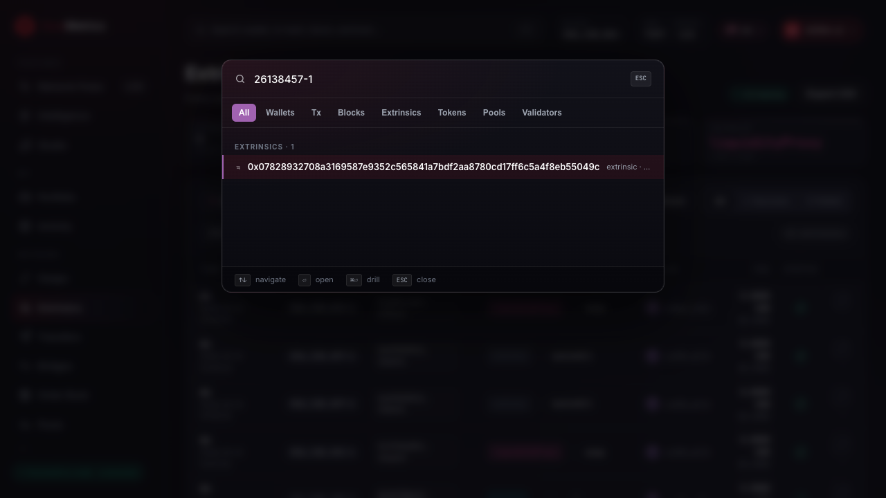
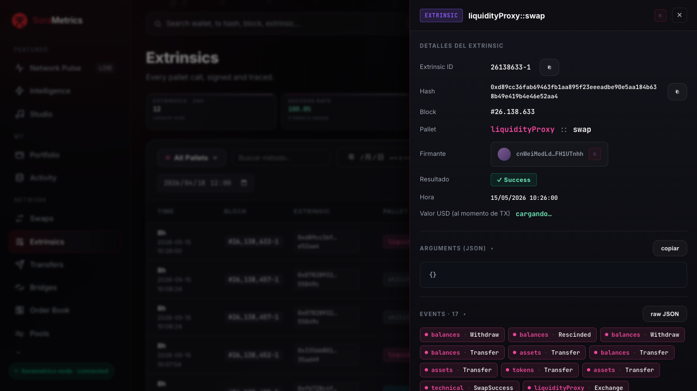
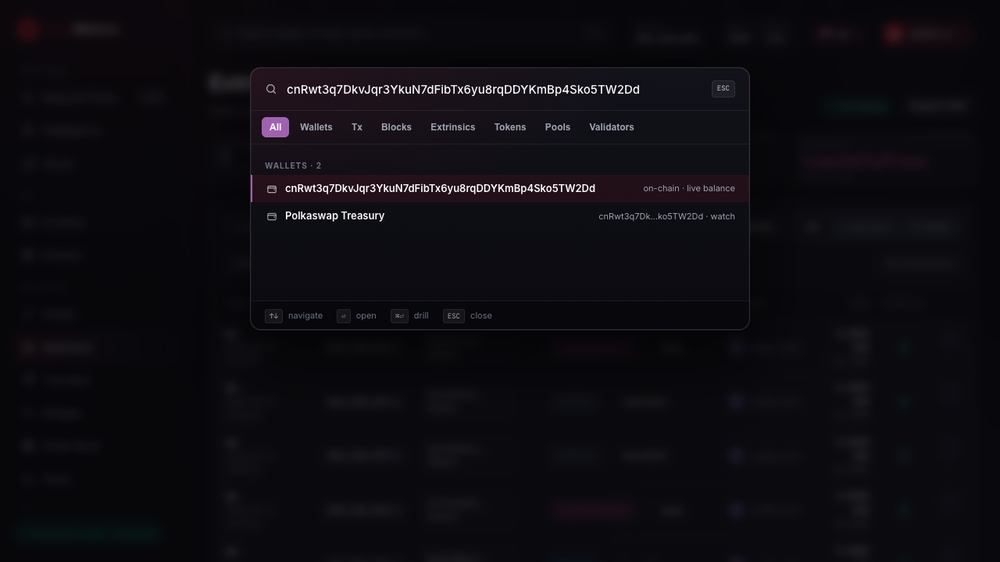
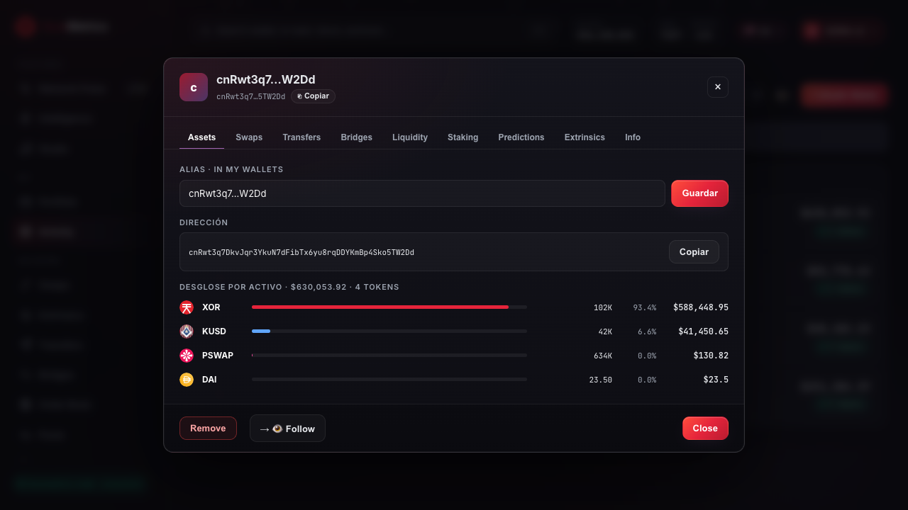

# Block Explorers

A **block explorer** is a tool that is used to view all blockchain transactions online. Specifically, to view all current and past **transactions** on the **blockchain**.

In other words, a block explorer is an online blockchain browser that reveals the data of individual blocks and transactions. With this tool, we can monitor transaction histories and balances of addresses.

The SORA mainnet uses the [SoraMetrics SORA v2 dashboard](https://sorametrics.org/sorav2) for block explorer and on-chain analytics data.

You can find any information that you need on:

- Block details
- Transaction details
- Transaction events
- Account information

## Practice

Use SoraMetrics for SORA v2 mainnet data.

Open the [SORA v2 dashboard on SoraMetrics](https://sorametrics.org/sorav2):

Here you will see the SoraMetrics interface, which contains:

- Global search. Use it to search by account, transaction hash, block number, or extrinsic ID.
- Current block, era, and epoch details
- Network statistics and live on-chain activity
- Transfers, extrinsics, holders, validators, liquidity, and bridge data

#### How to find a transaction

If you have the transaction hash or extrinsic ID, use the search box on SoraMetrics. You can also open the [Extrinsics](https://sorametrics.org/sorav2?tab=extrinsics) view and filter by block, pallet, method, status, or date.

The extrinsic details view shows parameters, events, status, and related block information.

#### How to find an account

If you have an account address, paste it into the SoraMetrics search box. You can also open an account directly by using `https://sorametrics.org/sorav2?tab=balance&address=<address>`.

On the wallet details view, you can find balances, transfers, swaps, bridge activity, liquidity, staking, and extrinsics for the account.

#### Transactions

Transactions are the most important part of the block explorer. Open the [Extrinsics](https://sorametrics.org/sorav2?tab=extrinsics) view to browse extrinsic history.

You can filter an extrinsic by date or block range, by account, module, and call. It is very useful for viewing account activity or the history of a specific operation.
