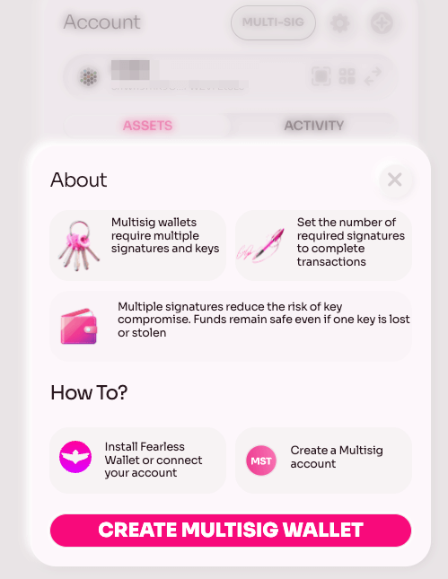
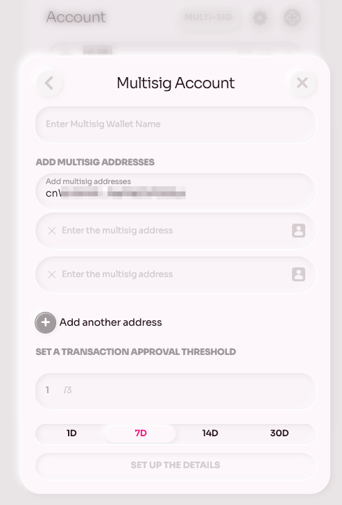
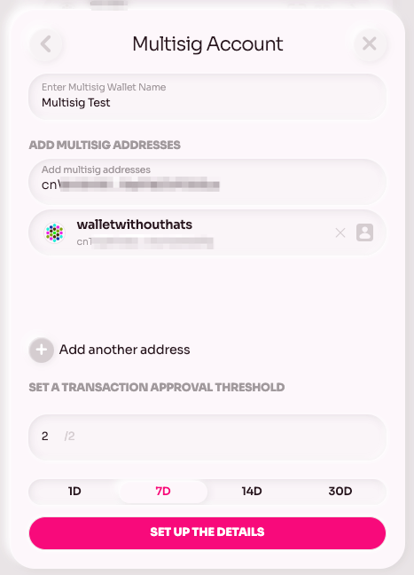
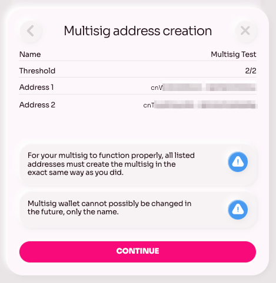
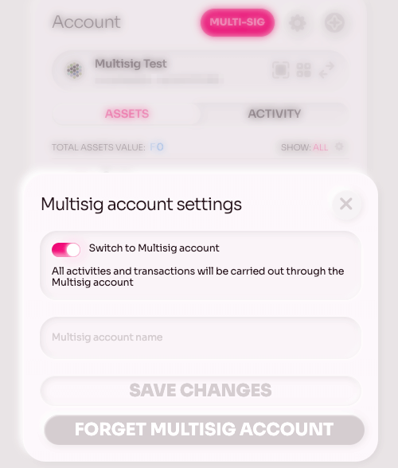
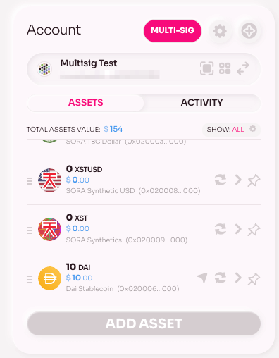
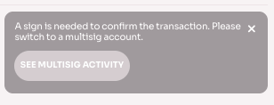
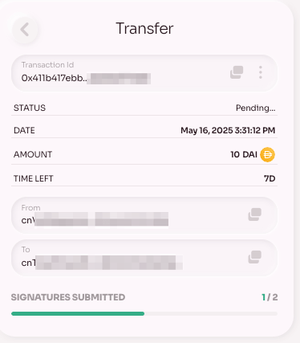
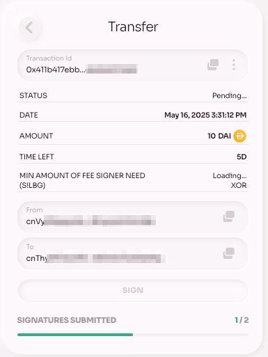

# Multi-Signature Account in SORA

With the addition of multi-signature accounts (abbreviated MST) in Polkaswap’s web interface, teams, DAOs, or any group managing shared funds can create highly secure accounts that can require multiple approvals (signatures) before a transaction is executed. 

This feature brings enhanced security for shared accounts. Instead of one person controlling assets, multiple designated signers must approve a transaction. This dramatically reduces single-point failure risk and insider threats – essential for any business or organization using SORA. This means community treasuries and project funds can be managed more safely.

With the MST feature active, DAOs, project teams, or even friends sharing an account can trade on Polkaswap without compromising security, requiring a majority of approvals (say 3 out of 5) for any transaction from this account to be processed. 

## Requirements to use the Multi-Signature Account Feature

[Polkaswap](https://polkaswap.io/) users must have an account on the [Fearless Wallet browser extension](https://chromewebstore.google.com/detail/fearless-wallet/nhlnehondigmgckngjomcpcefcdplmgc), currently available for Google Chrome browsers. 

:::info
Multi signature accounts are only available on desktop for now. 
:::

:::info
More wallets will be supported soon. 
:::

## MST Account Creation Tutorial

Follow these steps to set up a multi signature account.

In the [wallet view on Polkaswap](https://polkaswap.io/#/wallet), click on the Multi-Sig button, then "Create Multisig Wallet"

:::info
If you are using another wallet provider, Polkaswap will prompt you to connect via the Fearless browser extension. 
:::

Assign your wallet a name and then add the other members of the multisig (you can also add contacts from your address book) you can add more members clicking on the "+ Add another address" button. Then set a transaction approval threshold proportional to the addresses in the multisig (2/3, 3/5, etc) and a time limit for the pending transaction to expire. Then click set up the details. 

:::info
All the participants of the multisig need to input the same details (addresses, thresholds) for the account to be valid. 
:::

In this example, there are only two signer accounts in the Multisig test account, both accounts need to sign a transaction and the threshold is seven days. 

Click on set up the details and double check the information, then click continue. 

:::info
All the parties must input the same details, once created, the wallet's accounts cannot be changed. If you want to add more members eventually, a new wallet must be set up.
:::

Your wallet is now created, the counterparties need to set up the wallet with the same details and you are ready to make multi-signature transactions! 

To toggle between Multisig and "normal" mode in your account, click on the multisig button then use the "switch to Multisig account" toggle to activate/deactivate. You can also change the account name here, as well as "forget" the account.

:::info
Make sure you and the co-signers have drained the account before everyone forgets it, otherwise the funds will not be recoverable.
:::

## MST Account Signing Tutorial

When your multi signature account is active (on all the necessary accounts) the wallet view will be set to multisig, recognizable by the Multisig button highlighted. 

In this example, the multisig account will send ten DAI. In the Multisig view, proceed with the normal flow to send some tokens

Prepare the transaction then hit send, sign the transaction from the active wallet, then notify your counterparty you have sent that transaction. They will see the following message:

And if they look at the transaction, it will appear as pending signatures; 

To provide the missing signature, sign into the account, and toggle multi signature mode, then access the activity section and open the transaction that is pending.

Once you have signed, the transaction will go through. Congratulations, you just processed a multi-signature account. Note that the process is the same for any transaction such as LP, swaps, etc. 

## Learn More

- [Create an Account in SORA](/create-an-address.md)
- [Provide Liquidity to a Pool in SORA](/provide-liquidity-to-xyk-pools.md)

