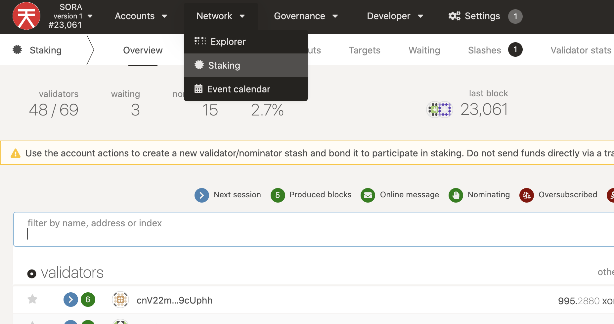
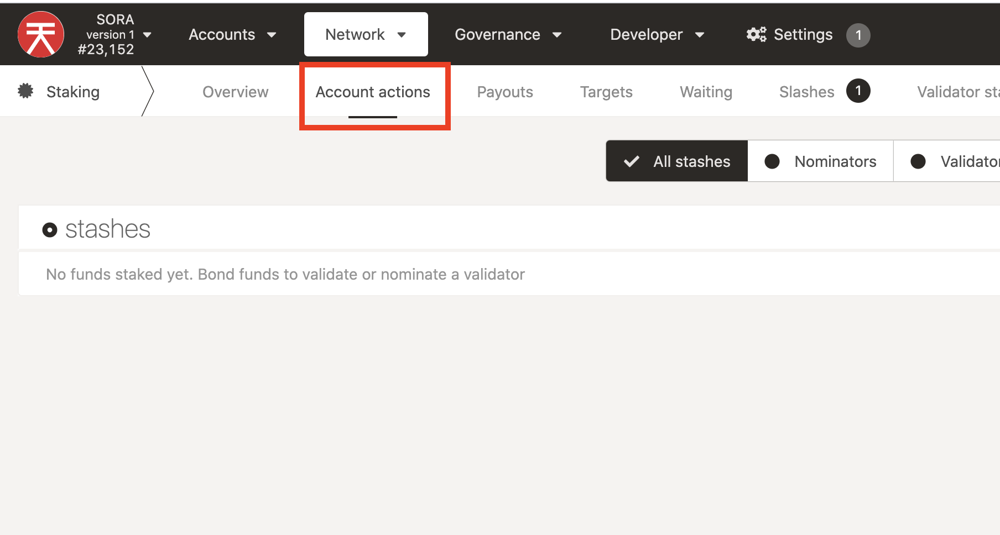
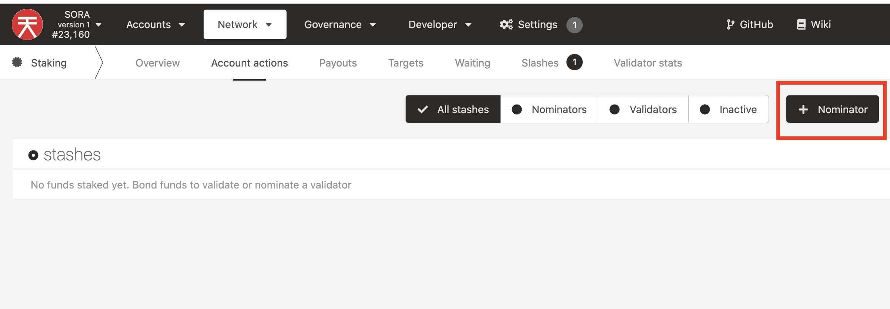
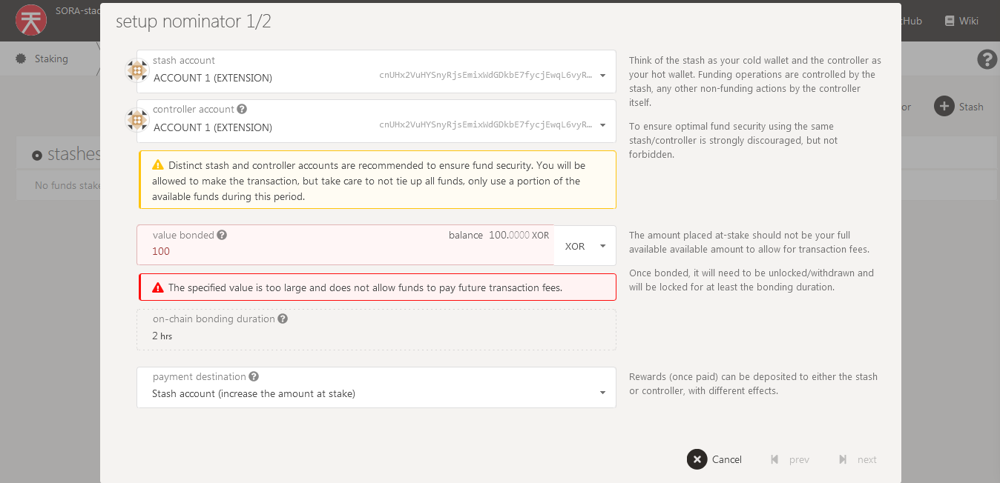
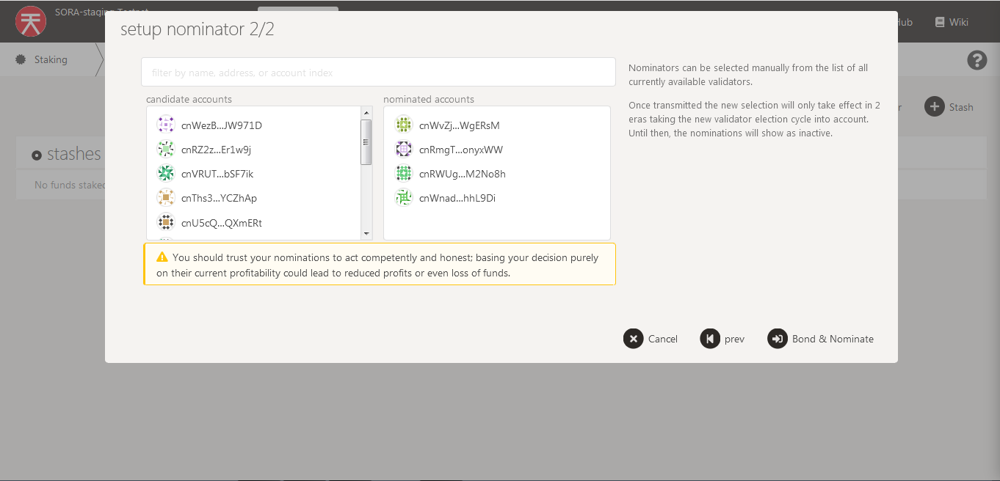
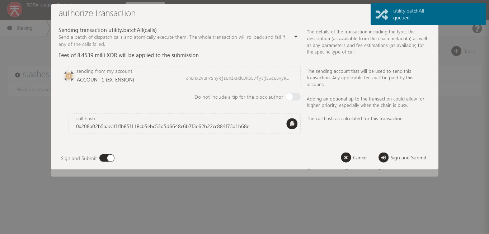
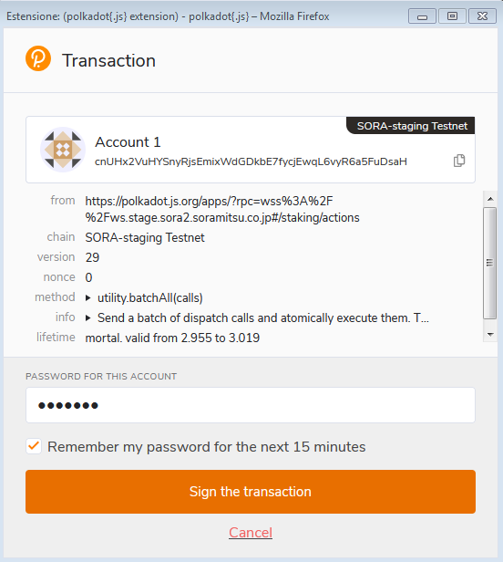

# Nominating Validators

Nominating validators is an important part of the SORA ecosystem as it helps to secure and decentralize the network. While you can nominate any validator, you should do your own research to make sure the validators you nominate are high quality and won't attack the network. If validators cause harm to the network, you will lose money as a nominator!

To provide some high quality validators on the network as a common good, the SORA Parliament maintains the following list of validators:

- cnVqqrLjSGQ7in5j3GVuXjr4b1benhdN72NQnqwzrbWxHWjYZ
- cnVyxUnvsrgtiCEaeHudqGEJuHPspfp89mGghLz21mVqdaQwv
- cnSdNvs39CVRDiFW4pEtaqZWGoSU7B8UkDKjwCb3mX999CsZH
- cnScvgXFLQgeNFoVfMjf2U5MC24CkdRkLTUKbJYefYRwqy3VZ
- cnSgH7nHuiPk5Z2cubwsFZGdmzvzhrgBKgTqLCeR7hyo6dek8
- cnU2w3CPn9narRKeSamHmKBBaSXY949A4udq6APBXNkmnkwsJ
- cnV58Z8zT37K6iUsijRjYHBzk95aTqvLfn3WvvfJcCwFQKHCL
- cnRrijYYHb4fWPuF9MraEvm8nvfztYDxcAZfKfN2AyKLBn81A
- cnUDwD4nPorodyd3inwThA2yBt2dFuHTfnvKowH6dirk47Qqr

## Via PolkadotJS UI

To nominate a Validator successfully on the SORA network, you need:

- The [Polkadot.js extension](https://polkadot.js.org/extension/) installed on your browser, with an account created and some XOR

::: info
Staking rewards **expire** after 84 eras. On **SORA**, that's about 21 days.
:::

1. Go to SORA[ polkadot.js](https://polkadot.js.org/apps/?rpc=wss%3A%2F%2Fws.sora2.soramitsu.co.jp#/staking), click on "Network" and then "Staking". **Make sure you are connected to the SORA network**, you should see the logo at the top left.

2. Next, you will need to create a new Nominator Stash. Click on "Account Sections" and then "Nominator", as shown in the pictures below. Make sure to read the information displayed carefully.

3. Set the Stash and Controller accounts.

Think of the stash as your cold wallet and the controller as your hot wallet.

Funding operations are controlled by the stash, while non-funding actions are managed by the controller itself. Having the stash and the controller accounts makes your funds more secure.

You can read more [here](https://www.holdpolkadot.com/post/stash-account-controller-account-on-polkadot-and-kusama).

4. Set the amount you want to stake and click "Next".

5. The next step is to choose the Validators you want to nominate.

SORA network uses the [Phragmèn Method](https://wiki.polkadot.network/docs/en/learn-phragmen) to select Validators.

During each era, Validators are chosen using the Phragmen Method, and those who nominated them will receive a reward (a stake reward).

From a Nominator's perspective, you only need to nominate at least one of the Validators who is actually elected during each era. This explains why you can nominate more than one candidate at the same time, with a maximum of 16 validators per nominator account.

::: info Disclaimer

It is important to nominate trustworthy and reliable validators. Validators and their Nominators' stake can be slashed, which is a punishment for failing to follow the protocol. You can read more about Slashing\* [here](https://w3f-research.readthedocs.io/en/latest/polkadot/slashing/amounts.html).

:::

6. When you have selected the validators, click on "Bond & Nominate", "Sign and Submit" and then sign the transaction with Polkadot.js extension, as shown in the pictures below:

