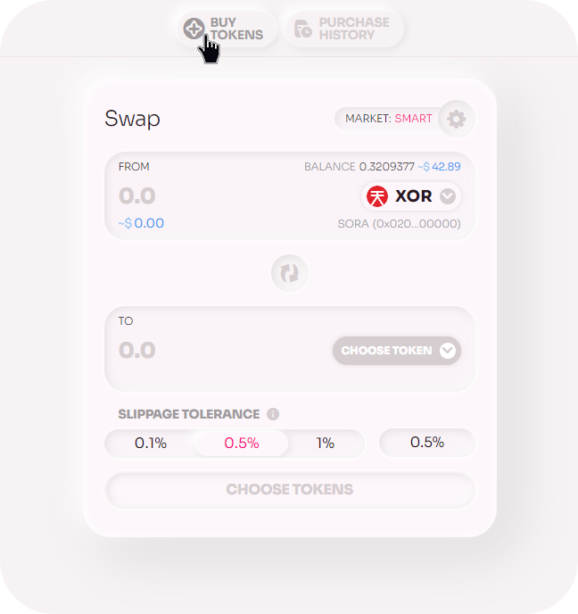
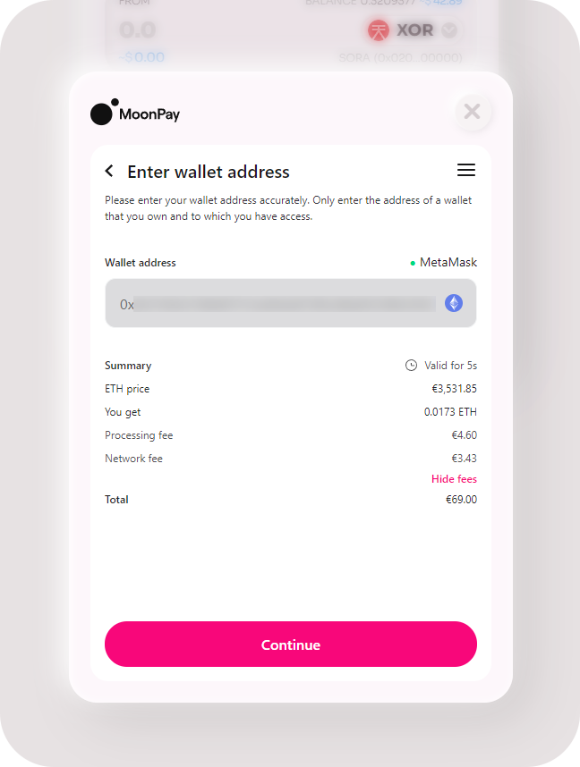
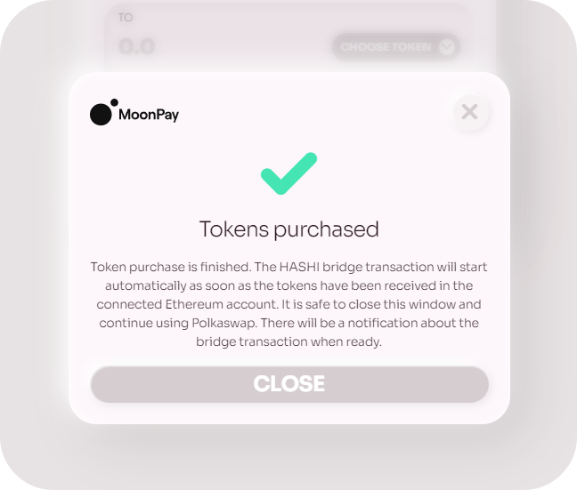
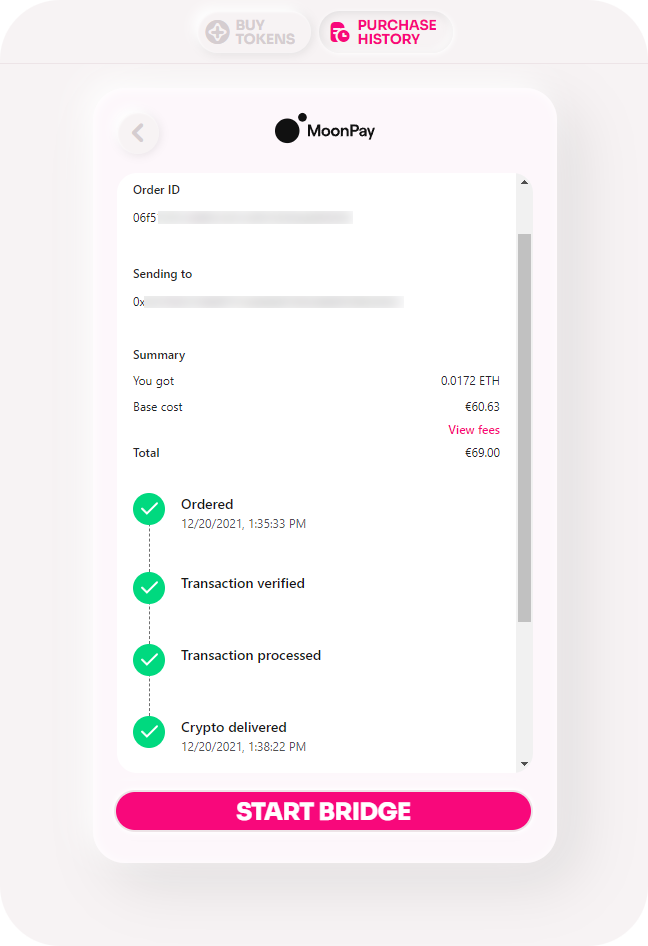

# On-ramp

## Via Polkaswap

Before getting started, make sure that:

- [**Metamask**](https://metamask.io/download.html) is installed in your browser with the Ethereum account that you wish to be using for MoonPay ready and connected, as tokens will be sent first to Ethereum, then to SORA using the HASHI bridge.
- You have enough ETH for the [**HASHI bridge**](https://polkaswap.io/#/bridge) transaction fees on the Ethereum network side.
- You are aware of [**MoonPay account limits and the KYC process**](https://support.moonpay.com/hc/en-gb/articles/4407710995217-What-are-your-account-limits-).

Follow these steps to get started:

1. Click the **BUY TOKENS** button to open the [MoonPay](https://www.moonpay.com/) purchase menu:

   

2. Select the **Currency** and **Amount**, then click **Continue.**

   ::: warning

   Currently you can only buy DAI and ETH.

   :::

   .png>)

3. On the next screen, the Metamask extension will pop up a request for you to select an account (_if you have multiple Metamask wallets_). Once you confirm, [MoonPay](https://www.moonpay.com/) will automatically connect your Metamask account address.

   - If everything is ok, click **Continue**.
   - If the address is not the one you would like to be using, change the account in Metamask to the one you wish to be using.

   

4. Go through the **KYC** process.

   ::: info

   You will have to do this only **once**. Every other time you will only have to enter the email address you submitted for verification. If you have already used [MoonPay](https://www.moonpay.com/) before, enter the email address you used.
   :::

5. Enter your credit card information, confirm that you agree with the **Terms of Use** and click **Buy now**.

   ::: tip

   If you're practicing on the testnet ([test.polkaswap.io](http://test.polkaswap.io)) use the following credit cards;

   Visa 4000 0209 5159 5032 12/2022 123

   Visa 4000 0209 5159 5032 12/2022 1

   :::

   

6. Wait for the transaction to be processed. You may close the window (and browser) safely at any time and come back to it later. You will also be notified via email by [MoonPay](https://www.moonpay.com/) once the transaction is completed or if there are any issues.

   ::: info
   Processing may take a few minutes _or a few hours_.
   :::

   

   If you don't close the window, you will be automatically taken to the next steps once the transaction is processed:

   

7. Once the tokens have been received in your Ethereum account (that is also actively connected to the Polkaswap site), the modal window to start the HASHI bridge transaction will appear automatically.

   .png>)

8. Click **START BRIDGE** to move the tokens from Ethereum to SORA. Alternatively, you can close this window and begin the process at a later time (_closing this window will not affect the transfer, you can still reach the transaction any time in Purchase History and start the bridge from there_).

   

9. Click **PURCHASE HISTORY** to review your transaction. You can click and view each transaction in detail, new and old, as well as start the bridge for any of the transactions that are ready and waiting.

   

10. When you are ready to transfer your funds to the SORA network, click **START BRIDGE** and then follow the usual steps for the HASHI bridge to move tokens from Ethereum to SORA.

11. Confirm the Ethereum network transaction:

    

12. Once the **Ethereum network transaction** has been processed, wait for the **SORA network transaction** to finish. This step takes longer as it is waiting for 30 block confirmations, hold on tight!

    

    The little wait is worth it though, as once this is done you’ve successfully bought crypto _with Style and Freedom_ directly from within Polkaswap using a credit card. _Woohoo!_

    .png>)

::: tip

You can always go back and review any of the HASHI bridge transactions via the [bridge history page](https://polkaswap.io/#/bridge/history).

You can also view all the purchases via the [Purchase History page](https://polkaswap.io/#/moonpay-history) and access all of your bridge transactions from there.

:::

In case you experience any issues at all, please join the [SORA Happiness](https://t.me/SORAhappiness) group on Telegram.
