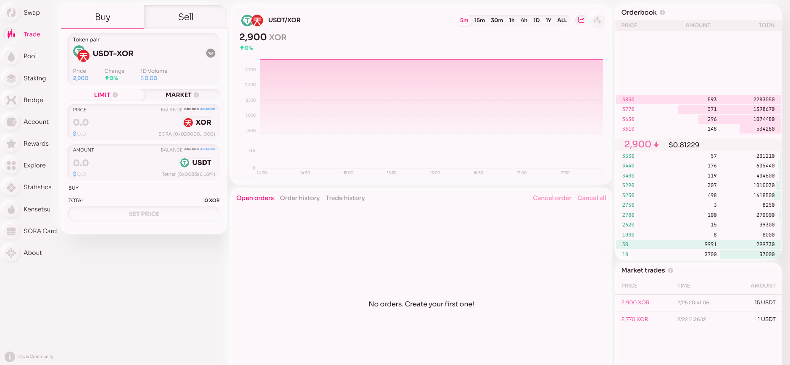
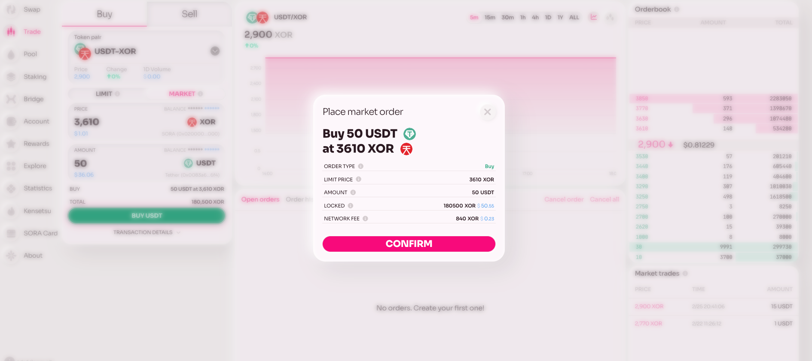
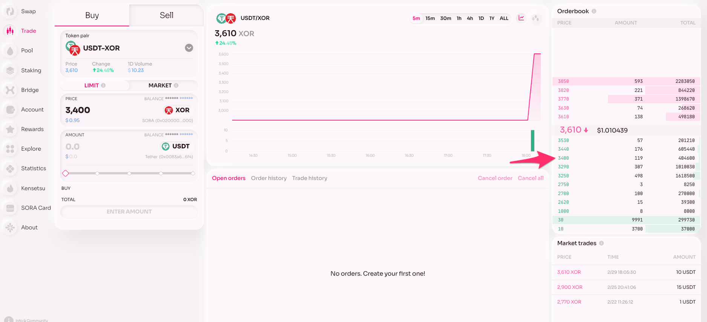

# Polkaswap Advanced Trading: Order Book

## Theory

An order book is a fundamental component of a decentralized exchange (DEX) that facilitates trading digital assets between buyers and sellers in a transparent and efficient manner. It serves as a virtual meta ledger that records all the buy and sell orders placed by participants in the market.

This tutorial will walk you through the essential steps for trading on Polkaswap, focusing on connecting your wallet, understanding the interface, and executing trades. Let's get started.

## Practice

1. **Connect Your Wallet:** To begin trading, connect your wallet to Polkaswap. This is a crucial step to access your funds and initiate trades.

2. **Fund Your Wallet:** Ensure you have XOR or another cryptocurrency. You'll need these assets to start trading on Polkaswap.

3. **Navigate to the Trade Tab:** Here's where the action happens. Click on the Trade tab to access the trading interface.

### Explore the Interface:

You'll see several key components in the Orderbook interface:

- **The Order Book Widget:** Shows all the aggregated orders for a selected pair.
- **Charts:** Shows visual representations of trading activity.
- **Buy and Sell Widgets:** Shows where you'll place your orders.
- **History Widget:** Displays your past trading activities.
- **Market Trades Widget:** Shows all trades for the selected pair.
- **Understanding Charts:** The chart for the selected pair reflects data related to Order Book trading. It does not aggregate liquidity from swaps.

### Placing Orders:

Choose the token pair you wish to trade. There are two types of orders:

- **Market Order:** Executes at the latest pair price, similar to a swap.

- **Limit Order:** Allows you to set any desired price. Orders default to one month and will be automatically canceled after this period.

4. **Order Cancellation:** You can cancel your order at any time
   without any fees.

5. **Fees on Order Placement:** You will incur a fee when placing an
   order. The fee amount depends on the price, similar to current
   swap fees.

   

   

6. **Executing Trades from the Order Book:** If you want to fill an
   existing order, simply click on it. This action pre-fills the Buy
   and Sell widget, allowing you to execute the trade.

   

That's it! You're now ready to start trading on Polkaswap. Remember, trading involves risks, so understand the process and trade responsibly. Happy trading with Style and Freedom!

## Learn More

- [Liquidity Operations on Polkaswap](/provide-liquidity-to-xyk-pools-polkaswap)
- [Swaps on Polkaswap](/swap-polkaswap)
