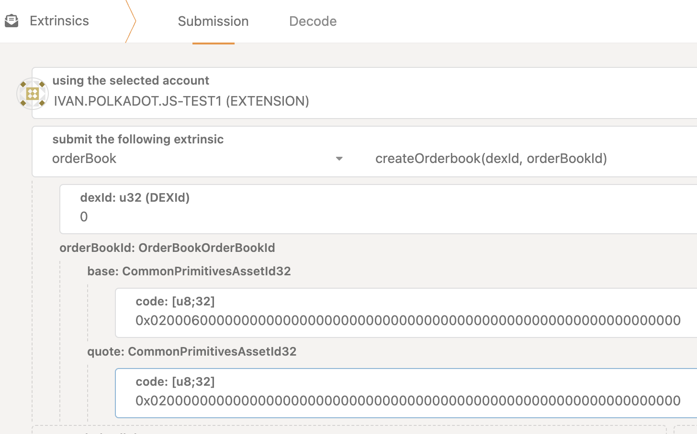
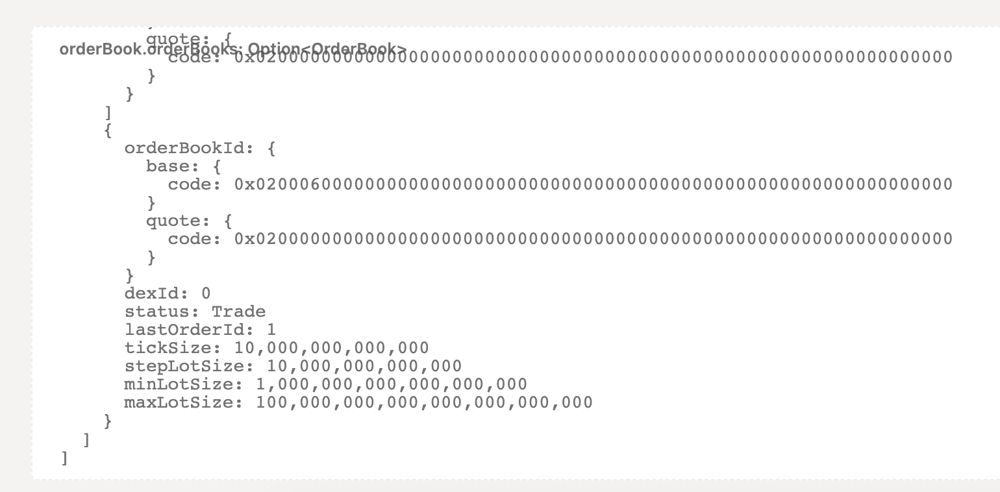
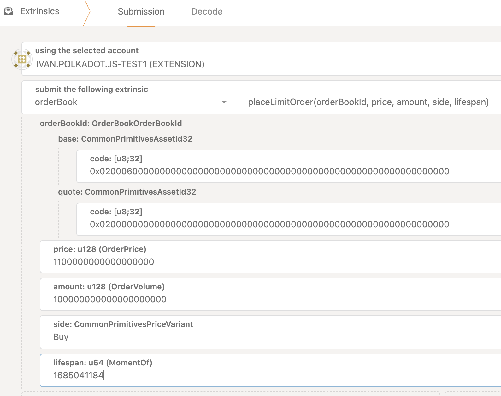
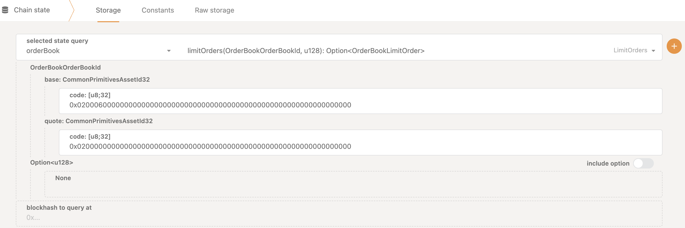
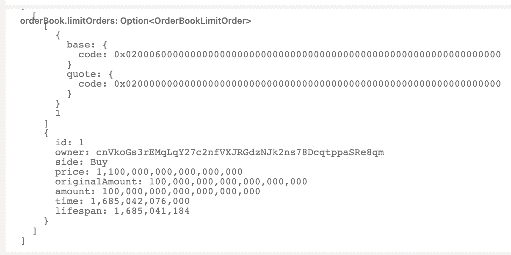

# Order books

::: info

If you are new to order books and want to understand their basic mechanisms, we highly recommend watching the following video:

<iframe width="560" height="315" src="https://www.youtube.com/embed/Kl4-VJ2K8Ik" title="YouTube video player" frameborder="0" allow="accelerometer; autoplay; clipboard-write; encrypted-media; gyroscope; picture-in-picture; web-share" allowfullscreen></iframe>

:::

## Use-case

An order book is a fundamental component of a decentralized exchange (DEX) that facilitates trading digital assets between buyers and sellers in a transparent and efficient manner. It serves as a virtual meta ledger that records all the buy and sell orders placed by participants in the market.

In a traditional centralized exchange, the exchange operator manages the order book, matching buy and sell orders to execute trades. However, in a decentralized exchange, the order book is maintained on a blockchain, allowing participants to interact directly with each other without the need for intermediaries.

By leveraging the power of blockchain technology, order books on decentralized exchanges offer several advantages:

- **Better price understanding**: Buyers and sellers will be able to see actual offers, enabling them to make more informed decisions about the true market value of assets. This can lead to more efficient trading.
- **Improved liquidity**: Buyers and sellers will have greater control over the prices at which they trade. This helps attract more market participants, leading to increased liquidity and a more dynamic market.
- **Additional liquidity source for the Liquidity Proxy**: Traders will have an alternative option to use the Liquidity Proxy, which can positively impact trading outcomes.
- **Reduced slippage**: In XYK markets, large trades can cause significant price changes due to the trade size impacting the market price. With order books, traders can place limit orders at the desired price, reducing the risk of slippage.
- **More trading options**: Traders will have access to various trading mechanisms, including market orders, limit orders, stop orders, and more. This can lead to more sophisticated trading strategies and better risk management.
- **Alternative market for NFT trading**: NFTs can have their own order book, where users can place buy and sell orders. While it may not be the optimal mechanism for NFT trading due to their uniqueness and the need for customized volume and price steps (auction models or peer-to-peer mechanisms where buyers and sellers can directly negotiate the price of NFTs are traditionally considered more suitable), the order book mechanism can be more relevant for NFT trading compared to Pool XYK.
- **Other benefits inherited from DEX characteristics**:
  - _Permissionless accessibility_: DEXs allow anyone to participate in trading digital assets without a centralized intermediary. This promotes financial inclusion and provides access to a global user base, regardless of geographical location.
  - _Enhanced ownership and control_: All assets remain under the ownership and control of users.
  - _Transparency_: Users can verify authenticity, ownership history, and transaction data, fostering trust and reducing the risk of fraud or manipulation by a centralized intermediary.
  - _Decentralization benefits_: Reduced risks of hacks, downtime, or data breaches associated with centralized platforms.
  - _Community-driven development_: Users can create order books themselves, contribute to liquidity, set their own trading parameters, and influence development using decentralized governance tools. This fosters innovation, competition, and a vibrant ecosystem.

While order books on decentralized exchanges offer numerous benefits, it's important to consider their limitations:

- **Scalability**: Blockchains have limitations in processing transaction volumes.
- **Liquidity**: Liquidity of decentralized order books can be limited.
- **User experience**: Interfaces may be more complex and less user-friendly compared to centralized solutions.
- **Fewer trading instruments**: Centralized exchanges typically offer a wider range of order types.
- **Order book management**: In centralized systems, the exchange operator can manage the order book and ensure its efficient operation. In decentralized order book implementations, management is left to users, which can lead to errors, inefficiencies, and potential manipulation.

## Data model

### Main entities

```rust
OrderBooks = StorageMap<OrderBookId, OrderBook>;
LimitOrders = StorageDoubleMap<OrderBookId, OrderId, LimitOrder>;
```

### Indexes entities

```rust
Bids = StorageDoubleMap<OrderBookId, OrderPrice, PriceOrders>;
Asks = StorageDoubleMap<OrderBookId, OrderPrice, PriceOrders>; AggregatedBids = StorageMap<OrderBookId, MarketSide>;
AggregatedAsks = StorageMap<OrderBookId, MarketSide>;
UserLimitOrders = StorageDoubleMap<AccountId, OrderBookId, UserOrders>;
```

### Order book

```rust
OrderPrice = Balance; OrderVolume = Balance;
struct OrderBookId { /// Base asset.
    pub base: AssetId,
/// Quote asset. It should be a base asset of DEX.
    pub quote: AssetId,
}
```

```rust
struct OrderBook {
    pub order_book_id: OrderBookId,
    pub dex_id: DEXId,
    pub status: OrderBookStatus,
    pub last_order_id: OrderId,
    pub tick_size: OrderPrice,
    pub step_lot_size: OrderVolume, // amount precision pub min_lot_size: OrderVolume,
    pub max_lot_size: OrderVolume,
}
```

### Limit order

```rust
struct LimitOrder {
    pub id: OrderId,
    pub owner: AccountId, pub side: PriceVariant,
    /// Price is specified in OrderBookId `quote` asset. /// It should be a base asset of DEX.
    pub price: OrderPrice,
    pub original_amount: OrderVolume,
    /// Amount of OrderBookId `base` asset
    pub amount: OrderVolume,
    pub time: Moment,
    pub lifespan: Moment, }

PriceOrders = Vec<OrderId>
MarketSide = BTreeMap<OrderPrice, OrderVolume>
UserOrders = Vec<OrderId>
```

### Hard-coded limitations

Regular asset

```rust
tick_size = 0.00001
step_lot_size = 0.00001
min_lot_size = 1
max_lot_size = 100000
```

NFT asset

```rust
tick_size = 0.00001
step_lot_size = 1
min_lot_size = 1
max_lot_size = 100000
```

General

```rust
MAX_ORDER_LIFETIME = 30 days
MIN_ORDER_LIFETIME = 1 block
MAX_PRICE_SHIFT = 50%
MaxOpenedLimitOrdersPerUser = 1000
MaxLimitOrdersForPrice = 10000
MaxSidePriceCount = 100000
```

### Orderbook statuses

```rust
pub enum OrderBookStatus {
    /// All operations are allowed.
    Trade,
    /// Users can place and cancel limit order, but trading is forbidden.
    PlaceAndCancel,
    /// Users can only cancel their limit orders. Placement and trading are forbidden.
    OnlyCancel,
    /// All operations with order book are forbidden. Current limit orders are frozen and users cannot cancel them.
Stop,
}
```

### Order book operations

```rust
Order Book operations
• Create Order Book
• Delete Order Book
• Update Order Book
• Change Order Book status • Place limit order
• Cancel limit order
```

### Permissions

See this [GH issue for more information](https://github.com/sora-xor/sora2-network/issues/400)

## Step-by-step instructions

In this section, you will learn how to perform various operations related to order books on the SORA blockchain in `polkadot.js` (or dotapps.io) starting in the `Developer` -> `Extrinsics` tab. Whether you want to create a new order book, delete an existing one, update its details, change the status, place a limit order, or cancel a limit order, this guide will provide you with clear and concise instructions.

::: warning

Please note that during the execution, there may be certain conditions that prevent the execution of specific transactions. In such cases, you will encounter errors with self-explanatory names. For a comprehensive list of all the errors, you can refer to the [codebase](https://github.com/sora-xor/sora2-network/blob/7de5fb694ee3b7ef1b315d13ba61c5eb25e26cb2/pallets/order-book/src/lib.rs#L267).

:::

### Creating an Order Book

This tutorial will walk you through the process of creating a new order book for a specific asset.

1. Choose `orderBook.createOrderbook(dexId, orderBookId)`
2. Fill the details:


_An order book is being created for the XOR-DAI trading pair, with XOR as the base asset. This selection is based on the chosen dexId, which is set to 0._

3. Verify that the Order book was created. Open `Chainstate` calls -> Choose `orderBook.orderBooks` -> Switch off include option switch -> Run the query.


_The provided image showcases the successful creation of an order book for the specified trading pair._

### Deleting an Order Book

In this tutorial, you will discover how to delete an existing order book. We will guide you through the steps to ensure a smooth and secure removal process.

1. Choose `orderBook.deleteOrderbook(dexId, orderBookId)`
2. Fill the details:

<!-- TODO. add the image -->

3. Check that the Order book was created. Open `Chainstate` calls -> Choose `orderBook.orderBooks` -> Switch off include option switch -> Run the query. A deleted order book should be missing.

### Updating an Order Book

If you need to modify the parameters of an existing order book, this tutorial will demonstrate the steps to update its details. You will learn how to adjust the price step, volume step, or any other relevant parameters.

<!-- TODO. Finish, when implemented -->

### Changing Order Book Status

This tutorial will explain how to change the status of an order book. You will understand the different statuses available and how to transition between them, such as from "Trade" to "PlaceAndCancel" or "OnlyCancel" to "Stop."

<!-- TODO. Finish, when implemented -->

### Placing a Limit Order

In this tutorial, you will learn how to place a limit order on an order book. We will guide you through the process of setting the desired price and volume for your order and executing the trade.

1. Choose `orderBool.placeLimitOrder`
2. Fill the details:



_The query included the following parameters:_

```
Price: 1.1 DAI (1100000000000000000)
Amount: 100 ETH (100000000000000000000)
Side: Bid
Lifespan: Current timestamp + 30 days
```

3. Check that the Limit order was opened. Open `Chainstate` calls -> Choose `orderBook.orderBooks` -> Switch off include option switch -> Run the query.


_The provided image showcases the query to check the result of the limit order being created._


_The image provided demonstrates the successful creation of the limit order._

### Canceling a Limit Order

If you need to cancel a previously placed limit order, this tutorial will demonstrate the steps to do so. You will understand how to locate your order and successfully cancel it.

1. Choose `orderBool.cancelLimitOrder`
2. Fill the details:

<!-- TODO. Finish, when implemented -->

3. Check that the Limit order was cancelled. Open `Chainstate` calls -> Choose `orderBook.orderBooks` -> Switch off include option switch -> Run the query.

<!-- TODO. Finish, when implemented -->

_The image provided demonstrates the successful cancellation of the limit order._

## References

If you are proficient in RUST and Substrate, we invite you to explore our codebase dedicated to order books. By following [this link](https://github.com/sora-xor/sora2-network/tree/master/pallets/order-book), you will have access to the source code, allowing you to delve deeper into the implementation details and functionalities of order books within SORA.

For more transparency on the development of order books, we recommend exploring the corresponding [GitHub milestone](https://github.com/sora-xor/sora2-network/milestone/4). This will provide you with additional insights into the progress and advancements in order book implementation.
