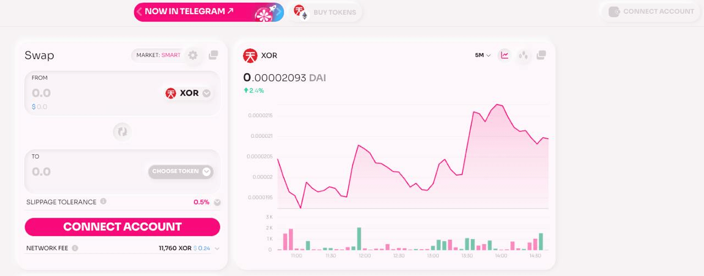
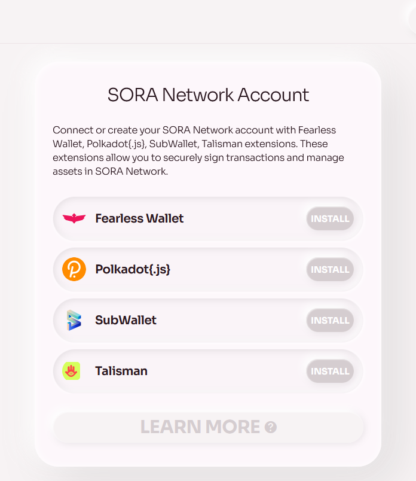
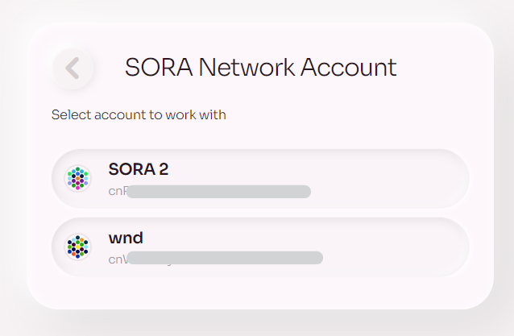

# Connect Wallet

1. Go to [Polkaswap.io](https://polkaswap.io) and click on the "Connect account" button at the top of the page.

2. You will see a list of supported wallet options to connect, including [Fearless Wallet](https://fearlesswallet.io), Polkadot.js, Subwallet, and Talisman.

3. Select the wallet extension installed on your browser. For example, if you are using Fearless Wallet, click on the Fearless Wallet option.
4. A pop-up window will appear from your selected wallet extension, asking you to confirm the connection to Polkaswap. Click "Confirm" to proceed.
5. After the connection has been established, you will see a list of your available accounts displayed on the Polkaswap page. Choose the account you want to use and click on it.

6. Once the connection is complete, you will be able to see your account balance and manage your funds on Polkaswap.
   Congratulations, you have successfully connected your wallet! Now you can stake, provide liquidity, trade, and much more with style and freedom on Polkaswap!
   Remember to always do your own research before making any financial decisions.
