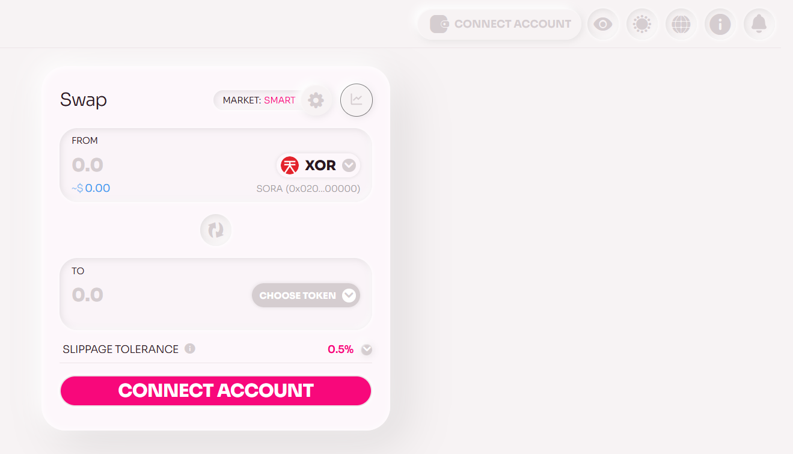

# Connect Your Wallet to Polkaswap

With the constant improvements making Polkaswap more stylish and free,
there are more ways to connect your account. In this section, we will
cover how to connect your account to the web app and Telegram mini
app.

## Polkaswap Web App

1. Go to [Polkaswap.io](https://polkaswap.io) and click on the "Connect account" button at the top of the page.

   

2. You will see a list of supported wallet options to connect,
   including an account created on [Google](/polkaswap-connect-with-google.md), [Fearless Wallet](https://fearlesswallet.io),
   Polkadot.js, as well as Wallet Connect and other
   [Polkadot-compatible
   wallets](https://wiki.polkadot.network/docs/wallets-and-extensions)
   that support SORA.

   

3. Select the wallet extension installed on your browser. For example, if you are using Fearless Wallet, click on the Fearless Wallet option.
4. A pop-up window will appear from your selected wallet extension,
   asking you to confirm the connection to Polkaswap. Click "Confirm"
   to proceed.
5. If you chose Wallet Connect, a popup with a QR code will appear for
   you to scan with your mobile wallet, otherwise you can copy the link.

   

6. After the connection has been established, you will see a list of your available accounts displayed on the Polkaswap page. Choose the account you want to use and click on it.

   

7. Once the connection is complete, you will be able to see your
   account balance and manage your funds on Polkaswap.

## Polkaswap Telegram App

1. Access the [Polkaswap Telegram app](https://t.me/polkaswap_io_bot/app) and
   launch the bot.

   

2. Click on the wallet icon on the top right or the connect account
   button on the main screen.

   

3. You can either connect a SORA account or use Wallet Connect. If you
   chose to connect a SORA account, you have the option to create a
   new account directly in the interface or import an existing account
   with your mnemonic phrase or a json file.

::: info
Follow the [Create an Address
flow](/create-an-address.md#via-polkaswap-telegram-application) if you
do not have a SORA address yet, or [restore an existing address](create-an-address.md#restoring-account-from-mnemonic-in-different-applications) if you already have one.
:::

4. If you choose to use Wallet Connect, the interface is very similar
   to the web app, where you can scan the QR or copy the code for your
   wallet.

   

Congratulations, you have successfully connected your wallet! Now you can stake, provide liquidity, trade, and much more with style and freedom on Polkaswap!

_Remember to always do your own research before making any financial decisions._

## Learn More

- [Create an Address](/create-an-address.md)
- [Account Security](/account-security.md)
