# Connect With Google

Connecting to [Polkaswap.io](https://polkaswap.io/#/wallet) has never been easier. Use a Google login to access your SORA account with style and freedom.
This feature would be of most interest to people who are new at DeFi and blockchain accounts.
::: warning
Never share your personal account information with anyone.
:::

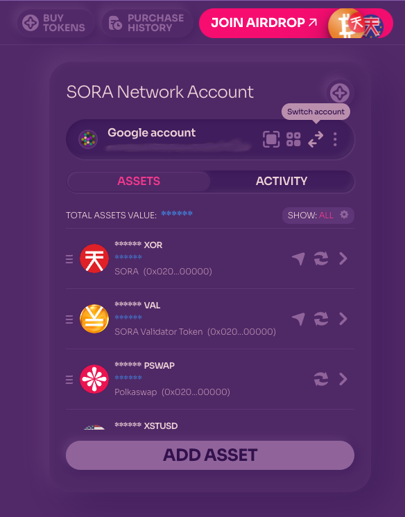

1. Navigate to the Account section in [Polkaswap.io](https://polkaswap.io/#/wallet) and click the “Switch Account” button.

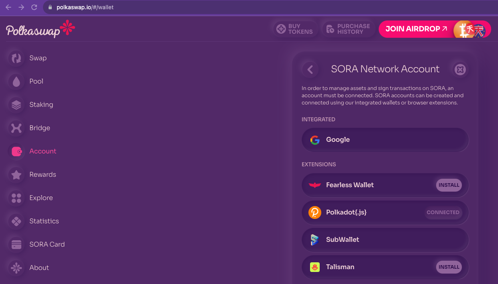

2. Click on Google and sign in with the existing account on your computer or create a new account.

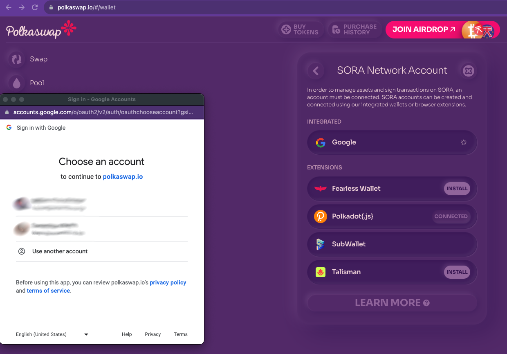

3. Allow [Polkaswap.io](http://Polkaswap.io) access to your Google account, after allowing this permission, Polkaswap will use the keys to your account, safely stored within your Google Drive.

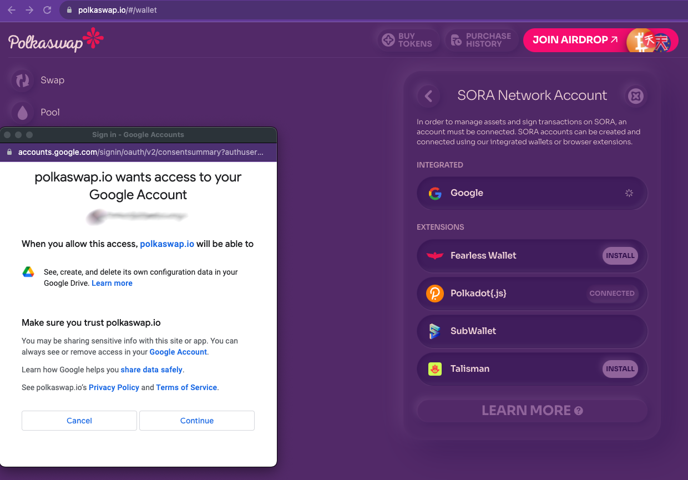

4. Once you have successfully signed in, you can create a new account or import an account using a JSON file.

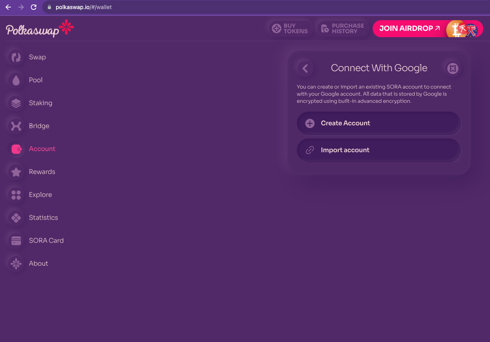

5. If you want to create a new account, click the button and store the 12-word phrase to secure your account, also known as seed or [mnemonic phrase](create-an-address.md#restoring-account-from-mnemonic-in-different-applications). Store it safely, and never share it with anyone!

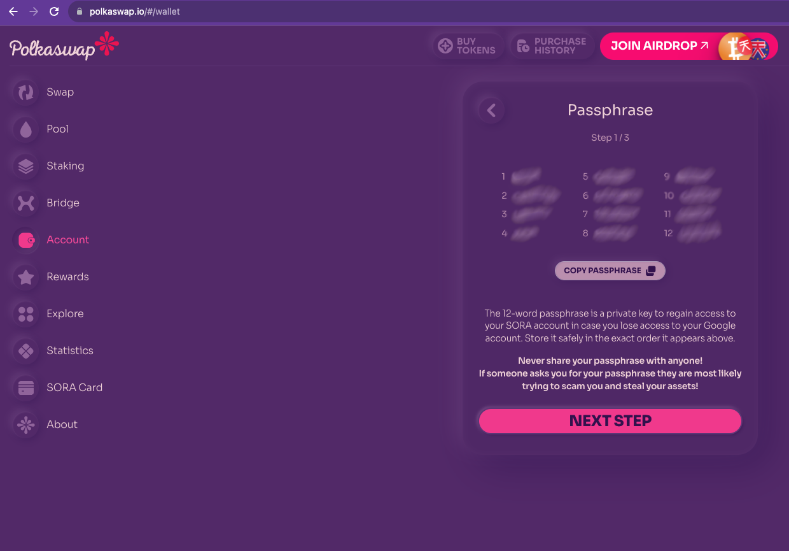

6. Confirm your passphrase to secure your account, or skip the process. You can return to confirm your passphrase later.

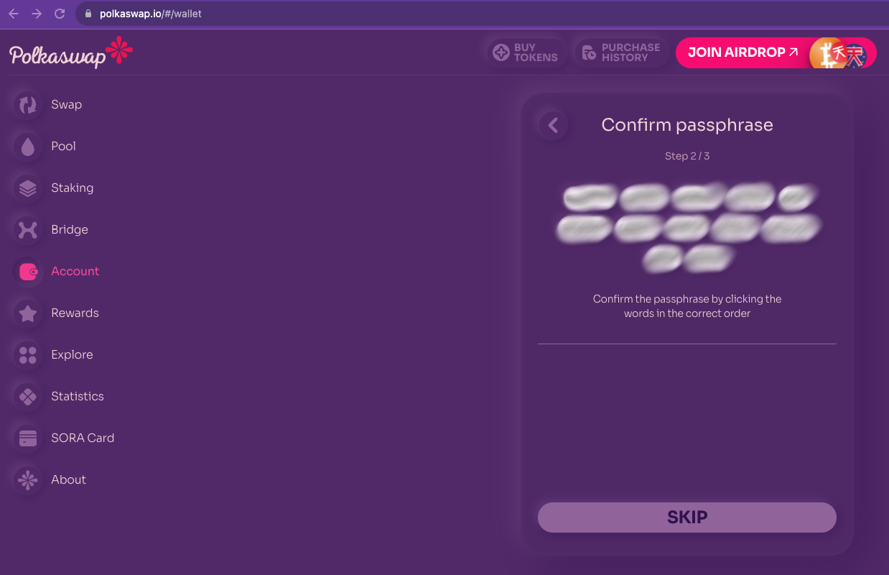

7. Give your account a name and password, then confirm the password. You can also export a JSON file at this point. **If you toggle the JSON file for the account restoration option, Polkaswap will download your account’s JSON file to your computer or device.**

::: info
You can use the JSON file to import an account on Polkaswap or another wallet.
:::

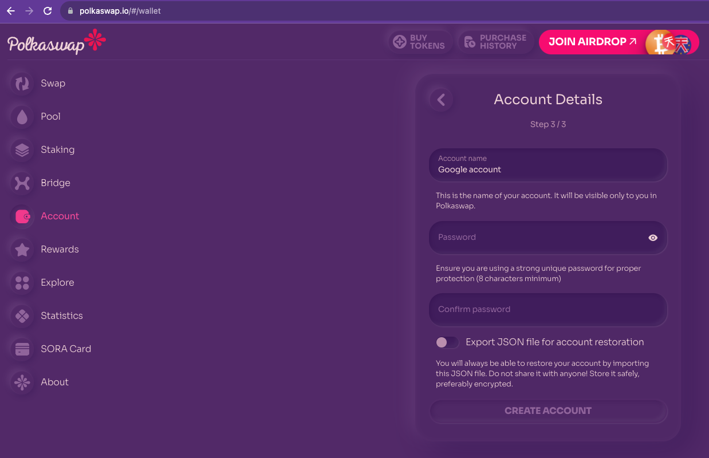

Success! You have created a SORA account to use on Polkaswap using Google!

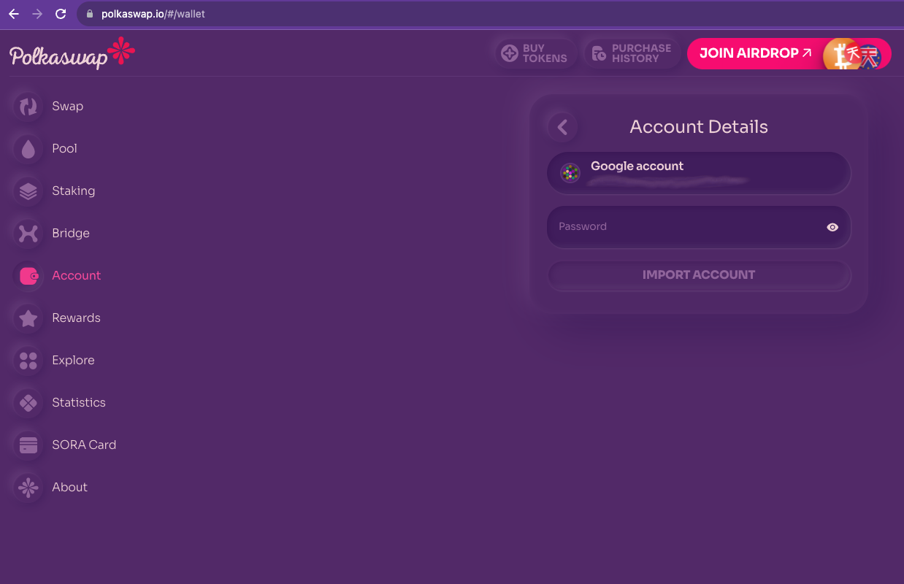

To access Polkaswap using this account, click on the account’s name, then input the account password you set in the last step.

**_You are now connected through Google with style and freedom!_**

## Importing an Existing Google Account

1. With the JSON file of the account you want to import at hand, navigate to the Account section on Polkaswap and click the Switch account button.

2. Click on Google and sign in to the account you want to use. You will find a screen with options to create or import an account if you have already signed in. Select the **Import Account** option.

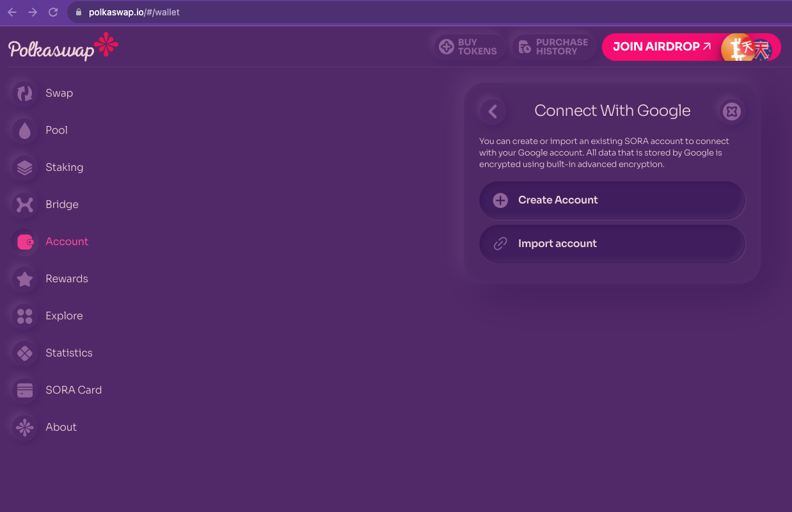

3. Here you can drag and drop the JSON file for your account, and there are also tutorials to help you export your JSON file from [Fearless
   Wallet](https://wiki.fearlesswallet.io/accounts/walkthrough/exporting-and-importing-a-wallet-using-a-json-file), [Polkadot JS](https://support.polkadot.network/support/solutions/articles/65000177677-how-to-export-your-json-backup-file), and [Subwallet](https://docs.subwallet.app/extension-user-guide/export-and-backup-an-account).

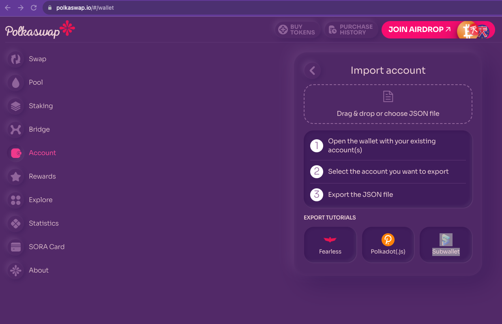

4. After you drop your JSON file, Polkaswap will ask you for the account password to be able to import your account.

5. After you input your account password, it will be available to select within the “Connect With Google” screen.

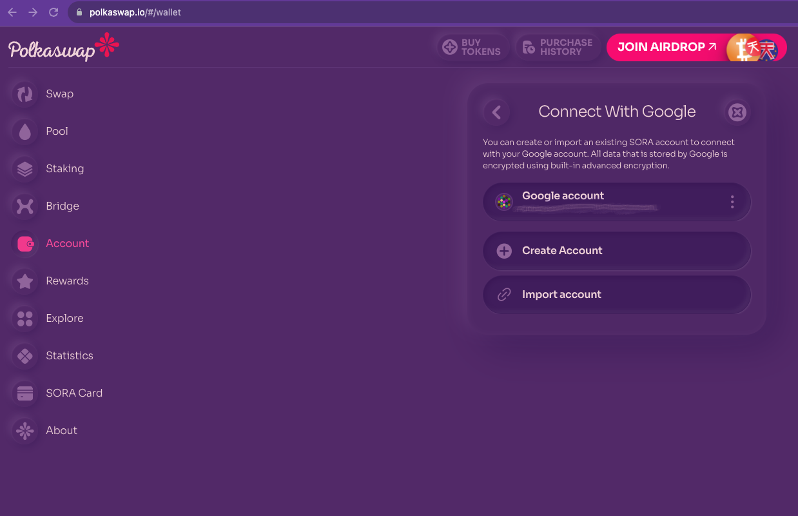

## Making Transactions with a Google Account

After your Google account has been selected as the active account, your balances will be available in the Wallet view.

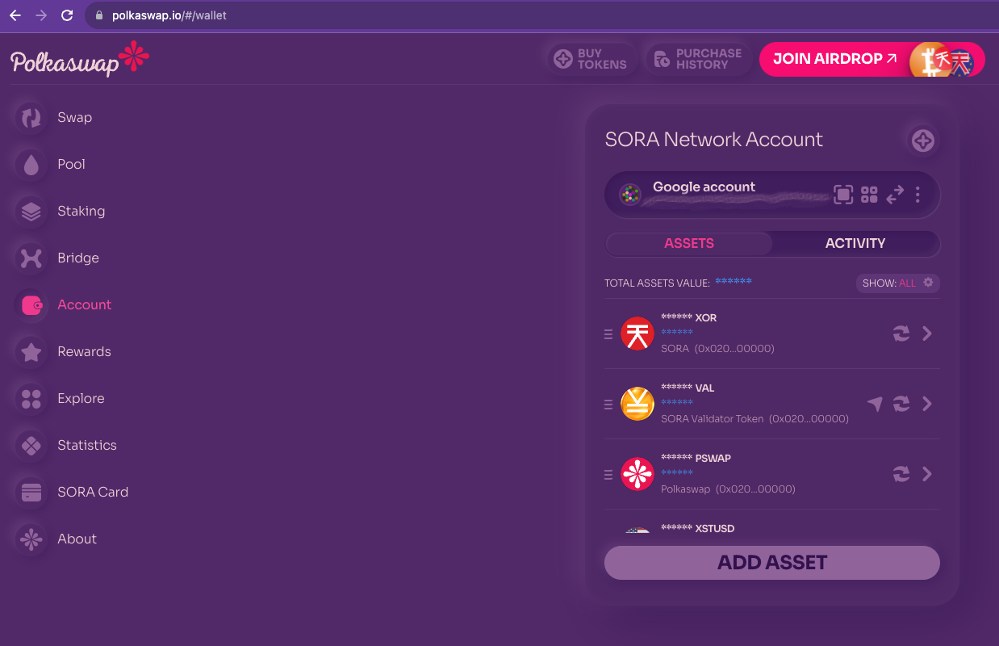

1. When swapping with your Google account, the process remains the same. Select the assets to swap, confirm, and confirm the fees.

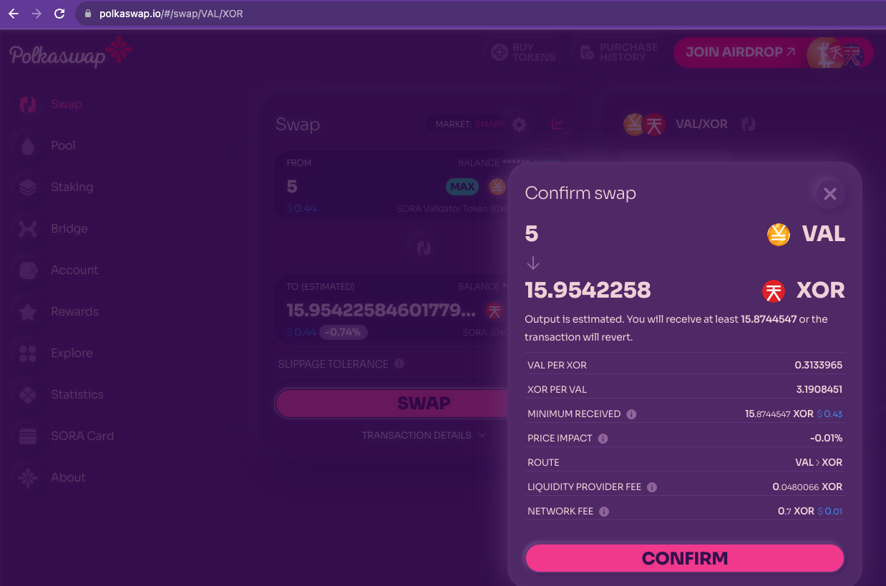

2. The Polkaswap interface will request your password to sign the transaction for your Google account, keeping it as safe as any dApp signer. You can also set Polkaswap to remember your password for fifteen minutes in _[Substrate Style](create-an-address.md#via-polkadot-js-browser-plugin)_.

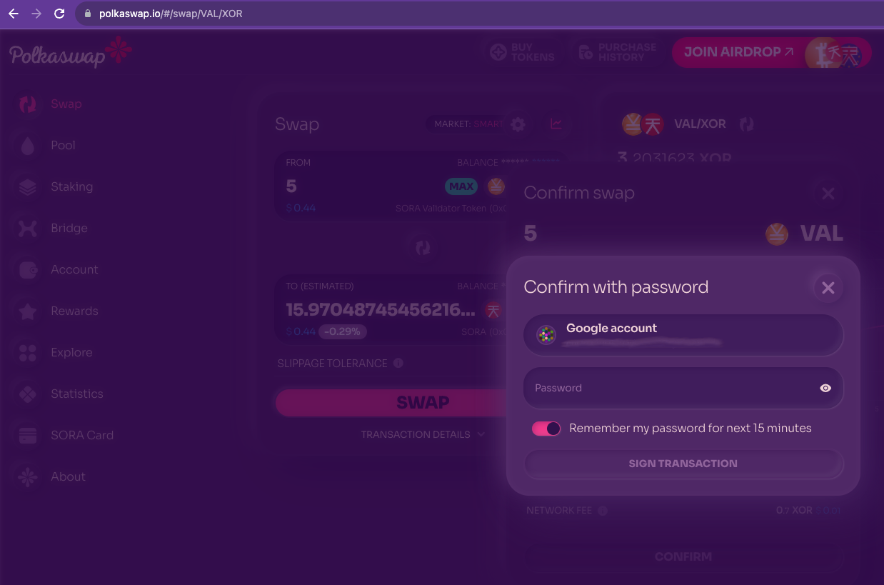

The same will apply to liquidity provision transactions, both double (_pooling_) and single-sided (_staking_)—as well as Bridge transactions and claiming rewards.

### Read More: [Liquidity Operations on Polkaswap](/provide-liquidity-to-xyk-pools-polkaswap), [Swaps on Polkaswap](/swap-polkaswap)
