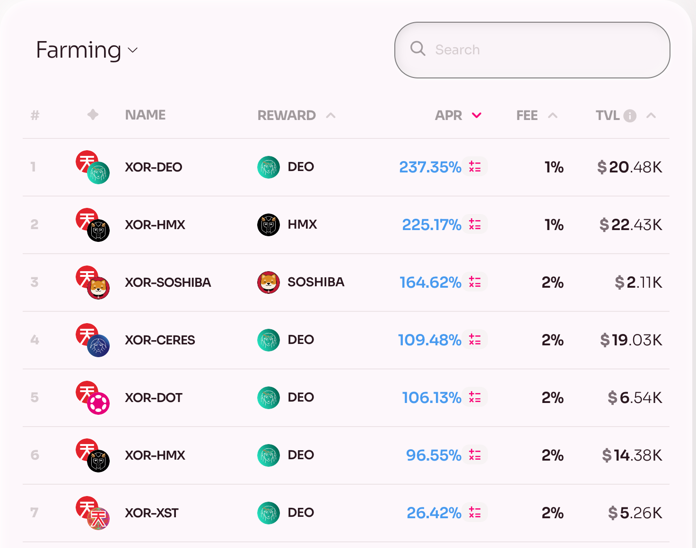
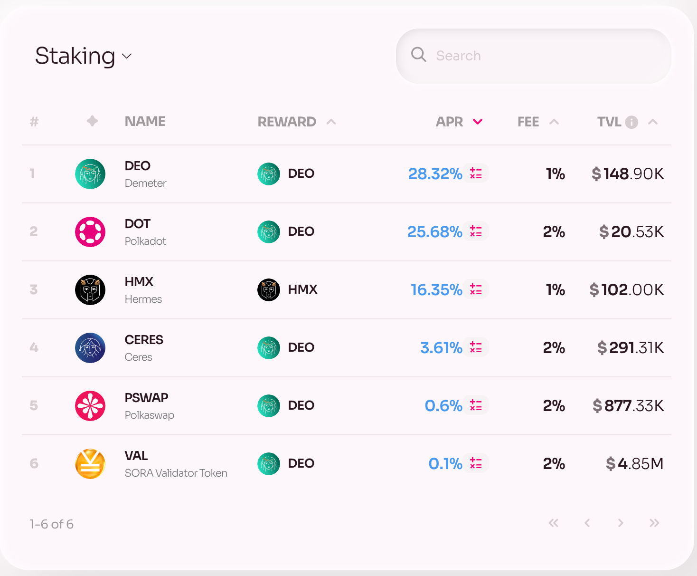
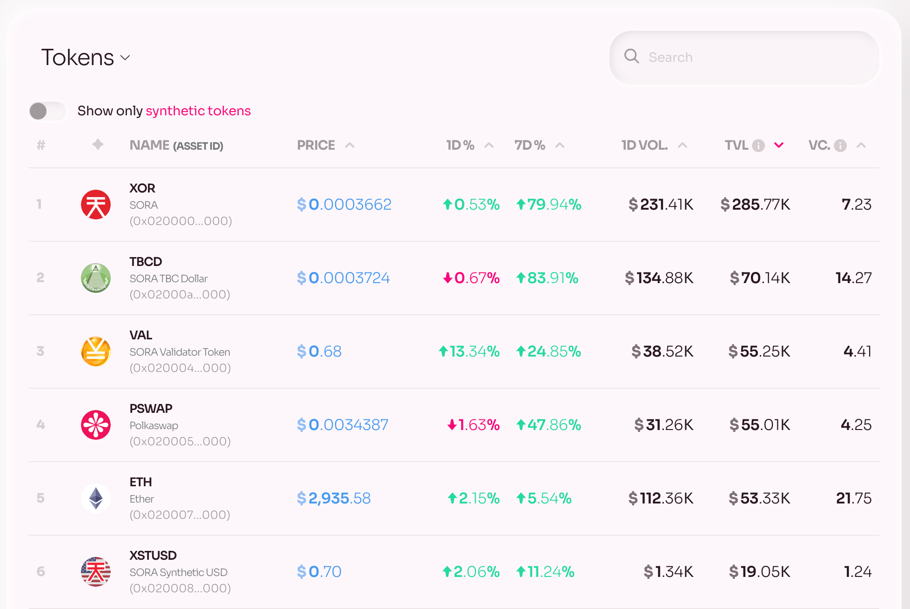

# Explore

The ["Explore" page](https://polkaswap.io/#/explore/demeter/farming) in Polkaswap.io is designed to help users discover and participate in decentralized finance activities such as pooling and staking, as well as discover information on the tokens currently available. It has several tabs that provide access to different sections of the platform. Here is a breakdown of each tab:

- [Farming:](https://polkaswap.io/#/explore/demeter/farming) This tab displays a list of available farming opportunities on Polkaswap. Users can stake their LP tokens in the designated pools to earn rewards in the form of PSWAP tokens.

- [Pools:](https://polkaswap.io/#/explore/pools/) The tab displays a list of available pools along with their respective APRs and total liquidity. The Pools tab helps users be informed to provide liquidity to various trading pairs on Polkaswap. By supplying liquidity, users can earn trading fees and other rewards.

- [Staking:](https://polkaswap.io/#/explore/demeter/staking) The tab displays a list of available staking options on Polkaswap.io along with their respective APRs and total locked liquidity. Users can stake their tokens in the designated pools and earn rewards.

- [Tokens:](https://polkaswap.io/#/explore/tokens) The Tokens tab displays a list of all available tokens on the Polkaswap platform and provides detailed information about each token, including its current price, total value, token velocity, and trading volume. Users can filter the list by different criteria such as name, symbol, and trading volume.

