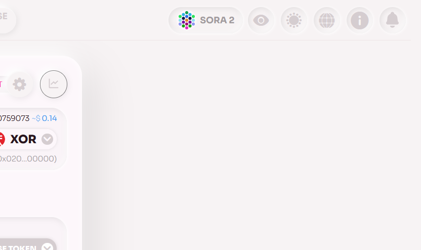

# Other Features

In the top right corner of the Polkaswap page, you'll find a few additional features that can enhance your experience.

These features include the ability to switch to dark or light mode, select a language from a list of available options, enable browser notifications for balance changes and other updates, as well as hide your balances for privacy.

You can easily access these features by clicking on the corresponding icons in the top right corner of the page.
