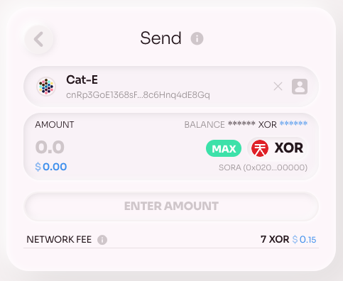
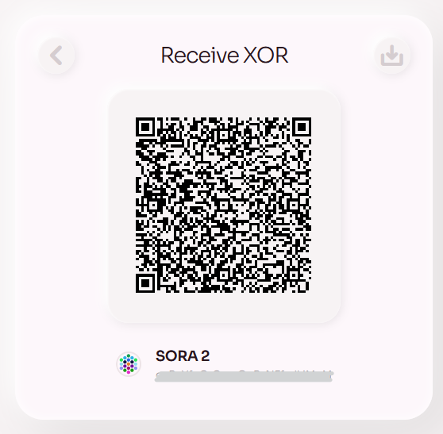

# Send & Receive

## Send crypto

1.  Go to the [Account tab](https://polkaswap.io/#/wallet) on Polkaswap\

2.  Choose the asset you want to send from the list of available assets. If you don't see the asset you want to send, click on the "add asset" button and add it to the list.
3.  Click on the "Send" button next to the asset you want to send.\

4.  Paste the receiver's address in the "Address" field

5.  Enter the amount you want to send in the "Amount" field.
6.  Review the network fee for the transaction. Please note that you need to have XOR for fees on your transferrable balance for the transaction to be successful
7.  Review the transaction details to ensure everything is correct, including the receiver's address and the amount of tokens being sent.
8.  Confirm the transaction and sign it using your wallet extension.

    Done! Your transaction is now complete!\

## Receive crypto

1.  Go to the [Account tab](https://polkaswap.io/#/wallet) on Polkaswap

2.  Choose the asset you'd like to receive and click on the "Receive" button

3.  Select the asset you would like to receive.
4.  You will be redirected to a page with your wallet address in both text and QR code format.\

5.  Copy your wallet address or share the QR code with the sender.
6.  The sender can then use your wallet address or scan the QR code to send you the desired asset.
