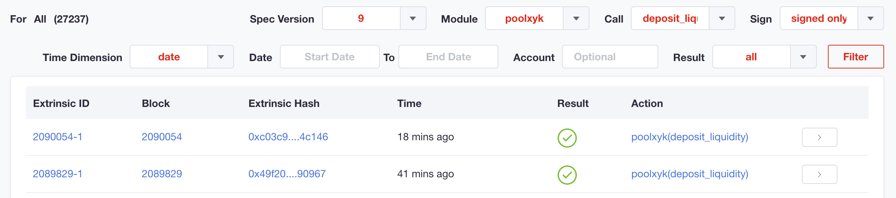

# Liquidity Operations

## Theory

<!-- @include: /snippets/provide-liquidity-theory.md -->

## Practice

### Creating a New Liquidity Pool

<!-- @include: /snippets/provide-liquidity-to-xyk-pools-new-liquidity-pool-polkaswap.md -->

### Providing Liquidity to an Existing Liquidity Pool

<!-- @include: /snippets/provide-liquidity-to-xyk-pools-provide-to-existing-liquidity-pool-polkaswap.md -->

### Removing Liquidity from the Pool

<!-- @include: /snippets/remove-from-liquidity-pool-polkaswap.md -->

## Checking Transactions

You can find the transactions for providing and removing liquidity you have made in the block explorer. Open the list of transactions and filter it using the PoolXYK module parameter and **deposit_liquidity** call for providing liquidity or **withdraw_liquidity** call for removing liquidity.

