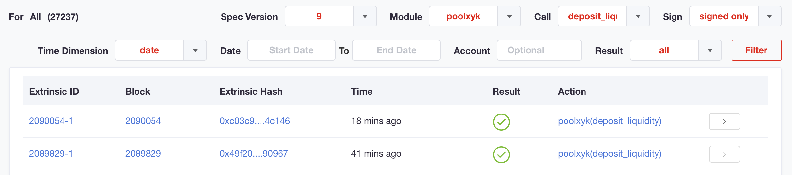
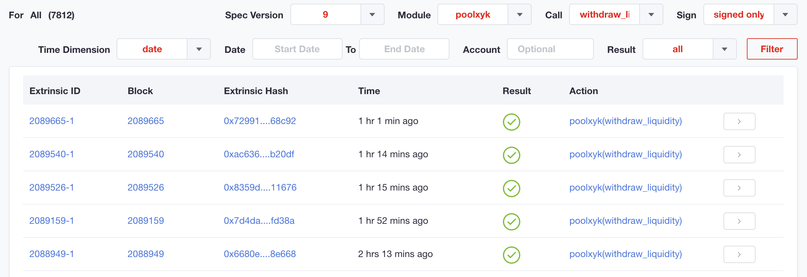

<!-- TODO:
- update image names in this topic
- check image alignment
-->

# Liquidity Operations

Everything about pool XYK liquidity provision in SORA.

## Theory

<!-- @include: /snippets/provide-liquidity-theory.md -->

## Practice

::: tip
We recommend using the SORA testnet for practice exercises. Here are the Testnet links:

1. [Polkaswap test application](https://test.polkaswap.io/)
2. [Polkadot js SORA testnet application](https://polkadot.js.org/apps/?rpc=wss%3A%2F%2Fws.stage.sora2.soramitsu.co.jp#/explorer)
3. [Android testnet application](https://play.google.com/store/apps/details?id=jp.co.soramitsu.sora.communitytesting&hl=en&gl=US)
4. [iOS testnet application](https://testflight.apple.com/join/670hF438)
   :::

In the practice section, we'll create a liquidity pool, provide liquidity to the existing pool and remove the liquidity.

### Creating a New Liquidity Pool

#### Via Polkaswap

<!-- @include: /snippets/provide-liquidity-to-xyk-pools-new-liquidity-pool-polkaswap.md -->

### Providing Liquidity to an Existing Liquidity Pool

#### Via Polkaswap

<!-- @include: /snippets/provide-liquidity-to-xyk-pools-provide-to-existing-liquidity-pool-polkaswap.md -->

### Removing Liquidity from the Pool

#### Via Polkaswap

<!-- @include: /snippets/remove-from-liquidity-pool-polkaswap.md -->

## Checking Transactions

You can find the transactions for providing and removing liquidity you have made in the block explorer. Open the list of transactions and filter it using the PoolXYK module parameter and **deposit_liquidity** call for providing liquidity or **withdraw_liquidity** call for removing liquidity.

