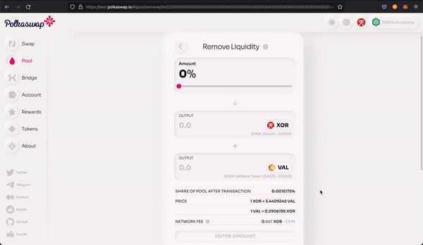

# Liquidity operations

## Theory

To Polkaswap means to exchange (_swap_) tokens on [Polkaswap](https://polkaswap.io/), Polkaswap is a non-custodial, cross-chain AMM DEX protocol for swapping tokens, Polkaswap removes trusted intermediaries and provides the opportunity for faster trading, and Polkaswap also combines multiple liquidity sources under a common liquidity aggregation algorithm, operating completely on-chain, in a trustless and decentralized way.

XYK Pools are managed by the community. Anyone can provide liquidity to any pool. Liquidity pools (XYK pools) are explained in this [video](https://www.youtube.com/watch?v=cizLhxSKrAc) on the Finemtaics YouTube channel. It's recommended to watch it in order to understand how Pools work in general.

You can provide liquidity in an XYK pool so that users are able to exchange tokens. There are 3 main cases here:

1. The pool doesn't exist and you'll be the first liquidity provider (LP)
2. The pool exists and you're adding liquidity
3. You already have a share in the pool and you'd like to remove liquidity

Every liquidity provider gets PSWAP rewards for providing liquidity. Rewards are the incentive for users to provide liquidity. There are 2 types of rewards:

1. Rewards paid from LP fees
2. [LP Farming bonus rewards](https://medium.com/polkaswap/pswap-rewards-1-polkaswap-liquidity-reward-farming-3e045d71509)

Rewards paid from LP fees are distributed every day for each liquidity pool. For example, if you have a share in 3 liquidity pools, then your rewards that are available to claim will be updated twice a day.

LP Farming bonus rewards are distributed every 6 hours.

Along with the network fee in XOR, all 3 cases require an additional fee - liquidity provider fee (LP fee). The LP fee is used to incentivize liquidity providers to supply liquidity in liquidity pools. Liquidity pools are described in this [article](https://medium.com/polkaswap/polkaswap-pools-48b726cf3a71).

_**Important: before providing liquidity read about the**_ [_**risks involved here**_](https://wiki.sora.org/polkaswap/polkaswap-faq#what-are-the-risks-of-providing-liquidity-to-polkaswap)_**.**_

#### How to check **the total** pooled amounts for XYK pool

In order to see the total pooled amounts, check the tool Ceres has built [https://tools.cerestoken.io/#/tokens](https://tools.cerestoken.io/#/tokens)

## Practice

::: tip
We recommend using the SORA testnet for practice exercises. Here are the Testnet links:

1. [Polkaswap test application](https://test.polkaswap.io/)
2. [Polkadot js SORA testnet application](https://polkadot.js.org/apps/?rpc=wss%3A%2F%2Fws.stage.sora2.soramitsu.co.jp#/explorer)
3. [Android testnet application](https://play.google.com/store/apps/details?id=jp.co.soramitsu.sora.communitytesting&hl=en&gl=US)
4. [iOS testnet application](https://testflight.apple.com/join/670hF438)
:::

In the practice section, we'll create a liquidity pool, provide liquidity to the existing pool and remove the liquidity.

### Creating a new Liquidity pool

#### Via Polkaswap

Creating a pool is really easy. Just open Polkaswap, then open the Pool section.

(5).png>)

There are 2 options:

1. Add liquidity
2. Create a pair

If you'd like to create a pool, you should click the **Create a pair** button. Select the tokens that should compose the trading pair. Keep in mind that all trading pairs in Polkaswap must contain XOR and another token. That's why the XOR token is preselected and can't be changed.

.png>)

Select the second token for the trading pair. Oooops! The trading pair for XOR-VAL is already created. It means that someone has already created a pool with this trading pair and provided the liquidity.

You can provide liquidity to this pool as well.

(14).png>)

Let's select another token.

(10).png>)

Pay attention when you're the first liquidity provider. The ratio of tokens will set the price of this pool.

(9).png>)

Let's describe the parameters:

1. **XOR per SAT** is the price of XOR in SAT tokens if a user will trade using this pool
2. **SAT per XOR** is the price of SAT in XOR tokens if a user will trade using this pool
3. **Network fee** - the fee for processing the transaction
4. **Share of Pool** - the percentage of your tokens in the pool

If everything is ok, confirm and sign the transaction.

(7).png>)

Now you can see your pool share on the Pool page

(8).png>)

### Providing liquidity to an existing Liquidity pool

#### Via Polkaswap

There are 2 options where you can add liquidity:

1. If you already have a share in a specific pool, you can click **Add liquidity** on the pool details
2. If you'd like to provide liquidity to a pool where you don't have a share, then click **Add liquidity** on the Pool page

(2).png>)

The next steps are pretty much the same. If you select the pool where you already have a share, then the token pair will be preselected, otherwise, you should select the tokens by yourself.

Ok, the token pair is selected.

(1).png>)

Enter the amount of source asset or destination asset. Pay attention, if you enter the amount of a source asset, the amount of dest. asset will be calculated according to the pool math. If you enter the amount of dest. asset, the amount of source asset will be calculated according to the pool math as well.

.png>)

Let's describe the parameters:

1. **XOR per VAL** is the price of XOR in VAL tokens if a user will trade using this pool
2. **VAL per XOR** is the price of VAL in XOR tokens if a user will trade using this pool
3. **Network fee** - the fee for processing the transaction
4. **Share of Pool** - the percentage of your tokens in the pool

If everything is ok, confirm and sign the transaction.

.png>)

Now you can see your share of the pool on the Pool page

(1).png>)

### Removing liquidity from the pool

#### Via Polkaswap

Once you've provided the liquidity to the pool, you're also able to remove it (_get your tokens back_). Just open the Pool page, then open the pool details and click on **Remove liquidity.**

(3).png>)

You'll see a lot of options there, but don't worry!

(3).png>)

Enter the amount of source asset or dest asset to be removed. Pay attention, if you enter the amount of source asset, the amount of dest. asset will be calculated according to the pool math. If you enter the amount of dest. asset, the amount of source asset will be calculated according to the pool math as well.

You can use the **Amount slider** to select the percentage of liquidity to be removed:

If you're ok with the given parameters, Confirm and sign the transaction.

(3).png>)

You can then check if your pool share was reduced

(2).png>)

## Checking transactions

You can find the transactions for providing and removing liquidity you have made in the block explorer. Open the list of transactions and filter it using the PoolXYK module parameter, and **deposit\_liquidity** call for providing liquidity or **withdraw\_liquidity** call for removing liquidity.

(2).png>)

(1).png>)
