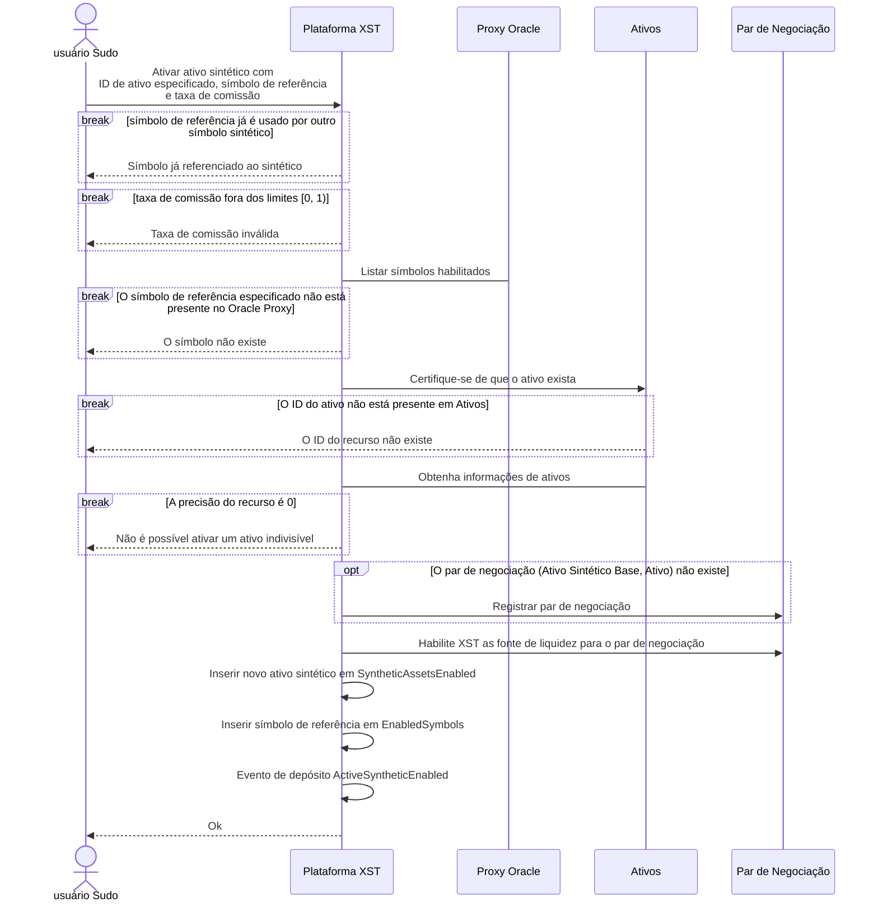
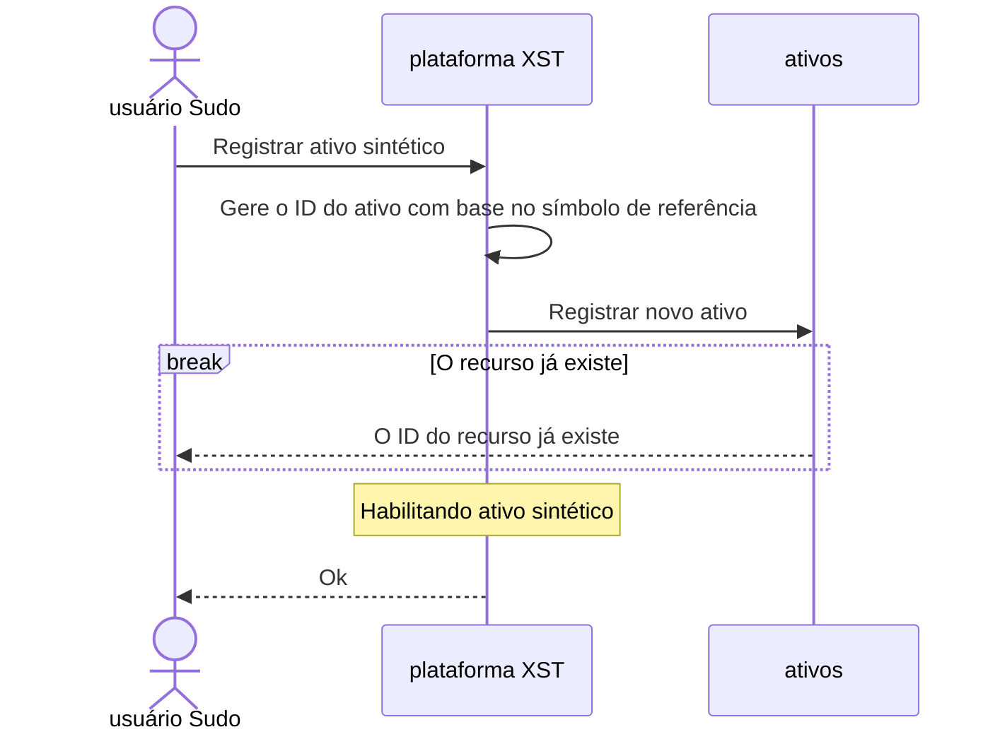
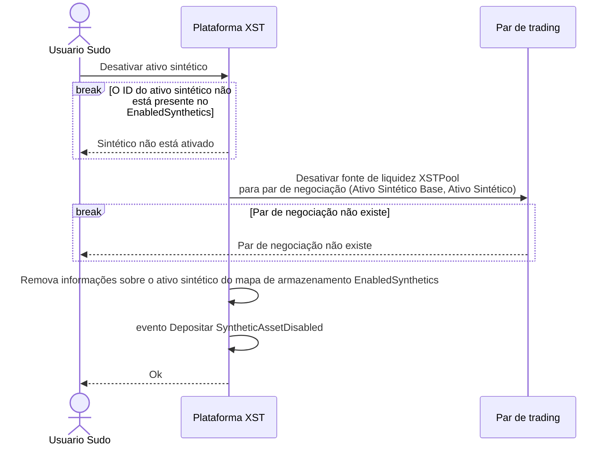
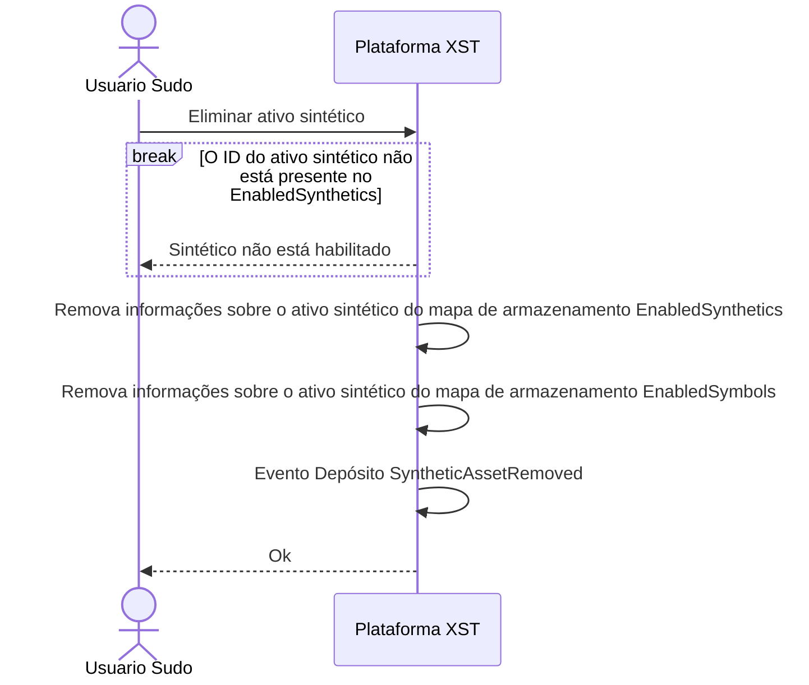
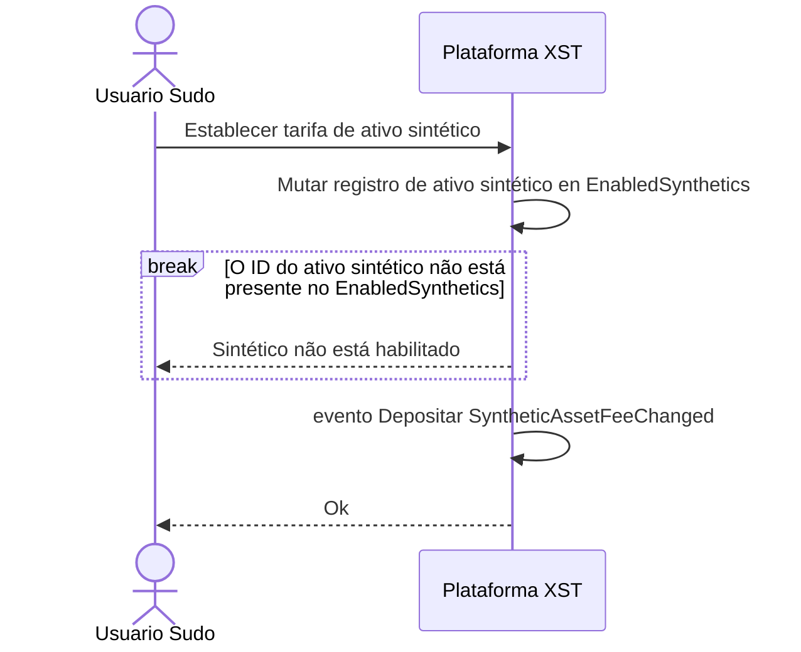
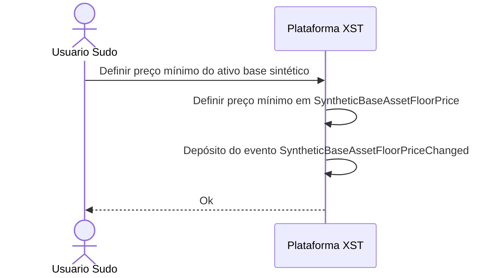
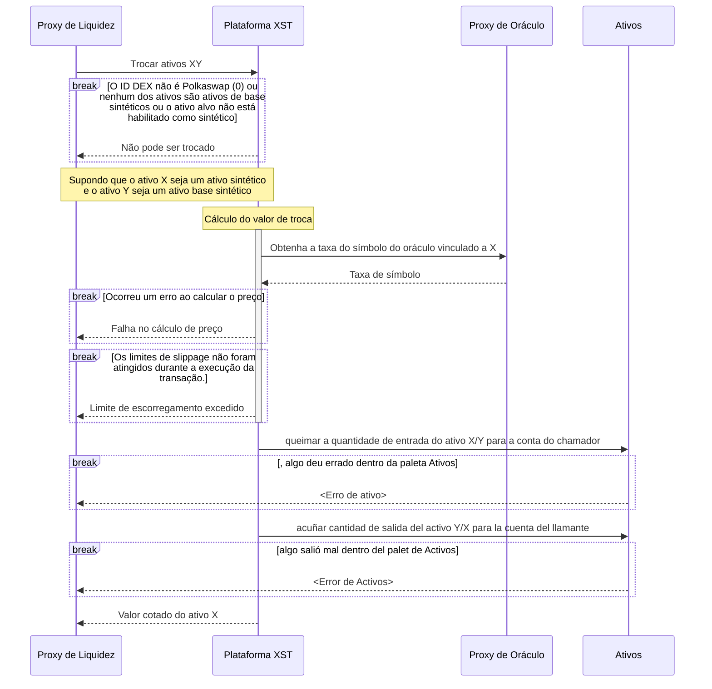
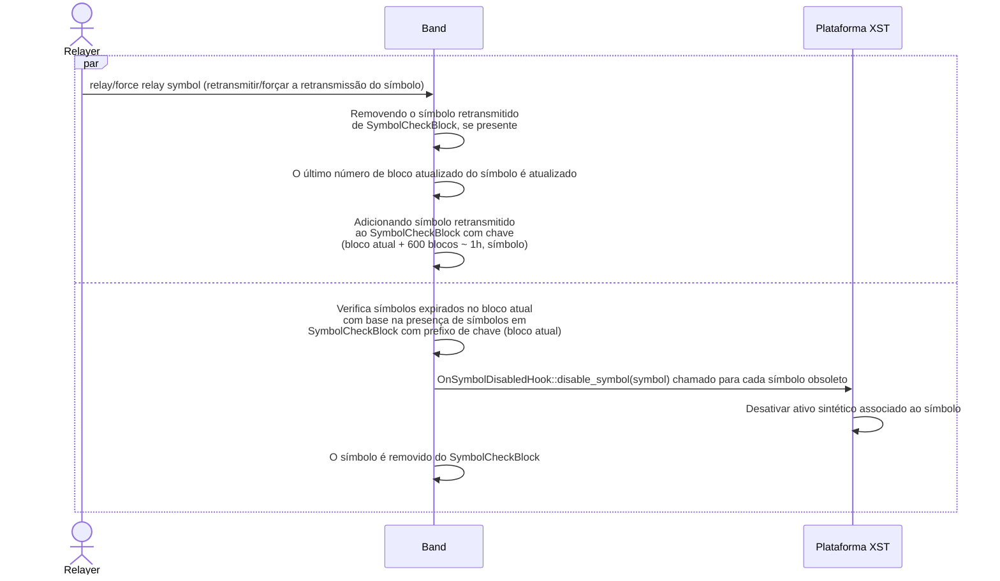

---
titulo: “SORA Sintéticos explicou. Como funcionam os ativos sintéticos SORA"
cabecera:
  - - meta
    - nombre: descripcion
      contenido: “Mergulhe na documentação SORA Synthetics - Um guia completo para criar e gerenciar testes sintéticos. Aumente o desempenho e a confiabilidade do seu aplicativo. Este guia fornece um passo a passo detalhado para projetar, implementar e monitorar testes sintéticos para obter o desempenho ideal do aplicativo. Explore exemplos de código, estratégias e práticas recomendadas para aproveitar ao máximo os recursos de monitoramento sintético do SORA"
  - - meta
    - nombre: palavras chave
      contenido: “Sintéticos SORA, ativos sintéticos, desempenho de aplicativos, exemplos de código, mecanismo de taxas dinâmicas, mecanismo de backstop, preço mínimo, governança on-chain, limite de negociação, pools de liquidez, índices totalmente garantidos, on-chain, off-chain, operações DeFi, censura dados resistentes, oracleizados, XSTUSD, comunidade, token especializado, garantia, ecossistema SORA, melhores práticas, monitoramento sintético, plataforma SORA, otimização de desempenho"
  - - link
    - rel: folha_de_estilo
      href: https://cdnjs.cloudflare.com/ajax/libs/KaTeX/0.5.1/katex.min.css
---

# SORA Sintéticos

## O que são ativos sintéticos?

Ativos sintéticos são ativos vinculados a um índice usando apenas garantias em cadeia. [XSTUSD (SORA Synthetic USD) é um ótimo exemplo de ativo sintético](https://www.forbes.com/sites/tatianakoffman/2021/11/23/the-rise-of-decentralized-money-on-polkadotnew -algorithmic-stablecoin-launches-on-sora/), pois está atrelado ao valor do dólar americano, mas atualmente respaldado pela possibilidade de resgate para


Os ativos sintéticos são importantes porque os ativos totalmente garantidos na rede, mas vinculados a índices fora da rede, são incrivelmente poderosos. Ativos puramente sintéticos podem ser usados ​​para representar muitos tipos de valor, como para rastrear ações de instrumentos financeiros e títulos. Quer o índice seja uma moeda fiduciária como o dólar americano, uma mercadoria como o XAU (ouro) ou um título como o TSLA, ter ativos totalmente em cadeia para representar esses títulos permite uma infinidade de operações DeFi combináveis, ao mesmo tempo que é impossível de censurar. Os usos possíveis são verdadeiramente infinitos e limitados apenas pela imaginação dos desenvolvedores e pelos dados oracle confiáveis!

SORA está recebendo dados oracleizados para habilitar praticamente qualquer ativo sintético possível na rede. A implicação disto é que, de repente, muitos novos ativos sintéticos, semelhantes ao XSTUSD, poderiam ser criados, se a comunidade desejar construí-los. Para potencializar isso, um token especializado foi criado para ser a garantia dos ativos sintéticos no ecossistema SORA: XST.

## Por que as pessoas são frequentemente atraídas por ativos sintéticos?

- **Acesso a mercados globais**: os ativos sintéticos permitem que os usuários obtenham exposição a uma ampla gama de ativos tradicionais e digitais de diferentes mercados globais. Os usuários podem investir em ativos que de outra forma seriam inacessíveis devido a limitações geográficas ou regulatórias.

- **Inclusão Financeira**: Os ativos sintéticos podem contribuir para a inclusão financeira, proporcionando às pessoas com acesso limitado aos serviços financeiros tradicionais a oportunidade de participar nos mercados globais e nas oportunidades de investimento.

- **Barreiras de entrada mais baixas**: Os ativos sintéticos eliminam certas barreiras de entrada que existem nos mercados financeiros tradicionais. Os usuários podem começar a negociar com requisitos de capital mais baixos, opções de propriedade fracionada e custos de transação reduzidos em comparação com a negociação tradicional de ativos.

- **Oportunidades de negociação**: os ativos sintéticos oferecem aos usuários oportunidades de negociação adicionais, permitindo-lhes capitalizar sobre tendências de mercado, diferenças de preços ou oportunidades de arbitragem. Os usuários podem participar de negociações alavancadas ou explorar estratégias de negociação complexas.

- **Diversificação**: Os ativos sintéticos permitem que os usuários diversifiquem suas carteiras de investimentos ganhando exposição a uma variedade de classes de ativos, como ações, commodities, índices ou moedas.

## **Usuários típicos de ativos sintéticos**

1. **Comerciantes de Criptomoedas**: Como os ativos sintéticos refletem apenas o valor nominal de um índice, eles permitem que grandes quantias sejam negociadas sem impactar o preço de mercado dos ativos subjacentes (por exemplo, Bitcoin).
2. **Investidores Internacionais**: Os ativos sintéticos permitem a negociação em diversas moedas de diferentes países, abrindo novas oportunidades para investimentos internacionais.
3. **Comerciantes de FX**: Os ativos sintéticos oferecem uma oportunidade única para os traders de criptomoedas diversificarem seus portfólios e aproveitarem as oportunidades de negociação no mercado de câmbio, sem a necessidade de regulamentações KYC, reduzindo as barreiras à entrada e aumentando a acessibilidade.
4. **Investidores avessos ao risco**: Os ativos sintéticos oferecem potencial redução de risco por meio da diversificação do portfólio e da redução da derrapagem e do risco de perda impermanente. Também oferece a possibilidade de manter os seus ativos num ativo sintético estável à sua escolha, por exemplo, se a sua moeda local estiver sujeita a uma maior volatilidade.
5. **Investidores Conscientes dos Custos**: A negociação de ativos sintéticos não incorre em cobrança de juros, o que a torna uma opção de investimento lucrativa.
6. **Investidores avessos a impostos**: A transação de ativos sintéticos sem incorrer em impostos proporciona benefícios financeiros significativos para investidores avessos a impostos

## **Histórias de usuários**

### User Story 1: Negociação de ativos sintéticos para diversificação

Como investidor, quero negociar ativos sintéticos numa bolsa descentralizada (DEX) para poder diversificar a minha carteira e obter exposição a uma vasta gama de ativos sem deter diretamente os ativos subjacentes. Quero poder negociar vários ativos sintéticos que representem diferentes criptomoedas, ações e mercadorias para reduzir o risco e maximizar os retornos potenciais.

### User Story 2: Cobertura da volatilidade do mercado com ativos sintéticos

Como trader, preciso poder usar ativos sintéticos em uma DEX para me proteger contra a volatilidade do mercado. Ao negociar derivados sintéticos que acompanham os movimentos de preços de ativos específicos, posso proteger as minhas posições de perdas potenciais e gerir o risco de forma eficaz, mesmo durante condições de mercado turbulentas.

### História do usuário 3: Aproveitando ativos sintéticos para negociações especulativas

Como trader de alto risco, quero aproveitar os ativos sintéticos em uma DEX para ampliar meus lucros potenciais com movimentos de preços de curto prazo. Ao negociar derivados sintéticos com alavancagem, posso ampliar os meus lucros sem deter grandes quantidades de garantias, o que me permite participar em oportunidades especulativas com maior flexibilidade financeira.

### User Story 4: Acessando ativos tradicionais em uma DEX com ativos sintéticos

Como investidor em criptografia, desejo obter exposição a ativos tradicionais, como ações, índices e moedas fiduciárias, por meio de ativos sintéticos em um DEX. Desta forma, posso aceder e negociar nos mercados tradicionais de forma descentralizada, diretamente da minha carteira de criptomoedas, sem necessidade de passar por intermediários financeiros tradicionais.

### História do usuário 5: Produção farming e fornecimento de liquidez com ativos sintéticos

Como entusiasta do DeFi, quero me engajar na produção agrícola e no fornecimento de liquidez usando ativos sintéticos em um DEX. Ao fornecer liquidez a pools de ativos sintéticos, posso ganhar recompensas e comissões, ajudando a garantir a disponibilidade e estabilidade destes ativos para outros traders e investidores no ecossistema descentralizado.

## Como funcionam os ativos sintéticos SORA?

XST é o ativo colateral que respalda todos os ativos sintéticos SORA. É também uma moeda de reserva da SORA Token Bonding Curve, juntamente com ETH, DAI, VAL, PSWAP e TBCD.

O XST ajuda a resolver o problema de liquidez do XOR criando ativos sintéticos respaldados por uma quantidade variável de XST e vinculados a um índice alvo (por exemplo, uma moeda). O token XST é cunhado/não cunhado (queimado) para garantir sempre o valor do índice alvo. Por esse motivo, o XST tem sido referido como token de plataforma porque é a base, ou garantia, para todos os ativos sintéticos no SORA.

O XST não exige garantia excessiva e os usuários de ativos sintéticos não correm o risco de liquidação. Isso ocorre porque o novo XST sempre pode ser cunhado para fornecer o valor total de um ativo sintético, trocando-o de volta pelo token da plataforma XST.

No caso de ativos sintéticos, como são apoiados pelo token da plataforma XST, o XST pode ser cunhado ou não cunhado por meio de algoritmos para fornecer valor total para os ativos sintéticos sob demanda. O Formador de Mercado Primário XST que cunha/desminta ativos sintéticos e o XST para seus ativos sintéticos, e o preço nunca se desviará (para baixo ou para cima) do preço do ativo. Portanto, os ativos sintéticos não estão sujeitos a derrapagens de preços ou iliquidez. Isso funciona, por exemplo, no caso de XSTUSD, porque um único XSTUSD é uma reivindicação de $1 USD *valor de XST*, e **não uma reivindicação do $USD real**.

## Anúncio Astra

Novos ativos sintéticos podem ser vinculados ao feed de dados de um oráculo através da governança em cadeia para criar novos ativos sintéticos (por exemplo, XSTXAU para um ativo sintético de ouro). A única limitação é passar a fonte de dados oracle para o SORA.

## Limites de compra/venda do ativo sintético base

Para proteger contra potenciais atividades manipulativas no início da plataforma sintética, é introduzido um limite de negociação no ativo base (XST). Está estabelecido um limite de 10 milhões de XST para compra e venda de ativos sintéticos.
As operações que excedem esse limite causarão uma mensagem de erro.

## Extrínseco

<!-- TODOS consideram consultar a documentação RUST gerada em vez de descrever todos os parâmetros extrínsecos aqui -->

<!-- ALL Considere substituir diagramas de sequência por diagramas de atividades -->

## Extrínseco

### Habilitando ativo sintético

- **[`XSTPool::enable_synthetic_asset`](https://sora-xor.github.io/sora2-network/xst/pallet/struct.Pallet.html#method.enable_synthetic_asset)**



### Registro de novo ativo sintético

- **[`XSTPool::register_synthetic_asset`](https://sora-xor.github.io/sora2-network/xst/pallet/struct.Pallet.html#method.register_synthetic_asset)**



### Configuração de ativos de referência

- **[`XSTPool::set_reference_asset`](https://sora-xor.github.io/sora2-network/xst/pallet/struct.Pallet.html#method.set_reference_asset)**

```mermaid
sequenceDiagram
    actor as usuário Sudo
    participant X as Plataforma XST
    participant A as Ativos
    S->>X: Establecer ativo de referencia
    X->>A: Certifique-se de que o ativo existe
    quebra de ID de ativo não presente em Ativos
        A-->>S: O ID do recurso não existe
    end
        X->A: Obtenha informações de ativos
    Detalhamento da precisão dos ativos = 0
        X-->>S: Ativo de referência indivisível
    end
    X->>X: Coloque o ID do ativo em ReferenceAssetid
 X->>X: Evento de depósito ReferenceAssetChanged
 X-->>S: Ok
```

### Desativar ativo sintético

- **[`XSTPool::disable_synthetic_asset`](https://sora-xor.github.io/sora2-network/xst/pallet/struct.Pallet.html#method.disable_synthetic_asset)**



### Eliminação de ativos sintéticos

- **[`XSTPool::remove_synthetic_asset`](https://sora-xor.github.io/sora2-network/xst/pallet/struct.Pallet.html#method.remove_synthetic_asset)**



### Definir taxa de ativos sintéticos

- **[`XSTPool::set_synthetic_asset_fee`](https://sora-xor.github.io/sora2-network/xst/pallet/struct.Pallet.html#method.set_synthetic_asset_fee)**



### Defina o preço mínimo do ativo base sintético

- **[`XSTPool::set_synthetic_base_asset_floor_price`](https://sora-xor.github.io/sora2-network/xst/pallet/struct.Pallet.html#method.set_synthetic_base_asset_floor_price)**



## Implementação da característica LiquiditySource

### Cotação de ativos sintéticos

```mermaid
sequenceDiagram
    participant L as Proxy de Liquidez
    participant X as Plataforma XST
    participant O as Proxy de Oráculo
    L->>X: Cotar ativos X-Y
    break El O ID DEX não é Polkaswap (0) ou nenhum dos ativos são ativos de base sintéticos ou o ativo alvo não está habilitado como sintético
        X-->>L: Não pode ser trocado
    end
    Note over X,L: Suponiendo que el activo X es un activo sintético <br/> y el activo Y es un activo base sintético
    Note over X: Cálculo do valor cotado
    activate X
    X->>O: Obtener tasa del símbolo de oráculo vinculado a X
    O-->>X: Taxa de símbolo
    break Ocorreu um erro ao calcular o preço
    X-->>L: Falha no cálculo do preço
    end
    break Os limites de slippage não foram atingidos durante a execução da transação.
    X-->>L: Limite de escorregamento excedido
    end
    desativar
    X-->>L: Valor cotado do ativo
```

### Troca de ativos sintéticos



## Mecanismo de reserva

O mecanismo de fallback na plataforma XST garante a desativação oportuna de símbolos obsoletos.



##Mecanismo de taxa dinâmica

### Notação

| Notación    | Descripción                                        |
| ----------- | -------------------------------------------------- |
| $\delta$    | Limite de desvio do feed de preços                 |
| $P_i$       | Preço Oracle da era atual (i)                      |
| $\tau$      | Constante de decaimento de taxa dinâmica           |
| $\mu$       | Taxa dinâmica mínima                               |
| $\phi_t(i)$ | Taxa dinâmica da era atual (i)                     |

onde época denota o período de tempo entre as atualizações do oráculo.

### Cálculo de taxa dinâmica

Para desencorajar potenciais negociações exploratórias com base em alterações antecipadas nos preços do oráculo (nomeadamente frontrunning), estamos a implementar uma taxa dinâmica, que é cobrada durante qualquer negociação que envolva um ativo sintético. Esta taxa é ajustada com base na variação percentual do preço do símbolo oráculo.

Taxa dinâmica calculada como:

$\phi_{D} ( i ) = \tau * \phi_{D} ( i-1 ) + max ( [P_{i} / P_{i-1} - 1 - 2 \delta- \mu], 0 )$

$\phi_D(0) = 0$

Os parâmetros constantes são armazenados na paleta Band.

### Como a taxa é cobrada

A taxa dinâmica está incorporada ao termo $S_{f}$ (definido na seção **Processo de cálculo de cotação/valor de câmbio**). O $S_{f}$ é, portanto, definido como a soma do índice de taxas dinâmicas e do índice de taxas base de um ativo sintético, que é definido via `XSTPool::set_synthetic_asset_fee`.

## Processo de cálculo de cotação/valor de câmbio

### Notação

| Notação            | Descrição                                                                                |
| ------------------ | --------------------------------------------------------------------------------------------- |
| $S_f$              | Relação de taxas associada ao ativo sintético selecionado                             |
| $S_o$              | Taxa de símbolo Oracle associada ao ativo sintético selecionado                     |
| $B_p^b$            | Preço de compra de referência do ativo sintético base em unidades do ativo de referência |
| $B_p^s$            | Preço de venda de referência do ativo sintético base em unidades do ativo de referência  |
| $\overline{R_p^b}$ | Preço de compra de referência do ativo de referência em unidades XOR                       |
| $\overline{R_p^s}$ | Preço de venda de referência do ativo de referência em unidades XOR                        |
| $O$                | Quantidade de saída                                                                            |
| $I$                | Quantidade de entrada                                                                          |
| $F_{XOR}$          | Tarifa (em XOR)                                                                               |

### Cálculo de preço do PriceTools

Antes de nos aprofundarmos na forma como os valores de cotação e câmbio são calculados, é crucial compreender como o preço de um ativo sintético básico é calculado em unidades de referência.

A paleta PriceTools armazena dois preços médios diferentes para cada ativo encontrado no Pool XYK. Estas médias são recalculadas a cada bloco em relação aos seus valores anteriores, garantindo que a sua diferença não ultrapasse determinados limites superior e inferior da razão. Dois valores são armazenados porque existem dois cenários: pode-se **comprar** XOR com algum ativo ou **vender** XOR por algum ativo. Os limites inferior e superior da razão variam em cada cenário, introduzindo assimetria. O limite inferior do índice nos casos de compra é igual ao limite superior do índice nos casos de venda e vice-versa.

Se o ativo sintético base estiver sendo adquirido, seu preço será calculado da seguinte forma:

$B_p^b = \frac{\overline{R_p^b}}{\overline{B_p^s}}$

Esta equação calcula o preço que seria obtido trocando o ativo de referência por XOR (ou seja, **comprar** XOR) e depois comprar o ativo sintético base com XOR (ou seja, **vender** XOR).
O preço de venda do ativo sintético base é calculado da seguinte forma:

$B_p^s = \frac{\overline{R_p^s}}{\overline{B_p^b}}$

### Preço mínimo do ativo base sintético

Se o preço calculado do ativo base sintético exceder o limite em `SyntheticBaseAssetFloorPrice`, então o preço será definido para este limite.

### Caso de venda (vender base sintética para algum ativo sintético)

#### Com entrada desejada

$O = \frac{(I - I\vezes S_f)\vezes B_p^s}{S_o}$

Como a taxa é calculada em XST e deve ser paga em XOR, precisamos convertê-la

$F_{XOR} = \frac{I\vezes S_f}{\overline{B_p^s}}$

#### Com saída desejada

$I = \frac{O \vezes S_o}{B_p^s} \vezes \frac{1}{1 - S_f}$

$F_{XOR} = \left (I - \frac{O \times S_o}{B_p^s} \right ) \times \frac{1}{\overline{B_p^s}}$

### Caso de compra (Compre base sintética com algum ativo sintético)

#### Com entrada desejada

$O = \frac{I \vezes S_o}{B_p^b} \vezes (1 - S_f)$

$F_{XOR} = \frac{I \times S_o}{B_p^b} \times S_f \times \frac{1}{\overline{B_p^s}}$

#### Com saída desejada

$O_{c/\ taxa} = \frac{O}{1 - S_f}$

$I = \frac{O_{c/\ taxa} \times B_p^b}{S_o}$

$F_{XOR} = \frac{O_{c/\ taxa} - O}{\overline{B_p^s}}$

## Aprender mais

- [Tokenomia XST](/xst)
- [Solicitar recursos no SORA](/rfp)